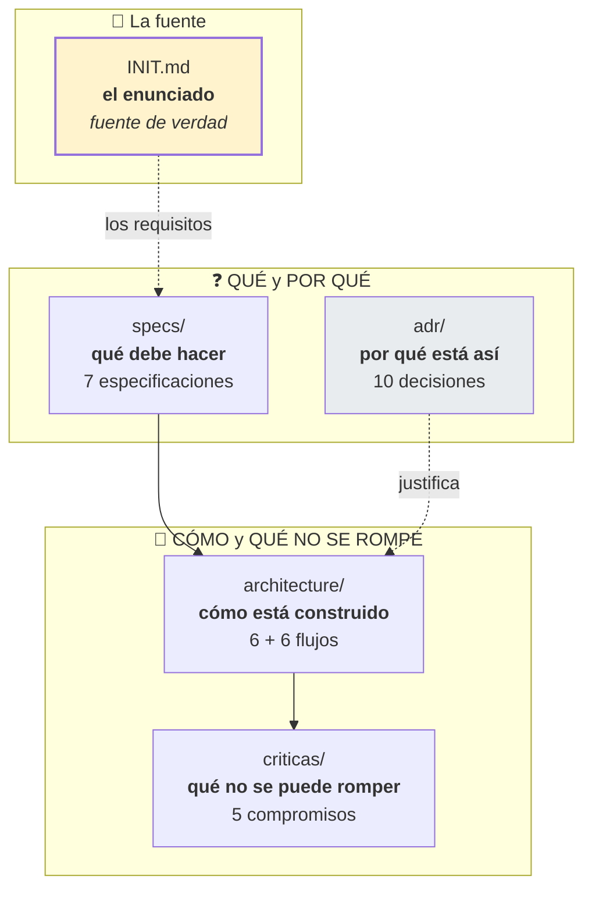
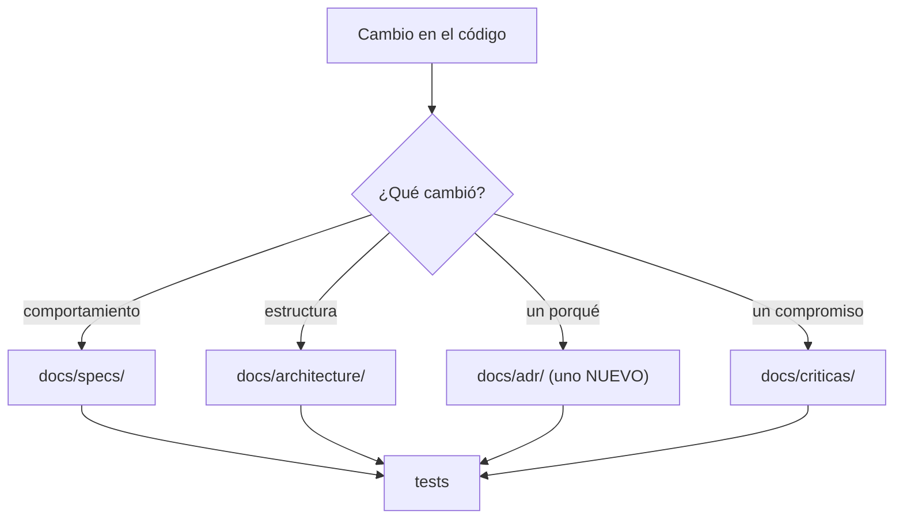

# Documentación de TalkAboutThis

Todo lo que hay que saber del proyecto, en tres familias.

## Las tres familias



| Familia | Responde | Se actualiza |
|---|---|---|
| [`specs/`](specs/) | **Qué** debe hacer el sistema | Cuando cambia un requisito |
| [`architecture/`](architecture/) | **Cómo** está construido | Cuando cambia el código |
| [`adr/`](adr/) | **Por qué** se decidió así | **Nunca** (un ADR aceptado no se edita) |
| [`criticas/`](criticas/) | **Qué no se puede romper** | Cuando se rompe el compromiso |

> **Si un documento de `docs/` contradice a `INIT.md`, se equivoca `docs/`.**
> `INIT.md` es el enunciado del cliente; los ADR y las especificaciones son
> interpretaciones. Cuando la interpretación y el enunciado no coincidan, gana el
> enunciado.

## Por dónde empezar

### Si quieres usar la herramienta

1. [`README.md`](../README.md) — instalación y uso.
2. [`specs/05`](specs/05-cli-y-modo-seco.md) — la interfaz de línea de comandos.

### Si quieres entender el diseño

1. [`architecture/README.md`](architecture/README.md) — la vista general.
2. [`architecture/capas.md`](architecture/capas.md) — las cuatro capas.
3. [`adr/README.md`](adr/README.md) — por qué.

### Si vienes a hacer un cambio

| Vas a… | Lee |
|---|---|
| Añadir un proveedor de LLM | [`specs/02`](specs/02-extraccion-con-llm.md), [`architecture/infrastructure.md`](architecture/infrastructure.md) |
| Añadir un formato de documento | [`specs/01`](specs/01-lectura-de-transcripciones.md), [`flujos/01-ingesta.md`](architecture/flujos/01-ingesta.md) |
| Añadir un tablero (TC-07) | [`specs/04`](specs/04-publicacion-en-projects.md), [`flujos/04-publicacion.md`](architecture/flujos/04-publicacion.md) |
| Cambiar el esquema de salida | [`specs/06`](specs/06-contrato-de-datos.md), [`adr/0005`](../docs/adr/0005-validador-propio.md) |
| Tocar la lógica de reintentos | [`criticas/reintentos-y-timeouts.md`](criticas/reintentos-y-timeouts.md) |
| Tocar el paralelismo | [`criticas/concurrencia.md`](criticas/concurrencia.md) |
| Tocar la salida o los códigos | [`flujos/05-errores-y-codigos.md`](architecture/flujos/05-errores-y-codigos.md) |

### Si quieres gestionar esto como un agente

1. [`AGENTS.md`](../AGENTS.md) — el contrato, lo primero.
2. [`specs/07-trazabilidad.md`](specs/07-trazabilidad.md) — qué cubre qué.
3. Los ADR que toquen tu cambio.

## Inventario

### Especificaciones — 7 documentos

| # | Documento | Requisitos |
|---|---|---|
| 01 | [Lectura de transcripciones](specs/01-lectura-de-transcripciones.md) | RF-01 |
| 02 | [Extracción con LLM](specs/02-extraccion-con-llm.md) | RF-02, RF-03 |
| 03 | [Resolución de identidades](specs/03-resolucion-de-identidades.md) | RF-04 |
| 04 | [Publicación en Projects v2](specs/04-publicacion-en-projects.md) | RF-05 |
| 05 | [CLI y modo seco](specs/05-cli-y-modo-seco.md) | RF-06 |
| 06 | [Contrato de datos](specs/06-contrato-de-datos.md) | RF-07 |
| 07 | [Trazabilidad](specs/07-trazabilidad.md) | Todos |

### Arquitectura — 12 documentos

| Documento | Contenido |
|---|---|
| [Índice](architecture/README.md) | Vista de contexto, las cuatro capas |
| [Capas](architecture/capas.md) | Reglas de dependencia verificables |
| [Dominio](architecture/domain.md) | Modelos, invariantes, los cuatro puertos |
| [Aplicación](architecture/application.md) | Casos de uso y orquestación |
| [Infraestructura](architecture/infrastructure.md) | Adaptadores concretos |
| [CLI](architecture/cmd.md) | El composition root |
| [Flujo general](architecture/flujos/00-vision-general.md) | De la invocación al código de salida |
| [Ingesta](architecture/flujos/01-ingesta.md) | Documento → texto |
| [Extracción](architecture/flujos/02-extraccion.md) | Retry loop con autocorrección |
| [Identidades](architecture/flujos/03-identidades.md) | Nombre → handle |
| [Publicación](architecture/flujos/04-publicacion.md) | Mutations y concurrencia |
| [Errores](architecture/flujos/05-errores-y-codigos.md) | Traducción a código de salida |

### ADR — 10 decisiones

| # | Decisión |
|---|---|
| [0001](adr/0001-arquitectura-hexagonal.md) | Arquitectura hexagonal con dominio puro |
| [0002](adr/0002-cero-dependencias-externas.md) | Cero dependencias externas |
| [0003](adr/0003-puertos-en-el-nucleo.md) | Los puertos se declaran en el núcleo |
| [0004](adr/0004-embed-del-schema.md) | El schema se compila en el binario |
| [0005](adr/0005-validador-propio.md) | Validador propio de JSON Schema |
| [0006](adr/0006-dry-run-por-defecto.md) | El dry-run se decide en el caso de uso |
| [0007](adr/0007-precedencia-flag-sobre-entorno.md) | El flag gana al entorno |
| [0008](adr/0008-guardas-con-go-parser.md) | Guardas con `go/parser` |
| [0009](adr/0009-cache-con-lock-por-clave.md) | Caché con lock por clave |
| [0010](adr/0010-sdk-publico-en-pkg.md) | `pkg/sdk` queda reservado |

### Funcionalidades críticas — 5 compromisos

| Documento | El compromiso |
|---|---|
| [Seguridad](criticas/seguridad-y-secretos.md) | Ninguna credencial aparece nunca en un log |
| [Observabilidad](criticas/observabilidad.md) | Cada línea pertenece a una ejecución identificable |
| [Manejo de errores](criticas/manejo-de-errores.md) | Todo error conserva su causa y su código |
| [Reintentos y timeouts](criticas/reintentos-y-timeouts.md) | Solo se reintenta lo que mejora con la espera |
| [Concurrencia](criticas/concurrencia.md) | El paralelismo está acotado y protegido |

### Fuera de `docs/`

| Documento | Qué es |
|---|---|
| [`INIT.md`](../INIT.md) | El enunciado original. **No se modifica.** |
| [`README.md`](../README.md) | Instalación, uso, códigos de salida |
| [`AGENTS.md`](../AGENTS.md) | El contrato para agentes |
| [`pkg/sdk/README.md`](../pkg/sdk/README.md) | La reserva de la API pública |

## Convenciones

### Los diagramas son Mermaid embebido

```mermaid
flowchart LR
    A["```mermaid"] --> B["se renderiza en GitHub,<br/>GitLab, VS Code y<br/>cualquier editor con el plugin"]
```

**No hay cuadros de texto.** Un diagrama en ASCII se desactualiza en cuanto alguien
cambia una función; un `flowchart` se rompe visiblemente si el autor lo actualiza,
lo cual es exactamente lo que se quiere.

Reglas:

- El bloque empieza con ` ```mermaid `.
- Los identificadores de nodo **no llevan tildes ni caracteres especiales**.
- Las etiquetas sí pueden llevarlas, entre comillas: `A["Capa de aplicación"]`.
- Un diagrama que no aporta nada se elimina: no es decoración.

### El idioma

| | |
|---|---|
| **Documentación** (`.md`) | Español, **con tildes** |
| **Código Go** | Español, **sin tildes** (identificadores, comentarios, mensajes) |

Las tildes en el código son una fuente de problemas: herramientas que las
convierten, terminales con distinta codificación y diffs que parecen cambios
mayúsculos. En la documentación no hay ese problema, y escribirlas da mejor
resultado.

### Los nombres de los tests

```go
// Español, en tercera persona, describiendo el COMPORTAMIENTO esperado
func TestTC01IngestaDocxRetornaTextoLimpio(t *testing.T)
func TestModoDeCubreResultadoSinDespacho(t *testing.T)
func TestResolverNodeIDEvitaElStampede(t *testing.T)
```

Un nombre de test es **documentación ejecutable**: dice qué se espera sin abrir el
fichero. Los que empiezan por `TC` corresponden a la matriz de `INIT.md`.

### Los diagramas Mermaid que más se usan

| Tipo | Para qué |
|---|---|
| `flowchart` | Flujos y decisiones |
| `sequenceDiagram` | Interacciones en el tiempo |
| `stateDiagram-v2` | Máquinas de estado |
| `erDiagram` | Modelos de datos |
| `gantt` | Cronología |

## Mantenimiento



**Un ADR aceptado no se edita.** Si la decisión cambia, se escribe otro que la
reemplaza y se marca el primero como *Reemplazada por*. La cadena de razonamiento
vale más que la sentencia.

## Verificación de la documentación

```bash
# ¿Los diagramas son válidos? Cualquier renderizador de Mermaid lo dice.
npx -y @mermaid-js/mermaid-cli -i docs/architecture/README.md -o /tmp/x.svg

# ¿Los nombres de test que se citan existen?
grep -roh '`Test[A-Za-z0-9_]*`' docs/ | tr -d '`' | sort -u > /tmp/citados.txt
grep -roh 'func \(Test[A-Za-z0-9_]*\)' --include='*_test.go' . \
  | sed 's/func //' | sort -u > /tmp/real.txt
comm -23 /tmp/citados.txt /tmp/real.txt   # → debe estar vacío
```

El segundo es el que importa: un documento que cita un test inexistente es peor
que uno que no lo cita.