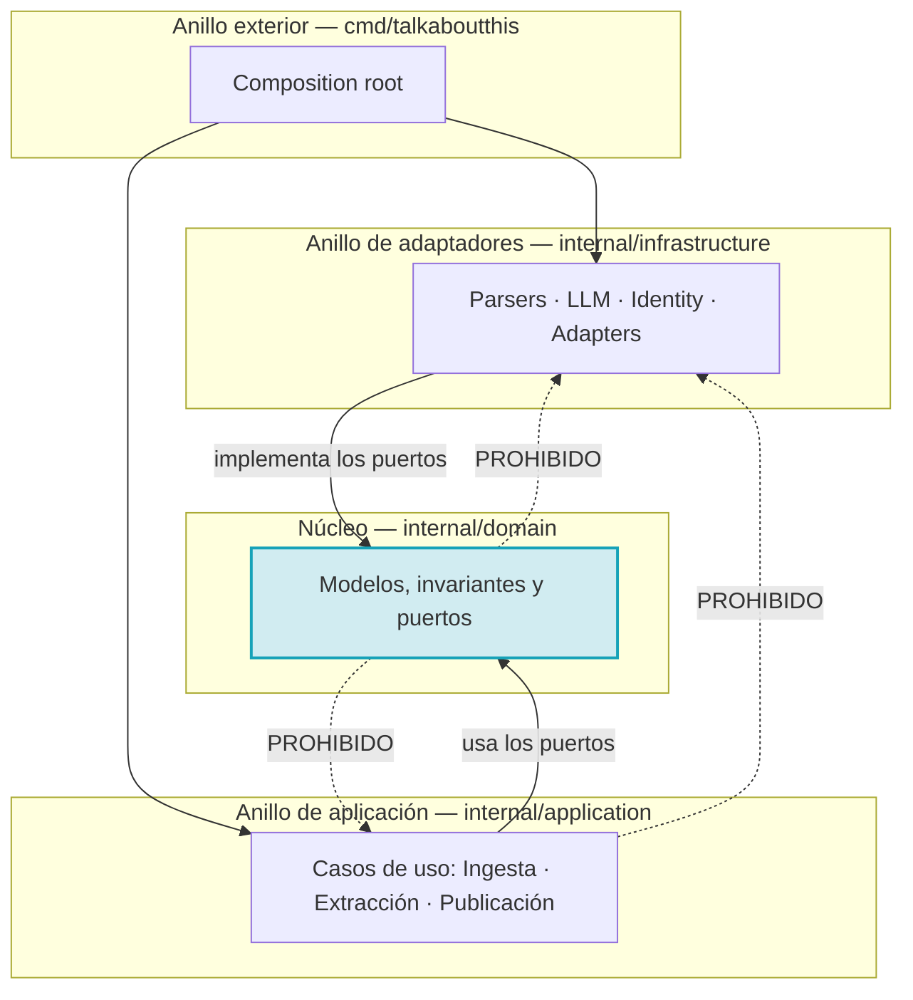

# ADR-0001 — Arquitectura hexagonal con dominio puro

- **Estado**: Aceptada
- **Fecha**: 2026-10-02
- **Decide**: el equipo del proyecto
- **Afecta a**: toda la estructura del repositorio

## Contexto

`INIT.md` propone un proyecto que:

- Ingiere transcripciones de reunión en formatos distintos (`.md`, `.txt`, `.docx`).
- Habla con **cuatro proveedores de LLM** muy distintos entre sí: un motor local
  sin autenticación y tres APIs SaaS con sistemas de salida estructurada
  incompatibles.
- Publica en **GitHub Projects v2**, con una API GraphQL cuya forma no tiene nada
  que ver con la de los proveedores.

Las fuerzas en conflicto eran:

1. **Cada capacidad tiene varias implementaciones intercambiables.** Un parser
   distinto por formato, un adaptador distinto por proveedor, un adaptador
   distinto por tablero.
2. **El núcleo del negocio es pequeño y muy estable.** «Una reunión tiene un
   resumen y una lista de tareas con responsable» no va a cambiar.
3. **Hay que poder probar sin red.** Ningún test debe llamar a una API ni gastar
   un token.
4. **El proyecto tiene tres tipos de agentes distintos** —CLI, JMeter, MCP— que
   consumirán el mismo núcleo.

Un diseño por capas clásico (`ui/`, `service/`, `dao/`) coloca la lógica de
negocio en el servicio, y el servicio acaba importando el DAO, el cliente HTTP y
el formato de la API. Eso ata el negocio a la infraestructura y hace imposible
cumplir el punto 3 sin una cantidad absurda de dobles.

## Decisión

Se adoptó **arquitectura hexagonal** (puertos y adaptadores), con cuatro anillos
y una regla única de dependencia:



La regla seфорphormuló como **una sola frase verificable**:

> El núcleo no sabe qué es un archivo, ni un modelo de lenguaje, ni GitHub.

Y se hizo **ejecutable**: `internal/domain/architecture_test.go` analiza el árbol de
imports y falla si el núcleo toca nada externo.

## Alternativas consideradas

**Opción B — capas clásicas (`cmd/`, `service/`, `internal/`).** Más familiar y
menos ficheros. Se descartó porque `service` acabaría importando `net/http` para
llamar al LLM, y en cuanto lo hiciera, «probar el servicio sin red» exigiría
duplicar toda la lógica dentro de un doble.

**Opción C — un solo paquete, `package main`.** El mínimo número de ficheros.
Se descartó por la misma razón que B, pero peor: no había ninguna frontera donde
colocar los dobles, y el proyecto tiene 390 tests.

**Opción D — arquitectura por capas con DTOs intermedios.** Una capa de
mapeo entre dominio y adaptadores. Se descartó porque duplicaría cada modelo sin
resolver el problema: seguiría habiendo que decidir dónde vive la lógica.

## Consecuencias

### Buenas

- **El dominio tiene 100 % de cobertura y cero imports de infraestructura.**
  Cualquier cambio de comportamiento rompe un test antes de llegar a producción.
- **Añadir un proveedor, un formato o un tablero no toca el núcleo.** TC-07 lo
  demuestra: un `JiraAdapter` completo, escrito desde fuera, se enchufa y
  funciona.
- **Los tests de los casos de uso usan fakes de tres líneas**, no HTTP.
- **`cmd/` es el único sitio que conoce todas las capas**, lo que hace trivial
  cambiar una implementación sin buscar usos.

### Malas

- **Duplicación de interfaces.** `application` declara `SelectorDeParser` y
  `parsers` implementa un conjunto de métodos equivalente. El nombre no coincide
  y eso desconcierta la primera vez que se lee.
- **Un paso extra al depurar.** Un método que «no existe» sí existe, en otro
  fichero.
- **Más ficheros.** Cuatro parsers, cuatro proveedores, dos tableros, cada uno en
  su fichero.

### Neutras

- El directorio `pkg/` existe en el árbol desde el principio aunque esté vacío.
  Ver [ADR-0010](0010-sdk-publico-en-pkg.md).

## Verificación

La decisión se rompe si el núcleo depende de algo externo. Eso lo vigila un test,
no un revisor:

| Regla | Test |
|---|---|
| El dominio no importa infraestructura, aplicación, `cmd` ni `pkg/sdk` | `TestDominioNoImportaInfrastructure` |
| El dominio no hace I/O de red ni ejecuta procesos | `TestDominioNoHaceLlamadasDeRed` |
| El dominio no tiene dependencias de terceros | `TestDominioSoloUsaStdlib` |

```bash
go test ./internal/domain/ -run 'Arquitectura|IO|Dependencias' -v
```

Y el criterio de éxito de TC-07:

| Criterio | Test |
|---|---|
| Un adaptador nuevo compila sin tocar el núcleo | `TestTC07ElAdaptadorNuevoSeEnchufaSinTocarElDominio` |
| El puerto no crece | `TestTC07ElDominioNoDefineAdaptadores` |

> **Verificado por inyección de regresión.** Añadir un método a
> `domain.ProjectBoardAdapter` rompe la compilación de
> `internal/application/extensibilidad_test.go`:
>
> ```
> cannot use (*JiraAdapter)(nil) as domain.ProjectBoardAdapter value:
>   *JiraAdapter does not implement domain.ProjectBoardAdapter
>   (missing method MetodoInyectadoParaRegresion)
> ```
>
> La guarda no es decorativa.

## Referencias

- [ADR-0003 — Los puertos se declaran en el núcleo](0003-puertos-en-el-nucleo.md)
- [ADR-0008 — Guardas con `go/parser`](0008-guardas-con-go-parser.md)
- [Arquitectura: las capas](../architecture/capas.md)