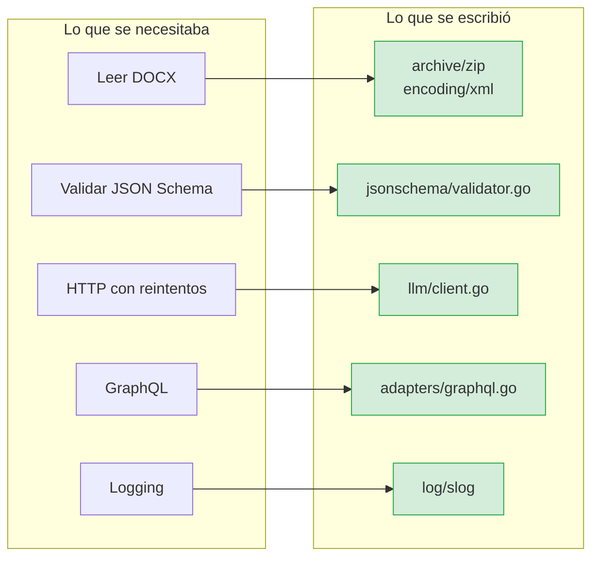
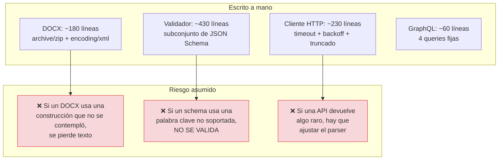
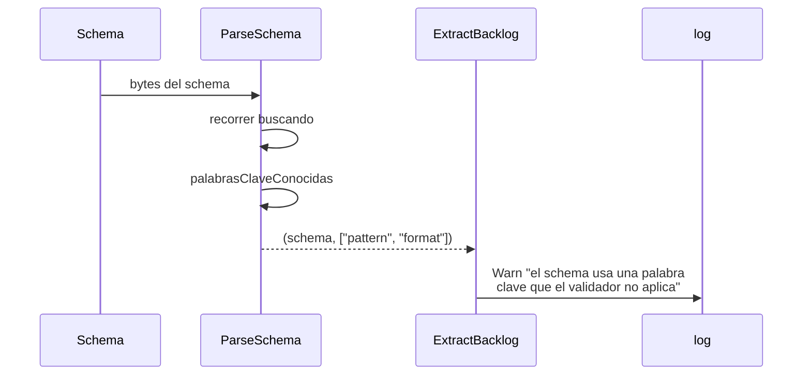

# ADR-0002 — Cero dependencias externas

- **Estado**: Aceptada
- **Fecha**: 2026-10-02
- **Decide**: el equipo del proyecto
- **Afecta a**: `go.mod`, todo `internal/infrastructure/`

## Contexto

`INIT.md` fija como requisito no negociable **RNF-01 y RNF-02**: cero
dependencias de terceros. Todo sale de la biblioteca estándar de Go.

En un proyecto normal esto seríaсточник de fricción permanente: nadie quiere
reinventar un cliente HTTP ni un lector de ZIP. Aquí era una decisión de diseño
del enunciado, y las fuerzas a favor eran reales:

1. **El proyecto debe ser auditable de principio a fin.** Sin un `go.sum` con
   400 líneas de hashes ajenos, el binario que se ejecuta es exactamente el
   código que está en el repositorio.
2. **El requisito es explícito en la especificación**, con casos de evaluación
   que lo comprueban.
3. **Las alternativas disponibles son pesadas o inmaduras** para el caso.

Las capacidades que hacen falta:

| Capacidad | Librería habitual | Problema |
|---|---|---|
| Leer `.docx` | `unioffice`, `docx` | La primera arrastra un grafo enorme; la segunda está sin mantener |
| Validar JSON Schema | `gojsonschema` | Motor completo, mucho más de lo que se usa |
| Cliente HTTP con reintentos | `resty`, `retryablehttp` | Todo se reduce a POST + JSON + backoff |
| GraphQL | `shurcooL/graphql` | Se usan cuatro queries fijas; no se genera ni una consulta |
| Logging | `zap`, `zerolog` | `log/slog` es de la stdlib y cubre lo necesario |

## Decisión

Se decidió implementar todo con la **biblioteca estándar**, y seन्नीvarepsilon
`go.mod` **sin un solo `require`**:



## El coste real, cifra a cifra



**El riesgo R2 merece atención.** El validador implementa un **subconjunto** de
JSON Schema. Un schema con `pattern` o `format` **no se valida**, y el programa
no falla: sigue funcionando como si la regla existiera.

Eso es peligroso en silencio, y por eso se añadió `PalabrasClaveDesconocidas()`:
el validador **avisa** de cada regla que ignora, y `ExtractBacklog` lo registra
en el log al arrancar.



Una regla que no se comprueba es peor que no tenerla. Avisar al menos hace que
se pueda decidir.

## Alternativas consideradas

**Opción B — aceptar dependencias y documentarlas.** Más rápido y menos código.
Se descartó porque contradice un requisito explícito y evaluable de `INIT.md`
(RNF-01), y porque `go mod audit` no es una garantía cuando el requisito es
cero.

**Opción C — una sola dependencia, `jsonschema`, y el resto stdlib.** Compromiso.
Se descartó porque el validador es la parte con más riesgo de quedarsi
desfasada: un motor JSON Schema completo sigue la especificación, y una
implementación propia la siga solo hasta donde alguien la escribió.

**Opción D — importar `golang.org/x/sync/errgroup`.** Sugerido en un borrador de
`AGENTS.md`. Se descartó porque basta con un `WaitGroup` y un
`chan struct{}` de tamaño 4, y `AGENTS.md` se corrigió para reflejarlo.

## Consecuencias

### Buenas

- **`go.mod` tiene cero `require`.** `go build` no descarga nada; el repositorio
  construye sin red.
- **Sin superficie de ataque de terceros.** No hay CVE de una dependencia
  transitiva.
- **Comportamiento predecible.** No hay sorpresas de versión: el código es el
  código.
- **El núcleo es portable.** `internal/domain` solo usa tipos de la stdlib.

### Malas

- **~900 líneas que una dependencia habría dado.** No es free: son líneas que hay
  que mantener y que un test puede no cubrir.
- **El DOCX es un subconjunto.** Si una minuta usa una construcción no
  contemplada, se pierde texto **en silencio**. Un aviso en el log es lo mínimo
  imprescindible; idealmente, un contador de párrafos no reconocidos.
- **El validador no cubre todo JSON Schema.** Gestionado con el aviso, pero es
  una deuda viva.
- **Cada API nueva exige parser propio.** Cuando Anthropic cambie su formato de
  respuesta, hay que tocar el adaptador. Con su librería, el proveedor lo haría
  por ti.

### Neutras

- El binario es más grande de lo que sería con las librerías equivalentes, pero
  comprimirlo no lo hace más pequeño.

## Verificación

```bash
# 1. Cero dependencias
grep -c "require" go.mod     # → 0

# 2. El dominio solo usa la stdlib
go list -deps ./internal/domain | grep -v '^[a-z/]*$'   # → nada del proyecto

# 3. El test que detecta dependencias de terceros en el dominio
go test ./internal/domain/ -run DependenciasExternas -v
```

El detector de dependencias de terceros usa una heurística: si el primer
segmento de la ruta contiene un punto (`github.com/…`, `golang.org/x/…`), es
externa. La stdlib no tiene ninguno.

## Referencias

- [ADR-0005 — Validador propio](0005-validador-propio.md)
- [Infraestructura](../architecture/infrastructure.md) — qué se escribió en lugar de qué