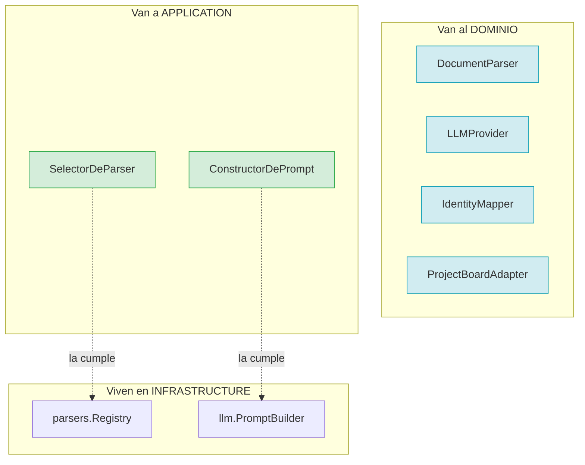
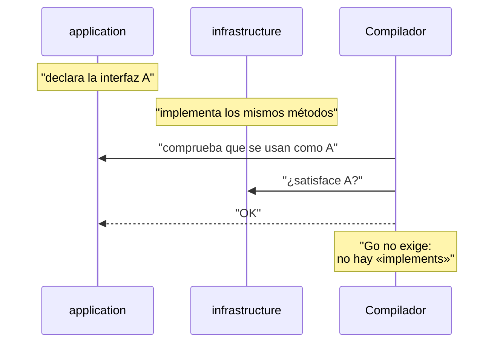

# ADR-0003 — Los puertos se declaran en el núcleo

- **Estado**: Aceptada
- **Fecha**: 2026-10-02
- **Decide**: el equipo del proyecto
- **Afecta a**: `internal/domain/ports.go`, `internal/application/*`, `internal/infrastructure/*`

## Contexto

La arquitectura hexagonal dice que los puertos se declaran **en la aplicación**,
no en el dominio. El «domain-driven design» va más allá: dice que los puertos
son parte del modelo, porque expresan las capacidades que el negocio necesita.

En este proyecto hay cuatro interfaces, y hay tres motivos para decidir dónde van:

1. **Las cuatro capacidades son del negocio.** «Convertir un documento en texto»,
   «preguntar a un modelo», «resolver un nombre», «publicar una tarea». Ninguna
   es infraestructura: son cosas que el proceso hace.

2. **`application` necesita tipar sus propias dependencias, pero no puede
   importar infraestructura** (ADR-0001). Si `SelectorDeParser` viviera en
   `parsers/`, el caso de uso tendría que importar el registro real para
   declararlo como campo.

3. **Hay capacidades que no aparecen en el libro.** El texto literal que
   se envía a un modelo es una decisión de infraestructura: es cómo se habla con
   *ese* proveedor. El caso de uso solo necesita el contrato, no el texto.

La tensión era esta: si todo va al dominio, el dominio acaba sabiendo que existe
un «constructor de prompt», que es un detalle de un canal concreto.

## Decisión

Se decidió una regla explícita y con dos Winners:

> **Un puerto va al dominio si expresa una capacidad del negocio. Va a `application`
> si solo sirve para tipar una dependencia interna.**



### Los cuatro puertos del dominio

| Puerto | Capacidad que expresa | Por qué es del negocio |
|---|---|---|
| `DocumentParser` | «Entiendo este formato de documento» | La lista de formatos es una decisión de producto |
| `LLMProvider` | «Puedo preguntar a un modelo» | El proceso depende de un modelo aunque no sepa cuál |
| `IdentityMapper` | «Sé quién es esta persona aquí» | Resolver identidades es una regla del negocio |
| `ProjectBoardAdapter` | «Sé publicar tareas en un tablero» | Publicar es el resultado del proceso |

### Las dos interfaces de `application`

```go
type SelectorDeParser interface {
    ParserParaExtension(extension string) (domain.DocumentParser, error)
    DetectarPorContenido(cabecera []byte) (domain.DocumentParser, error)
}

type ConstructorDePrompt interface {
    Construir(transcript, schemaJSON string) string
    ConstruirCorreccion(transcript, schemaJSON string, errores []string) string
}
```

`SelectorDeParser` está en `application` porque es la vista que el caso de uso
tiene del registro: no es una capacidad del negocio, es una dependencia interna
que hay que tipar. `ConstructorDePrompt` está ahí porque **el prompt no es del
negocio**: es cómo se habla con el canal.

### La coincidencia es estructural, no declarada



No hay un `implements`, ni una línea que enlace ambas interfaces, ni ninguna que
haga falta mantener. Si un día el registro expone `Parsear()`, `application`
compila igual y el comportamiento es idéntico: ambos son llamadas a un método
del mismo tipo.

## Alternativas consideradas

**Opción B — todo puerto en `application`.** Más coherente con el texto canónico
de la arquitectura hexagonal. Se descartó porque el dominio se quedaría sin
expresión de sus propias capacidades, y la «extensibilidad» se volvería invisible:
nadie vería que añadir un tablero es añadir una implementación.

**Opción C — todo puerto en el dominio, incluidas las dos internas.** Máxima
coherencia interna. Se descartó porque el dominio habría pasado a saber que
existe un «constructor de prompt», que es un detalle de canal.

**Opción D — definir las interfaces en infraestructura y que `application`
importe solo los tipos.** Habría roto ADR-0001: el caso de uso acabaría
importando el registro real.

## Consecuencias

### Buenas

- **El dominio declara sus capacidades de forma explícita.** Añadir un tablero es
  añadir una implementación, y eso se ve leyendo `ports.go`.
- **`application` no importa infraestructura** (ADR-0001) sinacapón.
- **Las dos interfaces internas son diminutas.** Tres y dos métodos. Nadie
  implementa «una interfaz» sin saber para qué es.

### Malas

- **Los nombres no coinciden.** `SelectorDeParser` en `application`,
  `NewRegistryPorDefecto` en `parsers`. La primera vez que se depura cuesta
  encontrar dónde está el método. Es la queja más frecuente contra este diseño.
- **Un cambio en el registro rompe `application` silenciosamente.** Si
  `DetectarPorContenido` cambia de firma, `application` deja de compilar: se ve
  al compilar, que es lo que importa. Pero el error dice «falta un método», no
  «el registro cambió».
- **Dos lugares donde buscar una interfaz.** La regla de dos WinningKeys es
  entendible, pero obliga a saber cuál es cuál.

### Neutras

- `go doc` no muestra las relaciones. No hay `go doc` que diga «el registro
  implementa `SelectorDeParser`».

## Verificación

La decisión se rompe si `application` importa infraestructura, o si un puerto
necesario para el negocio se queda en `application`.

| Regla | Test |
|---|---|
| El dominio no importa nada del proyecto | `TestDominioNoImportaInfrastructure` |
| `application` no importa `infrastructure` | incluido en la guarda del dominio; el resto se comprueba por convención |

Una comprobación útil y barata, que cualquiera puede ejecutar:

```bash
go list -deps ./internal/application | grep infrastructure
```

No debe devolver nada.

## Referencias

- [ADR-0001 — Arquitectura hexagonal](0001-arquitectura-hexagonal.md)
- [Puertos del dominio](../architecture/domain.md#los-cuatro-puertos)