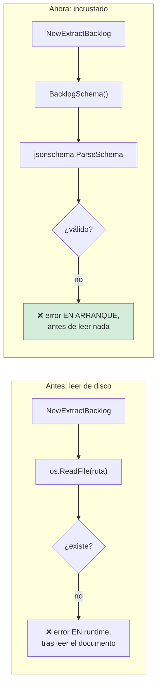

# ADR-0004 — El JSON Schema se compila dentro del binario

- **Estado**: Aceptada
- **Fecha**: 2026-10-02
- **Decide**: el equipo del proyecto
- **Afecta a**: `docs/specifications/embed.go`, `internal/application/extract_backlog.go`

## Contexto

El schema `backlog_schema.json` cumple dos papeles:

1. **Se envía al LLM** como texto literal, para que sepa qué forma tiene la
   respuesta.
2. **Se valida en local** contra la respuesta recibida.

La opción obvia es leerlo del disco en tiempo de ejecución:

```go
contenido, err := os.ReadFile("docs/specifications/backlog_schema.json")
```

Funciona mientras el usuario ejecute el binario desde la raíz del repositorio.
Las fuerzas queempsaron contra ella:

1. **El binario se distribuye solo.** El `Dockerfile` produce una imagen; la
   gente copiará el ejecutable a otra máquina. Un binario que necesita un
   fichero vecino es un binario que no funciona donde se espera.
2. **El directorio de trabajo no es predecible.** En un pipeline de CI, en cron o
   en un `PATH` global, la ruta relativa apunta a otro sitio.
3. **Un fallo de esquema debe abortar el arranque**, no aparecer en mitad de una
   extracción, después de haber leído el documento y construido el prompt.

## Decisión

Se decidió incrustar el schema en el binario con `go:embed`, y hacerlo desde el
**paquete donde vive el fichero**:

```go
package specifications

//go:embed backlog_schema.json
var schemaBacklog []byte

func BacklogSchema() []byte { return copiaDe(schemaBacklog) }
func Validar(documento any) (Resultado, error) { ... }
```

`docs/specifications/` es un paquete Go **y** la carpeta de especificaciones. No
hay dos copias de la verdad, y `go list ./...` incluye el paquete: si el JSON se
rompe, el proyecto no compila o el test falla.

## El obstáculo: `go:embed` no sube de directorio

```mermaid
flowchart TB
    subgraphTree1["Lo que se intentó"]
        T1["cmd/talkaboutthis/main.go"]
        T1 --> T2["//go:embed ../../docs/specifications/backlog_schema.json"]
        T2 --> T3["❌ go:embed no acepta<br/>rutas con '..'<br/><b>'pattern ../…: invalid pattern syntax'</b>"]
    end

    subgraph Tree2["Lo que funciona"]
        T4["docs/specifications/embed.go"]
        T5["//go:embed backlog_schema.json"]
        T6["docs/specifications/backlog_schema.json"]
        T4 --> T5 --> T6
        T6 --> T7["✅ compilado en el binario"]
    end

    classDef mal fill:#f8d7da,stroke:#dc3545
    classDef bien fill:#d4edda,stroke:#28a745
    class T3 mal
    class T7 bien
```

**`go:embed` solo puede alcanzar ficheros del propio directorio o subdirectorios
del paquete.** No hay forma de apuntar a `../../`. La regla es del compilador, no
una limitación de la versión.

### La consecuencia de diseño

El directorio de especificaciones **es** un paquete. `docs/specifications/` contiene:

```
backlog_schema.json   el dato
embed.go              la puerta de entrada: BacklogSchema(), Validar()
embed_test.go         sus tests
```

Y `docs/specifications/` aparece en `go list ./...` como un paquete más, con
cobertura propia (**75 %**) y los tests que verifica que el schema sigue siendo
JSON válido y que sus prioridades coinciden con las del dominio.

## Doble comprobación por partida



Un schema roto ahora es un **fallo de compilación o de test**, no una sorpresa a
las 14:30 con el documento ya leído.

## Alternativas consideradas

**Opción B — `go:embed` en `cmd/` con una copia del schema dentro de `cmd/`.**
Funciona técnicamente. Se descartó porque obliga a mantener **dos** ficheros
idénticos, y dos ficheros idénticos divergen. Fue el primer intento y ya
divergieron durante el desarrollo.

**Opción C — generar el schema desde los structs de Go en tiempo de
compilación.** `//go:generate`. Se descartó por complejidad: obliga a escribir un
generador, y el generador pasa a ser otro programa que puede tener bugs.

**Opción D — incrustar el schema como constante de cadena en `domain/models.go`.**
Descartado: el esquema es un **contrato de datos documentado**, pertenece a la
especificación, no al núcleo.

## Consecuencias

### Buenas

- **El binario es autosuficiente.** Se copia a cualquier sitio y funciona.
- **Un schema roto rompe el arranque**, no la ejecución.
- **Una sola copia del schema.** La de la especificación.
- **El schema es un artefacto compilado**, así que puede ir dentro de una
  variable, compararse con structs y validarse en un test.

### Malas

- **`docs/` contiene código Go**, lo que choca con la intuición de quien espera
  un directorio de solo documentación. Se acepta: el paquete es diminuto y su
  función es evidente.
- **Cambiar el schema exige recompilar.** Correcto, pero rompe cualquier
  someone's flujo que lo modificara en caliente.
- **`docs/specifications` aparece en `go list ./...`** y hay que recordar que
  tiene cobertura propia.

### Neutras

- El binario crece unos cientos de bytes.

## Verificación

| Regla | Test |
|---|---|
| El schema incrustado es JSON válido | `embed_test.go` |
| Las prioridades del schema coinciden con `domain.Priority` | `schema_sync_test.go` |
| Cambiar el schema sin actualizar el dominio rompe el build | `schema_sync_test.go` |

```bash
go test ./docs/specifications/ -v
go test ./internal/domain/ -run SchemaSync -v
```

## Referencias

- [Contrato de datos](../specs/06-contrato-de-datos.md)
- [ADR-0005 — Validador propio](0005-validador-propio.md)