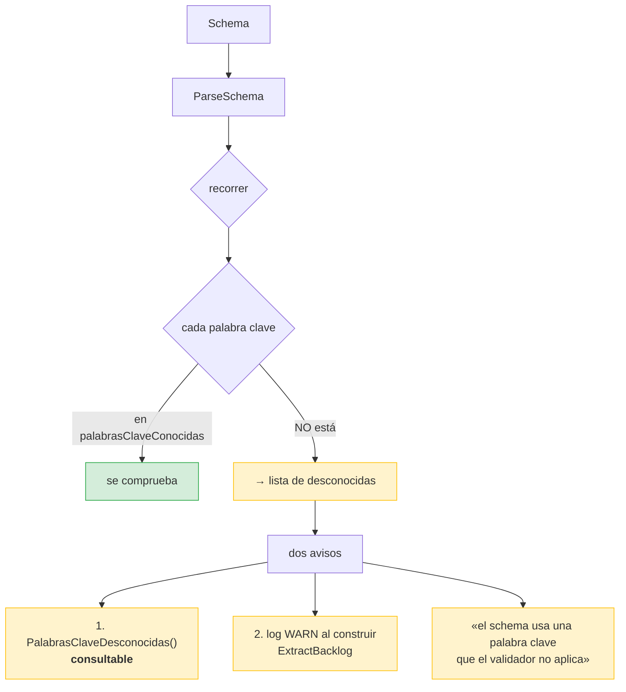
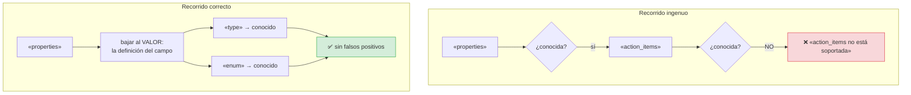

# ADR-0005 — Validador propio de JSON Schema

- **Estado**: Aceptada
- **Fecha**: 2026-10-02
- **Decide**: el equipo del proyecto
- **Afecta a**: `internal/infrastructure/jsonschema/validator.go`

## Contexto

RF-07 exige validar la respuesta del LLM contra un JSON Schema, y **reintentar con
autocorrección** si no cumple. La validación no es opcional: sin ella, el
`json.Unmarshal` al dominio aceptaría un `priority: "urgente"` y publicaría una
prioridad inventada.

RNF-01 prohíbe dependencias de terceros, así que `gojsonschema` y compañía están
fuera. Las opciones eran:

1. Escribir un validador.
2. No validar, y confiar en que el prompt baste.
3. Validar a mano solo los campos del dominio, sin schema.

La 2 era inviable: **el LLM falla**. Es la razón de existir del retry loop.

La 3 se descartó porque el schema es el **contrato con el modelo**: es lo que se le
envía en el prompt. Si el validador no es el mismo artefacto que el prompt, puede
divergir, y entonces se estaría corrigiendo al modelo con reglas que él no
conoce.

## Decisión

Se decidió escribir un validador que implemente un **subconjunto explícito** de
JSON Schema 2020-12, y —esto es lo importante— que **se declare lo que no
soporta**.

### El subconjunset soportado

| Grupo | Palabras clave |
|---|---|
| Tipo | `type` |
| Estructura | `properties`, `required`, `items`, `additionalProperties` |
| Valores | `enum` |
| Texto | `minLength`, `maxLength` |
| Números | `minimum`, `maximum` |
| Arreglos | `minItems`, `maxItems` |
| Metadatos | `$schema`, `$id`, `title`, `description` |

### La regla que hace que esto sea honesto



Una regla que no se comprueba es **peor que no tenerla**, porque aparenta existir.
Al menos así se puede decidir si endurecer el schema o aceptar que esa
validación no ocurre.

## El error que más costó: `properties`

Un recorrido ingenuo del schema reporta los **nombres de los campos** como si
fueran palabras clave no soportadas:

```json
{ "properties": { "action_items": {"type":"array"} } }
```

El recorrido plano ve `properties`, `action_items`, `type`… y acusa al schema de
usar reglas desconocidas.



**El ruido oculta las ausencias reales**, que es el único motivo por el que esa
función existe. El arreglo es distinguir dos sitios con reglas distintas:

| Sitio | Qué hay que revisar |
|---|---|
| Un nodo de esquema | Sus claves son palabras clave |
| El interior de `properties` | Sus claves son **nombres de campo**, no reglas |
| Los valores de `enum`, `required`, `description` | Datos, no reglas |

## Los mensajes de error importan

El validador no se usa solo para decir «no». Sus mensajes van al **prompt de
autocorrección** del LLM, así que tienen que ser accionables:

```mermaid
sequenceDiagram
    participant V as Validador
    participant L as LLM

    V-->>L: "action_items[2].priority:<br/>se esperaba tipo &quot;string&quot;<br/>y se recibió &quot;booleano&quot;"
    Note over L: "sabe QUÉ corregir<br/>y DÓNDE"
```

vs. `"valor inválido"`, que obliga al modelo a adivinar.

De ahí dos requisitos:

- **Rutas tipo JSON Pointer** (`action_items[2].priority`), para localizar el campo.
- **Orden determinista**: `ClavesOrdenadas()` ordena alfabéticamente, porque
  iterar un mapa de Go produce un orden **aleatorio** en cada ejecución. Un LLM que
  recibe las mismas instrucciones barajadas corrige peor.

`TestValidarEsDeterministaEnElOrdenDeLosErrores` lo comprueba 20 veces seguidas.

## Alternativas consideradas

**Opción B — `gojsonschema` (o similar).** Un motor completo, siempre al día con
la especificación. Descartada por RNF-01. Además habría dejado la validación
desacoplada del schema, que es justo lo que había que evitar.

**Opción C — no validar; confiar en `json.Unmarshal` al dominio.** Más simple, y
el dominio ya comprueba `Priority`. Se descartó porque el dominio solo detecta lo
que se le ocurre comprobar: no sabría que `meeting_summary` es obligatorio, ni que
`description` no puede estar vacía.

**Opción D — validar con reglas escritas a mano en `extract_backlog.go`.** Evitar
un paquete nuevo, pero duplicaría el schema en dos sitios que divergirían.

## Consecuencias

### Buenas

- **Una sola fuente de verdad**: el schema que se envía al modelo es el que
  valida.
- **Los mensajes son accionables**, porque están escritos para el LLM.
- **El determinismo está garantizado** y probado.
- **Sin dependencias**, y el subconjunto es pequeño y auditable.

### Malas

- **Un schema con `pattern`, `format` o `multipleOf` no se valida.** Riesgo
  asumido, mitigado con el aviso.
- **~430 líneas que mantener**, y una especificación que evoluciona.
- **Cada palabra clave nueva es trabajo**, no una bandera.

### Neutras

- Vive bajo `infrastructure/`, aunque sea lógica pura y no hable con nadie. Es la
  única excepción a «application no importa infrastructure» que existe en el
  proyecto, y es aceptable porque **no** es un adaptador: no depende de nada
  externo y es usable por cualquiera.

## Verificación

| Regla | Test |
|---|---|
| Las palabras no soportadas se detectan | `TestPalabrasClaveDesconocidasInformaLoQueNoSeAplica` |
| El aviso es deduplicado y ordenado | `TestPalabrasClaveDesconocidasDeduplicaYOrdena` |
| Un schema soportado no produce ruido | `TestPalabrasClaveDesconocidasSinReglasNoSoportadas` |
| El método no miente y no filtra el estado | `TestPalabrasClaveDesconocidasInformaLoQueNoSeAplica` |
| Los errores son deterministas | `TestValidarEsDeterministaEnElOrdenDeLosErrores` |
| Los mensajes nombran tipo esperado y recibido | `TestValidarNombraElTipoEsperadoEnLosMensajes` |
| Los nombres de campo no se acusan | implícito en el test anterior |

```bash
go test ./internal/infrastructure/jsonschema/ -v
```

> **Bug encontrado al escribir esos tests.**
> `PalabrasClaveDesconocidas()` devolvía `return nil` **siempre**, con un
> comentario que decía que se calculaba en otro sitio. Es decir: un método
> público que miente sobre su propio estado. Ahora `ParseSchema` guarda la lista
> en el `Schema` y el método la devuelve con copia defensiva.

## Referencias

- [ADR-0002 — Cero dependencias externas](0002-cero-dependencias-externas.md)
- [Flujo de extracción](../architecture/flujos/02-extraccion.md)