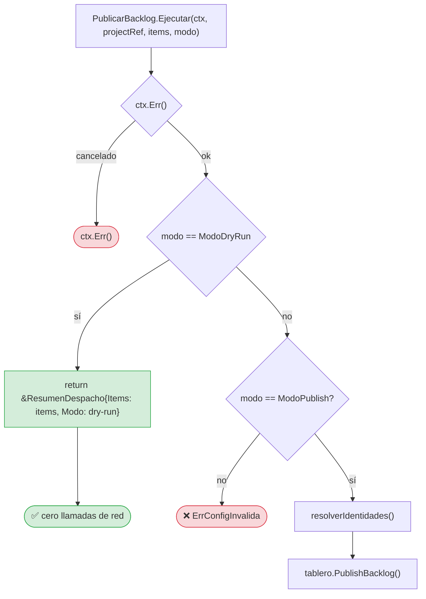
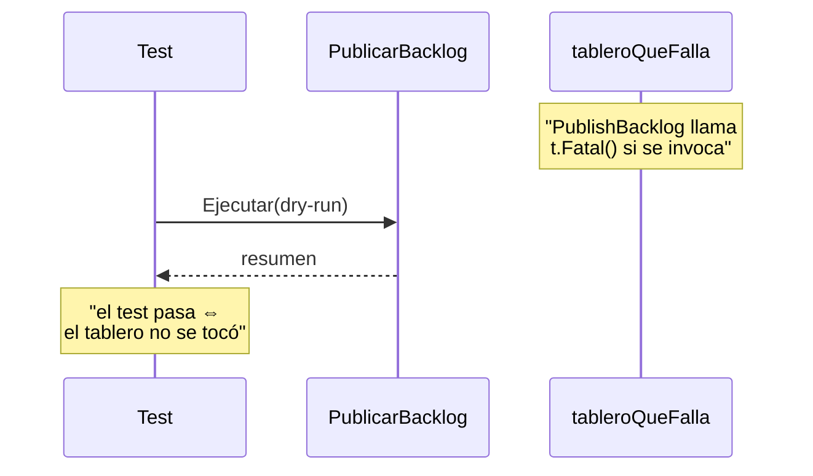
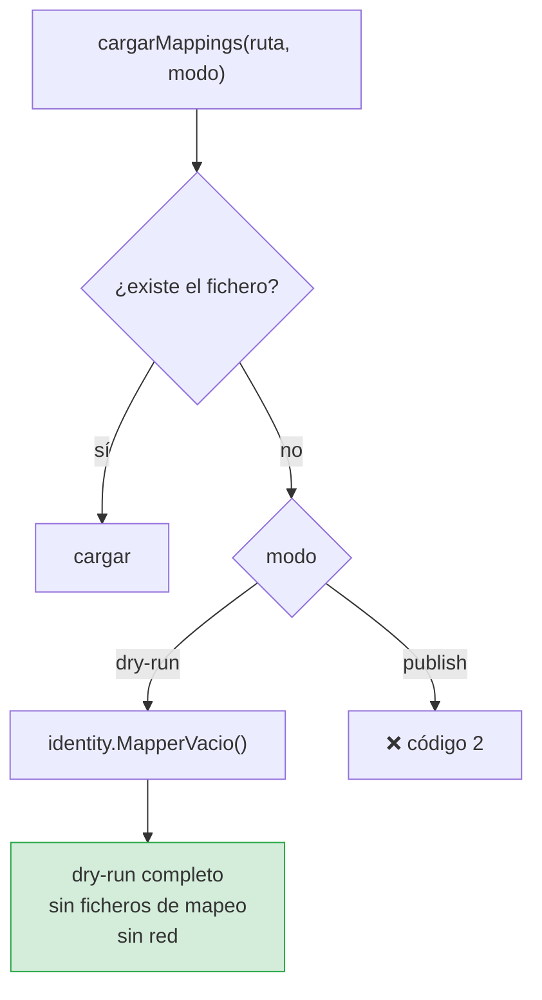
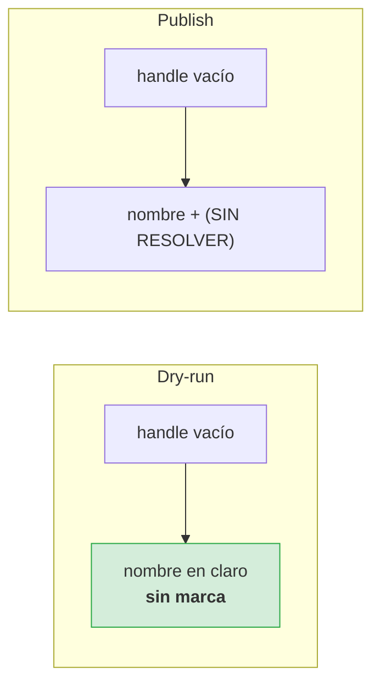

# ADR-0006 — El dry-run se decide en el caso de uso

- **Estado**: Aceptada
- **Fecha**: 2026-10-02
- **Decide**: el equipo del proyecto
- **Afecta a**: `internal/application/publish_backlog.go`, `internal/domain/ports.go`

## Contexto

RF-06 y TC-05 exigen que `--dry-run` **no realice ninguna llamada de red** y que sea
el modo **por defecto**. La razón es de seguridad, no de comodidad: publicar
veinte issues en el tablero equivocado es una operación costosa de deshacer.

La pregunta es **dónde** se comprueba el modo. Y aquí había tres fuerzas en
conflicto:

1. **La garantía tiene que ser demostrable**, no declarada. Un «no publicamos»
   en un `if` cerca de la llamada es una promesa; lo que hace falta es que un
   test lo demuestre.

2. **El modo debe atravesar la frontera de la aplicación.** Si un adaptador
   puede recibir una orden de publicar y decidir no hacerlo, entonces
   «dry-run significa cero red» deja de ser cierto para cualquier adaptador que no
   lo implemente.

3. **Las identidades también son red.** Un mapper respaldado por una API de
   organisation consulta por cada nombre. Resolver veinte identidades «solo para
   ver el resultado» ya es traffic.

La última es la que se olvidó en la primera implementación: el modo se
comprobaba justo antes de invocar el tablero, pero **después** de resolver las
identidades.

## Decisión

Se decidió que el modo se compruebe en `PublicarBacklog.Ejecutar` como **primera
instrucción útil**, antes de tocar identidades o tablero, y que se prohíba
explícitamente en el contrato del puerto que el adaptador decida por su cuenta.



Y el puerto lo dice explícitamente:

```go
// ProjectBoardAdapter define el contrato para publicar items de backlog.
//
// La implementacion NO debe dry-runear por su cuenta: esa decision ya fue
// tomada antes de invocar el puerto (RF-06).
type ProjectBoardAdapter interface { ... }
```

## Cómo se demuestra la garantía

No contando llamadas de red: **haciendo que el tablero SEA un test de red**.



Es la forma más fuerte de demostrar «no se ha llamado a algo»: que el
**llamarlo rompa el test**. No hay que contar, ni interceptar, ni fantasies con
contadores atómicos. Si algún refactor mueve la comprobación, el test falla
inmediatamente y con la pila de llamadas del adaptador.

TC-05 se cumple por construcción, no por convención.

## El dry-run también evita la tabla de mapeo



`MapperVacio()` existe para esto: devuelve un mapper que no resuelve nada. Su
documentación lleva una advertencia:

> **NO usarlo fuera de dry-run:** publicaría todo sin responsable, que es
> exactamente el fallo silencioso que TC-04 existe para evitar.

## Y no marca «SIN RESOLVER»

Un detalle de presentación que seDavía a una decisión de arquitectura:



En dry-run **no se consultan identidades**, así que el handle siempre está vacío.
Marcarlo «SIN RESOLVER» levantaba una alarma en cada fila que no correspondía: no
se intentó resolver nada, y el usuario ya sabe que no se publicó nada.

El ruido que enseña a ignorar la marca donde la marca **sí** importa.

## Alternativas consideradas

**Opción B — comprobar el modo en `cmd/`.** La CLI decide y el caso de uso no se
entera. Se descartó porque cualquier otro consumidor —un agente, un servidor—
perdería la garantía, y porque mover la comprobación no rompe ningún test.

**Opción C — pasar el modo al puerto y que el adaptador lo respete.** Se descartó:
es una promesa por adaptador, y un adaptador nuevo que la ignore destruye la
garantía en silencio. TC-07 es precisamente el caso donde eso[colgaría].

**Opción D — un `DryRunBoardAdapter` que no hace nada.** Elegante. Se descartó
porque obliga a que se construya la cadena completa de identidades igualmente, y
porque «dry-run» dejaría de ser una propiedad del proceso para ser un objeto.

## Consecuencias

### Buenas

- **TC-05 se cumple por construcción.** El modo se comprueba antes de poder hacer
  nada.
- **El test lo demuestra sin instrumentación.** Un tablero que entra en panic.
- **Cero dependencias en dry-run.** Ni `mappings.json`, ni API de identidades, ni
  tablero.
- **`cmd/` no tiene que recordar nada.** No hay forma de «olvidar» el dry-run.

### Malas

- **Identidades sin resolver en la salida.** Es correcto, pero obliga a que la
  tabla no marque, y eso no es evidente para quien lee el código por primera vez.
- **`MapperVacio()` es un mapper que no sirve para nada.** Existe por una razón
  estructural, no funcional, y su comentario tiene que(load) explicarlo.

### Neutras

- El `ExtractBacklog` **sí llama al LLM en dry-run**. Es intencional: ver el
  backlog es el objetivo del modo seco. Solo la publicación es un simulacro.

## Verificación

| Regla | Test |
|---|---|
| El tablero no se invoca en dry-run | `TestTC05LaCLICompletaNoTocaGitHub` |
| El tablero no se invoca, a nivel de caso de uso | `TestPipelineDryRunCompleto` (con `tableroQueFalla`) |
| Dry-run funciona sin `mappings.json` | `TestTablaMappingsAusenteNoBloqueaElDryRun` |
| En publish sí hace falta | `TestTablaMappingsAusenteSiFallaEnPublish` |
| El modo por defecto es dry-run | `TestDryRunEsElModoPorDefectoEnLaPractica` |
| Sin resolución de identidades en dry-run | `TestMapperVacioNoResuelveNada` |
| La tabla no marca en dry-run | `TestResponsableLegibleNoMarcaEnDryRun` |

## Referencias

- [ADR-0001 — Arquitectura hexagonal](0001-arquitectura-hexagonal.md)
- [Flujo de publicación](../architecture/flujos/04-publicacion.md)