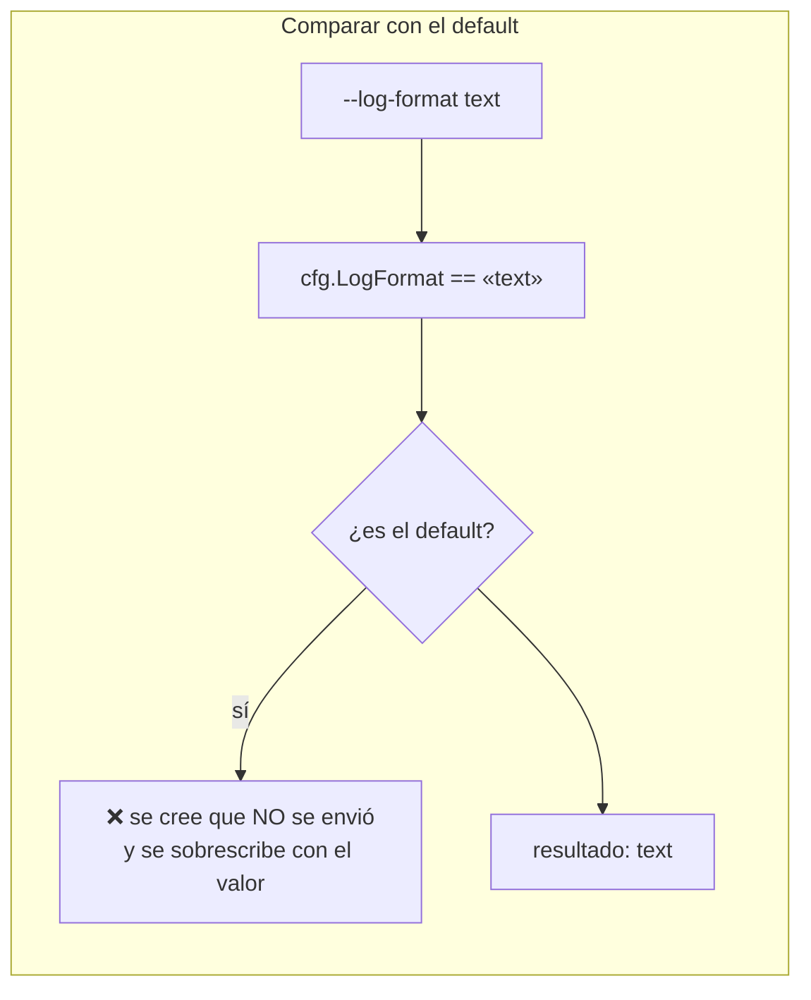
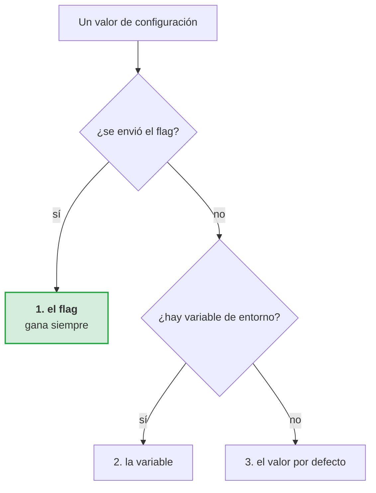
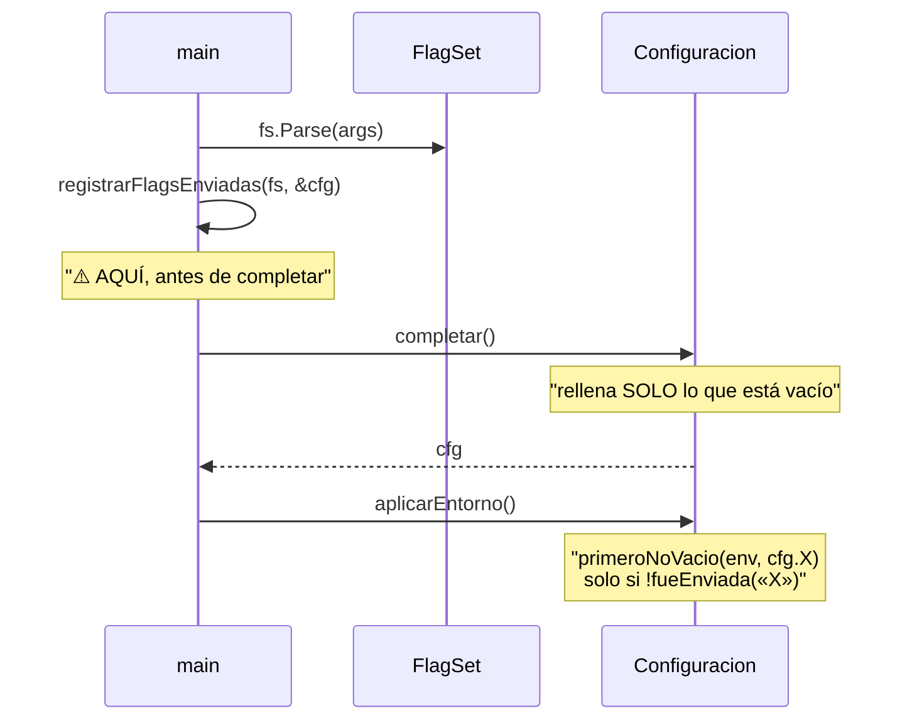

# ADR-0007 — El flag gana al entorno

- **Estado**: Aceptada
- **Fecha**: 2026-10-02
- **Decide**: el equipo del proyecto
- **Afecta a**: `cmd/talkaboutthis/config.go`

## Contexto

Cada opción de configuración tiene tres orígenes posibles: el flag de la línea de
comandos, la variable de entorno y el valor por defecto. La precedencia entre
ellos no es evidente, y las dos implementaciones «obvias» fallan.

La primera versión:

```go
// Lo que había
cfg.Owner = primeroNoVacio(os.Getenv("GITHUB_OWNER"), cfg.Owner)
```

El entorno se consultaba **primero**. Un `--owner` explícito en la línea de
comandos solo se usaba si la variable no estaba definida en la sesión de trabajo.

Y un segundo problema, menos visible:



`--log-format` **tiene como default `text`**. Escribirlo a mano era indistinguible
de no escribirlo, así que el flag no podía ganar nunca: su único valor posible no
se distinguía del default. El flag existía y era inerte.

## Decisión

Se decidió una regla simple, enunciada de forma que no admita interpretación:



> **El flag escrito en la línea de comandos gana siempre sobre cualquier valor de
> entorno.**

Y se resolvió el problema de detección con `flag.FlagSet.Visit`, que **solo**
visita las banderas explícitamente escritas:

```go
func registrarFlagsEnviadas(fs *flag.FlagSet, cfg *Configuracion) {
    envios = make(map[string]bool)
    fs.Visit(func(f *flag.Flag) { envios[f.Name] = true })
}

func fueEnviada(nombre string) bool { return envios[nombre] }
```

### El orden importa: `registrarFlagsEnviadas` antes de `completar()`



Si se registrara **después** de `completar()`, los campos ya habrían quedado rellenos con el valor por defecto, y `fueEnviada` compararía contra el default — que es exactamente el error original.
valor por defecto y `fueEnviada` compararía contra el default — que es
exactamente el error original.

## El global `envios`

```go
var envios map[string]bool
```

Es un global, y eso tiene un motivo: `flag.FlagSet.Visit` no existe como
función libre. Se reinicia en **cada** invocación de `ejecutarIngest`, porque
`main()` en un test es una función de biblioteca llamada muchas veces, y un
mapa acumulado daría resultados distintos según el orden.

## Alternativas consideradas

**Opción B — el entorno gana.** Se descartó porque es contraintuitivo: escribir
`--owner X` es la acción más explícita posible. Ignorarla porque haya una
variable en el shell es el peor comportamiento posible.

**Opción C — sin entorno, solo flags.** Se descartó porque las credenciales
(`GITHUB_TOKEN`, `OPENAI_API_KEY`) no se escriben en una línea de comandos: ahí
acaban en el historial del shell y en `ps`.

**Opción D — subcomandos separados (`talkaboutthis publish` vs `talkaboutthis
preview`).** Más limpio conceptualmente. Se descartó por no encajar con el
enunciado, que especifica `ingest --dry-run`.

## Consecuencias

### Buenas

- **El flag escrito siempre gana**, que es lo que el usuario espera.
- **Escriba lo que escriba**, el flag funciona, incluso si coincide con el default.
- **Las credenciales van por entorno** y los ajustes por flag.

### Malas

- **Un global mutable**, que es una fuente clásica de condición de carrera. Se
  mitiga reiniciándolo por invocación y no usándolo fuera de `config.go`.
- **Hay que acordarse de llamar a `registrarFlagsEnviadas` antes de `completar`.**
  Es una trampa de orden que ya mordió una vez. El comentario en el sitio lo dice.
- **`fs.Visit` no distingue `--log-format text` de `--log-format=text`.** No hace
  falta.

### Neutras

- La variable de entorno con el mismo nombre que el flag se ignora en silencio si
  el flag se envía. Es el comportamiento correcto, pero no se avisa.

## Alternativa que se descartó por error, y su corrección

| | Antes | Ahora |
|---|---|---|
| Precedencia | `primeroNoVacio(env, cfg.X)` | `primeroNoVacio(cfg.X, env)` si no se envió el flag |
| Detección | comparar con el default | `flag.FlagSet.Visit` |
| Orden | `completar()` y luego detectar | detectar **antes** de `completar()` |

## Verificación

| Regla | Test |
|---|---|
| El flag gana al entorno | `TestElFlagGanaAlEntorno` |
| Un flag con el valor del default funciona | `TestEntornoSobrescribePorDefecto` |
| El entorno se aplica si no hay flag | `TestElEntornoGanaSiNoHayFlag` |
| `envios` se reinicia entre invocaciones | cubierto por la suite completa |

```bash
go test ./cmd/talkaboutthis/ -run Precedencia -v
```

Comprobación manual:

```bash
export GITHUB_OWNER=del-entorno
talkaboutthis ingest --file x.md --owner del-flag --dry-run
# debe usar "del-flag"
```

## Referencias

- [La CLI](../architecture/cmd.md#precedencia-flag--entorno--default)
- [Variables de entorno](../specs/05-cli-y-modo-seco.md#variables-de-entorno)