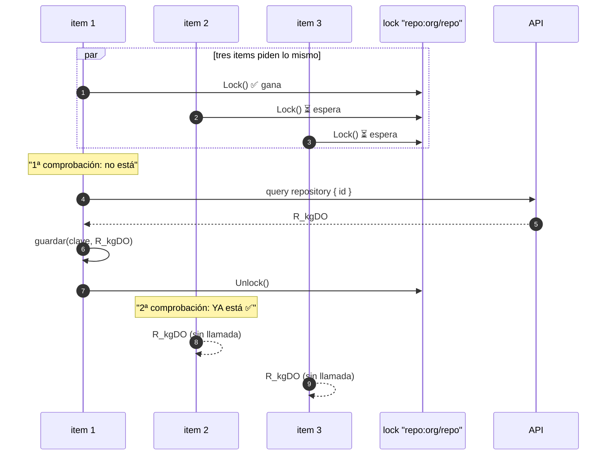
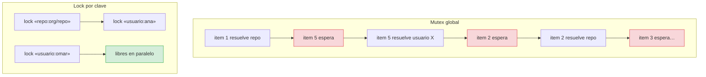
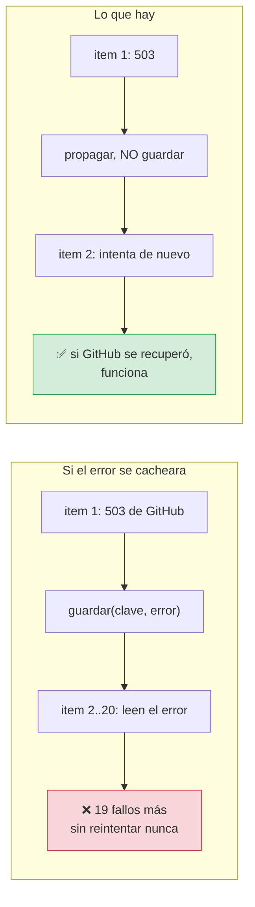

# ADR-0009 — Caché de identificadores con lock por clave

- **Estado**: Aceptada
- **Fecha**: 2026-10-02
- **Decide**: el equipo del proyecto
- **Afecta a**: `internal/infrastructure/adapters/github_graphql.go`

## Contexto

Publicar un backlog implica resolver varios identificadores que **no cambian
durante una ejecución**:

| Identificador | Cuántas veces se necesita |
|---|---|
| `node_id` del repositorio | Una por cada issue creado |
| `node_id` del tablero | Una por cada issue creado |
| `node_id` de cada responsable | Una por cada asignación |

Con 20 items, son 20 búsquedas del **mismo** `node_id` del repositorio. Con 5
responsables distintos, 20 consultas de usuario. Son ~45 llamadas que devuelven
siempre lo mismo.

Las fuerzas en conflicto:

1. **La API de GitHub tiene límite de peticiones.** Repetir 20 veces lo mismo no
   solo es lento: es cuota desperdiciada, y una sesión que llega al límite por
   descuido falla en sitios que no explica.
2. **Los items se publican en paralelo** (hasta 4). Una caché con mutex global
   serializaría las resoluciones y tiraría el paralelismo.
3. **Un fallo no debe quedar cacheado.** Un 503 de GitHub es transitorio;
   cachearlo convertiría un fallo de red en un fallo permanente durante toda la
   vida del proceso.

## Decisión

Se decidió una caché con **un lock por clave** y **doble comprobación**.

```go
type cacheIDs struct {
    mu      sync.Mutex
    valores map[string]string
    locks   map[string]*sync.Mutex
}

func (g *GitHubGraphQL) resolverNodeID(ctx context.Context, clave string, resolver func(context.Context) (string, error)) (string, error) {
    // 1ª comprobación: sin bloquear
    if valor, existe := g.cache.obtener(clave); existe {
        return valor, nil
    }

    // Serializar SOLO quien pide esta clave
    lock := g.cache.lockDe(clave)
    lock.Lock()
    defer lock.Unlock()

    // 2ª comprobación: otro pudo resolverla mientras esperábamos
    if valor, existe := g.cache.obtener(clave); existe {
        return valor, nil
    }

    valor, err := resolver(ctx)
    if err != nil {
        return "", err          // ← el error NO se cachea
    }

    g.cache.guardar(clave, valor)
    return valor, nil
}
```

## Por qué la doble comprobación



**Sin la segunda comprobación**, los tres items esperarían el lock y luego
lanzarían su propia consulta: tres llamadas idénticas a la API. Es el
**cache stampede**, y es precisamente lo que la caché debía evitar.

## Por qué un lock por clave y no un mutex global



Con un mutex global, resolver `usuario:ana` bloquearía la resolución del
repositorio. Funciona —y es correcto— pero **tarda más**: cada item espera a
todos los demás. El lock por clave serializa solo a quienes piden **lo mismo**.

## Y el error no se cachea



Con la caché, el usuario tendría que relanzar la herramienta para volver a
intentar. La variables de entorno tampoco ayudan: es una variable de proceso.

Además, `obtener` trata **el valor vacío como ausente**:

```go
func (c *cacheIDs) obtener(clave string) (string, bool) {
    valor, existe := c.valores[clave]
    return valor, existe && valor != ""
}
```

Porque cachear `""` haría que todos los items siguientes creyeran tener el
identificador y no consultaran nunca, reproduciendo el fallo que la caché
pretendía evitar.

## Alternativas consideradas

**Opción B — sin caché.** 20 llamadas por ejecución. Se descartó: es cuota
desperdiciada y riesgo de rate limit.

**Opción C — `sync.Map`.** Sustituye el mapa por un `sync.Map`. Se descartó
porque no resuelve el stampede: `LoadOrStore` solo evita el `Store` duplicado,
**no** el trabajo duplicado. Las dos goroutines ejecutan `resolver()` antes de
llamar a `LoadOrStore`.

**Opción D — `singleflight`.** Es la solución canónica al stampede. Se descartó
por RNF-01: `golang.org/x/sync/singleflight` es externo. El patrón completo son
unas 25 líneas.

## Consecuencias

### Buenas

- **Una sola consulta por identificador**, aunque se publiquen 500 items.
- **El paralelismo entre claves distintas se conserva.**
- **Un error transitorio no se convierte en permanente.**
- **~25 líneas** en lugar de una dependencia.

### Malas

- **Un `sync.Mutex` por clave, para siempre.** El mapa `locks` no crece, porque
  las claves son una combinación fija de owner/repo/proyecto y una lista corta de
  usuarios. Si algún día las claves fueran ilimitadas, habría que limpiar los
  locks huérfanos.
- **El patrón es sutil.** Sin la doble comprobación parece funcionar y falla solo
  bajo concurrencia, que es cuando más difícil se reproduce.
- **Reimplementar `singleflight` en vez de usar la estándar** es deuda que se
  asume conscientemente.

## Verificación

| Regla | Test |
|---|---|
| N resolvers simultáneos → una consulta | `TestResolverNodeIDEvitaElStampede` (32 goroutines) |
| La caché sirve sin volver a resolver | `TestResolverNodeIDSirveDesdeCacheSinVolverALaRed` |
| El error no se cachea | `TestResolverNodeIDPropagaElErrorYNoLoCachea` |
| Claves distintas no se bloquean entre sí | `TestCacheIDsSeparaLasClaves` |
| El valor vacío no se considera cacheado | `TestCacheIDsIgnoraValoresVacios` |
| Cacheo en el flujo completo | `TestCacheDeIdentificadores` |

> **Verificado por inyección de regresión.** `TestResolverNodeIDEvitaElStampede`
> lanza 32 goroutines y **falla** si el resolutor se ejecuta más de una vez.
> Quitando la doble comprobación, el test falla de inmediato con
> «se ejecuto el resolutor 32 veces, se esperaba 1 (cache stampede)».

## Referencias

- [Flujo de publicación](../architecture/flujos/04-publicacion.md)
- [Concurrencia](../criticas/concurrencia.md)