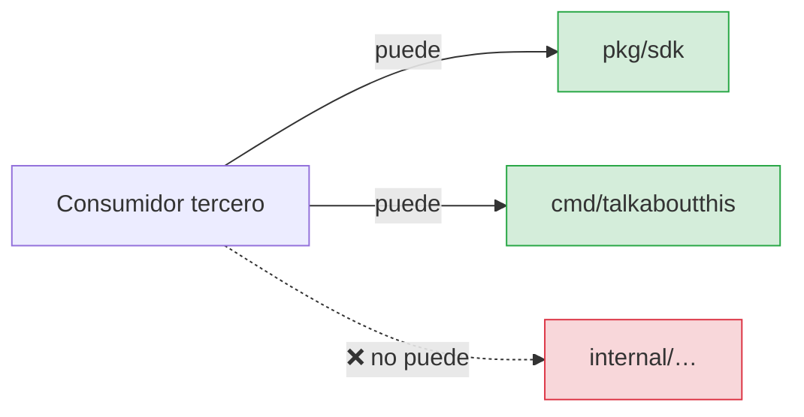
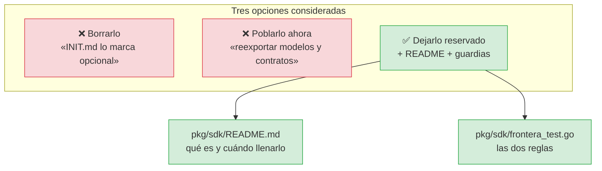
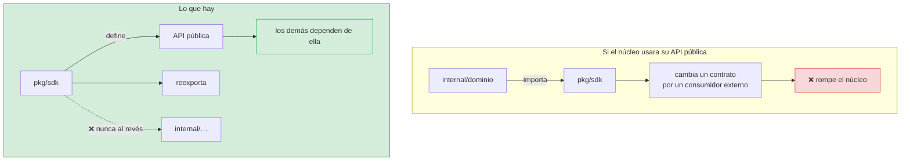

# ADR-0010 — `pkg/sdk` queda reservado, sin poblar

- **Estado**: Aceptada
- **Fecha**: 2026-10-02
- **Decide**: el equipo del proyecto
- **Afecta a**: `pkg/sdk/`, `internal/domain/architecture_test.go`

## Contexto

`INIT.md` §7 incluye en el árbol de referencia:

```
├── pkg/                       # Librerías reutilizables por terceros (opcional)
│   └── sdk/
```

Marcado como **opcional**. Desde el commit inicial (`dc63eb5`, «scaffold package
directory layout per hexagonal architecture»), el directorio existe con un
`.gitkeep` y ningún fichero Go.

Al revisar el proyecto apareció la pregunta: **¿está muerto o es una reserva?**

### La razón por la que tendría sentido

En Go, `internal/` es **invisible para cualquiera fuera del módulo**. Hoy, un
tercero que quiera reusar los modelos, el contrato de tablero o el cliente de
GitHub **no puede importarlos**: tendría que copiar el código o depender del
ejecutable. `pkg/sdk` es la capa que resolvería eso.



### Y una regla que ya existía

`internal/domain/architecture_test.go` incluye `talkaboutthis/pkg/sdk` en
`modulosProhibidos`:

```go
var modulosProhibidos = []string{
	"talkaboutthis/internal/infrastructure",
	"talkaboutthis/internal/application",
	"talkaboutthis/pkg/sdk",   // ← aquí
	"talkaboutthis/cmd",
}
```

Eso no es un uso: es una **guarda preventiva**, ya escrita, que se activaría si
alguien publicara el SDK y el dominio empezara a importarlo.

## Decisión

Se decidió **conservar la reserva vacía, documentarla y vigilar sus dos reglas
específicas**, sin poblarla.



## Las dos reglas que se añadieron

### 1. `pkg/sdk` no puede importar `internal/` ni `cmd/`

`pkg/` es la **superficie pública**: es lo único que alguien puede importar desde
fuera del repositorio. Si un paquete de `pkg/` dependiera de `internal/`, no sería
utilizable fuera, y el directorio existiría sin cumplir su propósito.

```mermaid
flowchart LR
    T["Consumidor externo"] --> SDK["pkg/sdk"]
    SDK -.->|"❌| INT["internal/…"]

    Note1["porque internal/ es invisible<br/>para fuera del módulo:<br/>el SDK no compilaría"]
```

Vigilada por `TestPkgSdkNoDependeDeInternal`. Hoy se salta: no hay código que
vigilar. En cuanto se escriba el primer `.go`, empezará a comprobar.

### 2. `internal/` no puede importar `pkg/sdk`

La regla recíproca, y la más fácil de violar por accidente. El núcleo **no
depende de su propia API pública**: si lo hiciera, la superficie que se ofrece a
terceros empezaría a dictar el diseño interno, y cualquier cambio pensado para un
consumidor externo rompería el núcleo.



Vigilada por `TestPkgSdkNoEsImportadoPorInternal`, que recorre los ~50 `.go` de
`internal/`.

### La tercera regla ya existía

`internal/domain` tiene prohibido importar `pkg/sdk`, además de `infrastructure` y
`application`. Es la guarda de RNF-01. Las tres juntas cierran la frontera.

## Alternativas consideradas

**Opción B — borrarlo.** Coherente con que `INIT.md` lo marca opcional, y menos
directorio vacío que confundir a nadie. Se descartó porque el coste es cero
mientras no haya código, y el valor es alto cuando lo haya: cuando aparezca el
primer consumidor externo, tener el sitio y las reglas listas evita Exactly el
debate que se está teniendo hoy.

**Opción C — poblarlo ahora.** Reexportar los contratos y modelos de
`internal/domain` para que un tercero pueda usarlos hoy. Se descartó por la razón
que hay que decir con todas sus letras:

> Añadir una superficie pública es una **deuda permanente**. Cada cambio de un
> contrato se convierte en un cambio de API, con su deprecación, su documentación y
> su compatibilidad. **No se paga por adelantado «porque puede que haga falta».**

Además, el problema concreto seguiría sin resolverse: para que un tercero pueda
usar `domain.ActionItem` necesitaría el tipo, y **ese tipo vive en `internal/`**.
Reexportar un tipo de un paquete `internal` desde uno público **no lo hace
importable**: el compilador comprueba el `internal/` en el camino de importación
y lo rechaza. Un SDK real exigiría **mover** los contratos a `pkg/`, lo que rompe
la guarda de RNF-01 y obliga a reevaluar la arquitectura entera.

Eso no se hace en un rato, y no se debe hacer sin que alguien lo pida.

## Consecuencias

### Buenas

- **Una reserva con reglas ya escritas.** Quien la llene dentro de seis meses no
  tendrá que inventar la frontera.
- **Cero coste.** Un directorio vacío no compila, no pesa y no falla.
- **La opción sigue disponible.** Cuando haya demanda, se llena.
- **Tres guardas activas** sobre la frontera, no una.

### Malas

- **Un directorio vacío durante un tiempo indeterminado** es una cosa que hay que
  explicar. De ahí el `README.md`.
- **`pkg/sdk` aparece en `go list ./...`** desde que se añadió el fichero de test.
  Es un paquete sin código de producción, lo cual puede confundir a alguien que
  lo busque con `go doc`.
- **Las reglas no se ejecutan de verdad** hasta que haya código: `TestPkgSdkNoDependeDeInternal`
  se salta hoy.

### Neutras

- `.gitkeep` sigue ahí. Es innecesario (el directorio ya existe por el fichero de
  test), pero inofensivo.

## Verificación

```bash
go test ./pkg/... -v
```

| Regla | Test |
|---|---|
| `pkg/sdk` no depende de `internal/` | `TestPkgSdkNoDependeDeInternal` |
| `internal/` no depende de `pkg/sdk` | `TestPkgSdkNoEsImportadoPorInternal` |
| La reserva existe | `TestLaReservaExiste` |
| El dominio no importa `pkg/sdk` | `TestDominioNoImportaInfrastructure` |

`TestLaReservaExiste` no estrivial: si alguien borrara el directorio, la regla 1
dejaría de comprobar algo —no habría nada que violar— y el test 1 pasaría.

## Condiciones para revisitar

La reserva se llena cuando ocurra **una** de estas:

1. Un segundo consumidor existe y no vive en este repositorio.
2. El proyecto se publica como módulo y alguien pregunta por los contratos.
3. Aparece un `JiraAdapter` externo que solo necesita los tipos.

Ninguna ha ocurrido. Revisitar sin una de estas sería llenar la API pública por
inercia.

## Referencias

- [`pkg/sdk/README.md`](../../pkg/sdk/README.md) — la versión para quien llega aquí
- [ADR-0001 — Arquitectura hexagonal](0001-arquitectura-hexagonal.md)
- [`docs/architecture/capas.md`](../architecture/capas.md) — reglas de dependencia