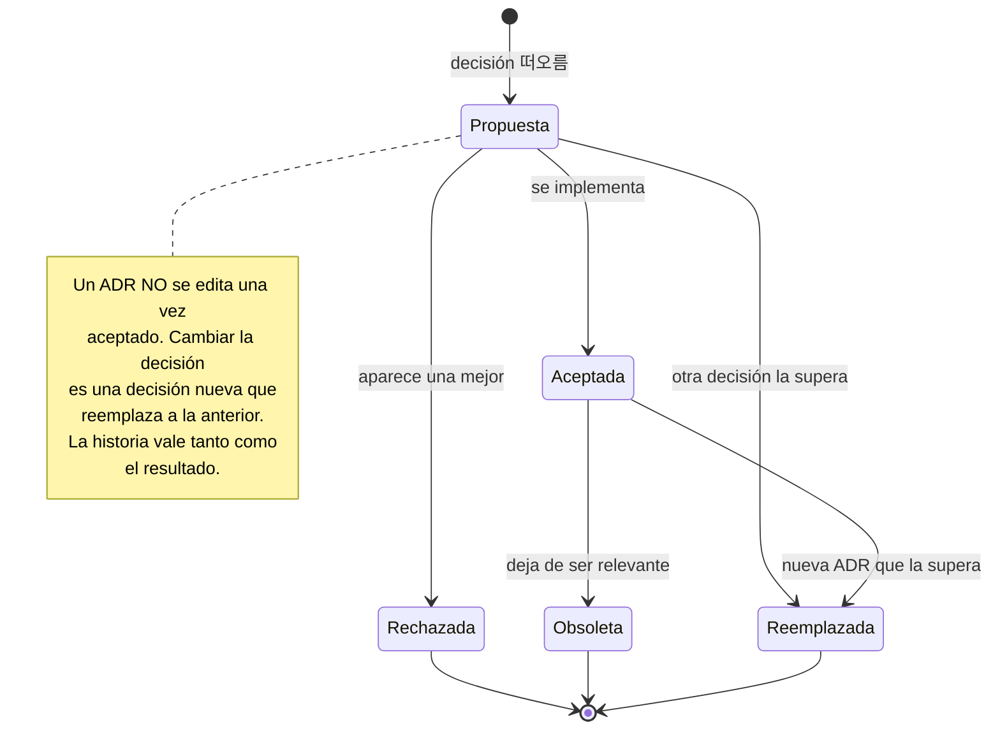
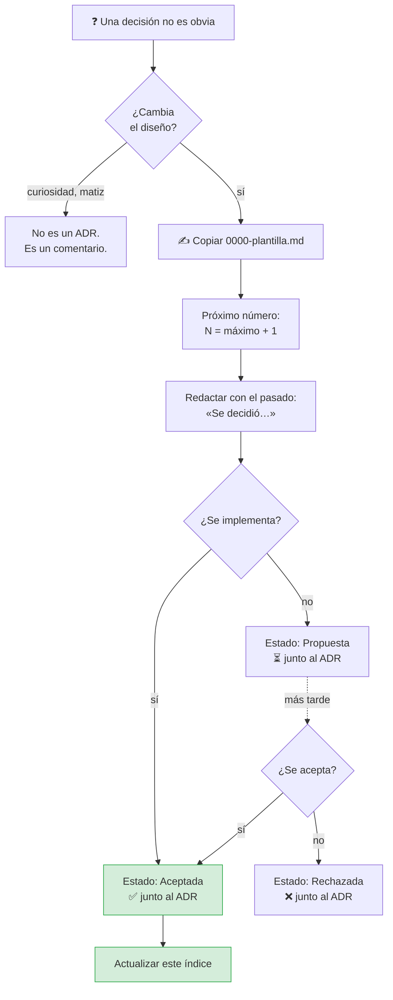
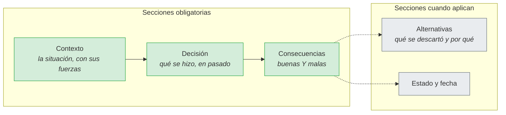

# Architecture Decision Records

Registro de **decisiones**, no de hechos. Un ADR captura el *por qué* en el
momento en que se tomó, con sus alternativas y sus consecuencias. Sin eso, dentro
de seis meses el código dice *qué* se hace y nadie sabe si *por qué* era
obligatorio hacerlo así.

## Por qué este proyecto los necesita

Nueve de las decisiones de este proyecto no son obvias. Un lector vería el
código y pensaría «esto se podría hacer más simple»:

- ¿Por qué **cero dependencias** externas, pagando un lector de DOCX propio?
- ¿Por qué `application` declara una interfaz que ya existe en `infrastructure`?
- ¿Por qué el schema se compila dentro del binario?
- ¿Por qué el flag gana al entorno, y no al revés?
- ¿Por qué existe un directorio vacío llamado `pkg/sdk`?

Sin registro, la respuesta es «no sé». Con registro, es
[ADR-0002](0002-cero-dependencias-externas.md) y son 15 minutos de lectura.

## Índice

### Fundamentos

| # | Decisión | Estado |
|---|---|---|
| [0001](0001-arquitectura-hexagonal.md) | Arquitectura hexagonal con dominio puro | Aceptada |
| [0002](0002-cero-dependencias-externas.md) | Cero dependencias externas | Aceptada |
| [0003](0003-puertos-en-el-nucleo.md) | Los puertos se declaran en el núcleo | Aceptada |

### Decisiones técnicas

| # | Decisión | Estado |
|---|---|---|
| [0004](0004-embed-del-schema.md) | El JSON Schema se compila dentro del binario | Aceptada |
| [0005](0005-validador-propio.md) | Validador propio de JSON Schema | Aceptada |
| [0006](0006-dry-run-por-defecto.md) | El dry-run se decide en el caso de uso | Aceptada |
| [0007](0007-precedencia-flag-sobre-entorno.md) | El flag gana al entorno | Aceptada |
| [0008](0008-guardas-con-go-parser.md) | Guardas arquitectónicas con `go/parser` | Aceptada |

### Frontera y escalado

| # | Decisión | Estado |
|---|---|---|
| [0009](0009-cache-con-lock-por-clave.md) | Caché con lock por clave, no un mutex global | Aceptada |
| [0010](0010-sdk-publico-en-pkg.md) | `pkg/sdk` queda reservado, sin poblar | Aceptada |

## Estados

En este repositorio **todos están aceptados**, porque la implementación ya existe.
Los rechazados también se documentarían, y con más detalle: es donde está el
razonamiento de lo que se descartó.

## Proceso

## Reglas de redacción

**Redactar en pasado y en primera persona del plural.** «Se decidió usar…», no
«Se debe usar…». El modo imperativo convierte el ADR en una instrucción y borra
el contexto de la negociación.

**Un ADR, una decisión.** Si hacen falta dos, son dos ADR. Uno con dos
decisiones tiene el doble de probabilidad de quedar medio reemplazado.

**Escribir las alternativas de verdad.** La alternativa descartada es la parte más
útil del documento: es lo que evita que alguien vuelva a proponer lo mismo dentro
de un año, y lo que explica por qué el código tiene esa forma rara.

**Escribir las consecuencias malas.** Un ADR con solo beneficios no es una
decisión, es propaganda. La sección de consecuencias es la que se consulta cuando
algo sale mal.

**No editar un ADR aceptado.** Si la decisión cambia, se escribe otro que lo
reemplaza y se marca el primero. La cadena de razonamiento tiene más valor que la
sentencia.

## Formato de un ADR

## Plantilla

[0000-plantilla.md](0000-plantilla.md)

## Documentos relacionados

- [`docs/architecture/`](../architecture/README.md) — cómo está construido hoy.
- [`docs/specs/`](../specs/) — qué debe hacer.
- [`AGENTS.md`](../../AGENTS.md) — reglas operativas para agentes.
- [`INIT.md`](../../INIT.md) — la especificación original.