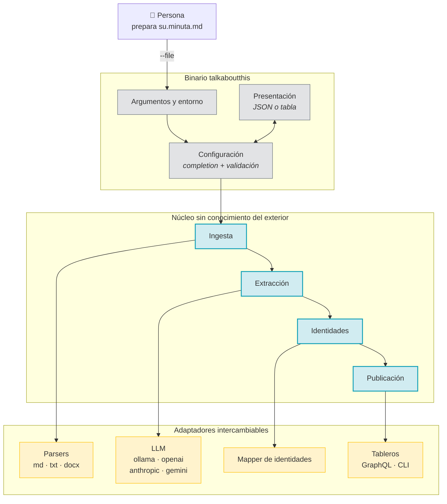
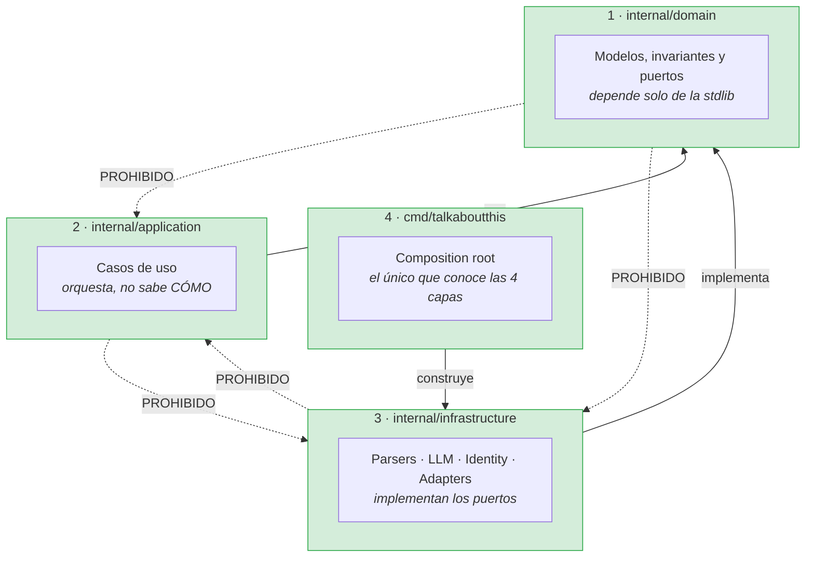

# Arquitectura de TalkAboutThis

Este directorio describe **cómo está construido el sistema**: qué hace cada
capa, qué depende de qué, cómo se modela el dominio y cómo fluye una ejecución
de principio a fin.

## Índice

| Documento | Contenido |
|---|---|
| [capas.md](capas.md) | Las cuatro capas y las reglas de dependencia |
| [domain.md](domain.md) | El núcleo: modelos, invariantes y puertos |
| [application.md](application.md) | Casos de uso y orquestación |
| [infrastructure.md](infrastructure.md) | Adaptadores concretos |
| [cmd.md](cmd.md) | La CLI, el *composition root* |
| [flujos/00-vision-general.md](flujos/00-vision-general.md) | El recorrido completo, de la invocación al código de salida |
| [flujos/01-ingesta.md](flujos/01-ingesta.md) | Lectura y conversión de la transcripción |
| [flujos/02-extraccion.md](flujos/02-extraccion.md) | Retry loop con autocorrección |
| [flujos/03-identidades.md](flujos/03-identidades.md) | De «Omar Hernández» a `@omarhernan` |
| [flujos/04-publicacion.md](flujos/04-publicacion.md) | Mutations GraphQL y concurrencia |
| [flujos/05-errores-y-codigos.md](flujos/05-errores-y-codigos.md) | Traducción de fallo a código de salida |

## Vista de contexto

## La idea en una frase

> El **núcleo no sabe qué es un archivo, ni un modelo de lenguaje, ni GitHub.**
> Solo sabe qué es una transcripción, un backlog y una publicación.

Todo lo demás son adaptadores que se enchufan desde un único sitio.

## Las cuatro capas

Las flechas punteadas son **prohibiciones**, y no son convenciones: están
vigiladas por tests que fallan si alguien las cruza.

| Prohibición | Test que la vigila |
|---|---|
| `domain` → `infrastructure`, `application`, `cmd`, `pkg/sdk` | `internal/domain/architecture_test.go` |
| `domain` → `net/http`, `net/url`, `os/exec` | `internal/domain/architecture_test.go` |
| `domain` → dependencias de terceros | `internal/domain/architecture_test.go` |
| `pkg/sdk` → `internal/` | `pkg/sdk/frontera_test.go` |
| `internal/` → `pkg/sdk` | `pkg/sdk/frontera_test.go` |

## Cero dependencias externas

`go.mod` no tiene un solo `require`. Todo sale de la biblioteca estándar:

| Necesidad | En vez de | Solución |
|---|---|---|
| Leer `.docx` | `unioffice`, `docx` | `archive/zip` + `encoding/xml` |
| Validar JSON Schema | `gojsonschema` | `internal/infrastructure/jsonschema` |
| Cliente HTTP con reintentos | `resty`, `retryablehttp` | `internal/infrastructure/llm/client.go` |
| GraphQL | `shurcooL/graphql` | Peticiones `POST` a mano sobre `net/http` |
| Logging | `zap`, `zerolog` | `log/slog` |

Motivo y consecuencias en [ADR-0002](../adr/0002-cero-dependencias-externas.md).

## Invariantes del dominio

El núcleo garantiza, y sus tests comprueban (`100 %` de cobertura):

1. Una `Priority` solo puede ser `HIGH`, `MEDIUM` o `LOW`.
2. Un `ActionItem` tiene título, descripción y responsable no vacíos.
3. Un `Transcript` vacío es un error: se detecta **antes** de gastar una
   llamada al LLM.
4. El esquema JSON y los structs Go no pueden divergir: un test los compara.
5. Los identificadores de responsable se guardan **sin `@`**.

## Documentos relacionados

- [`INIT.md`](../../INIT.md) — especificación original (RF, RNF, TC). Fuente de verdad.
- [`AGENTS.md`](../../AGENTS.md) — contrato operativo para agentes.
- [Vocabulario y glosario](domain.md#vocabulario) — los términos del dominio.
- [Trazabilidad requisitos ↔ tests](../specs/07-trazabilidad.md) — qué cubre qué.