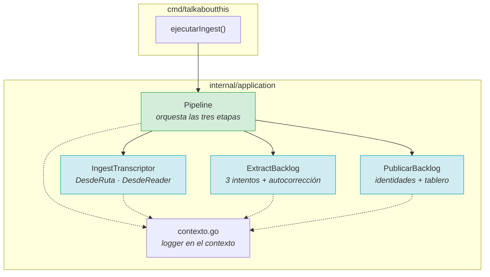
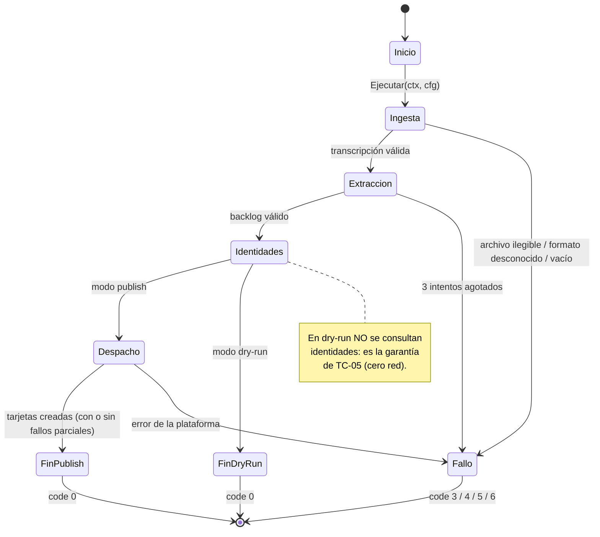
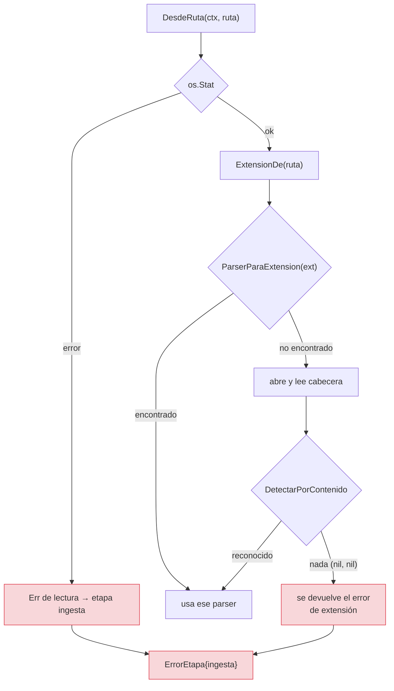
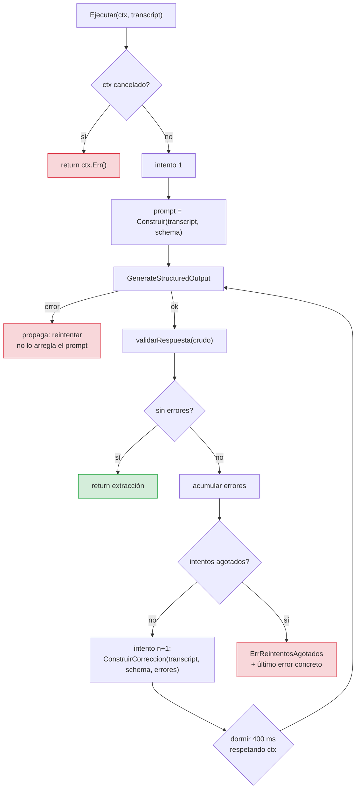
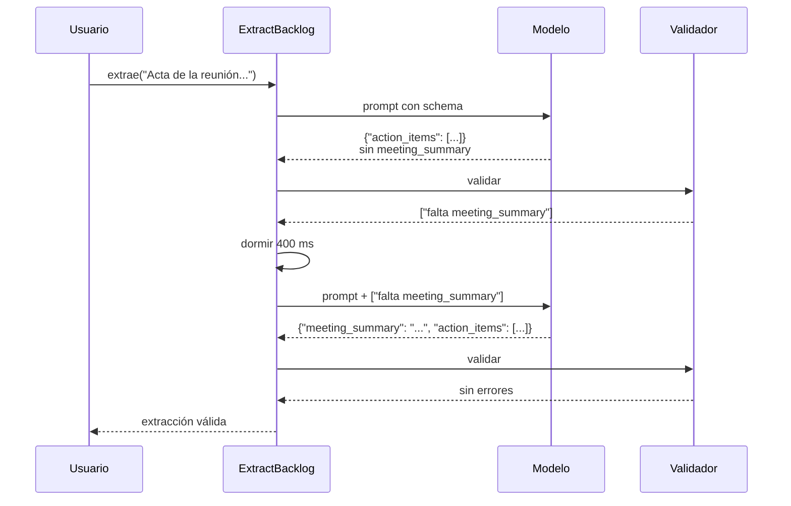
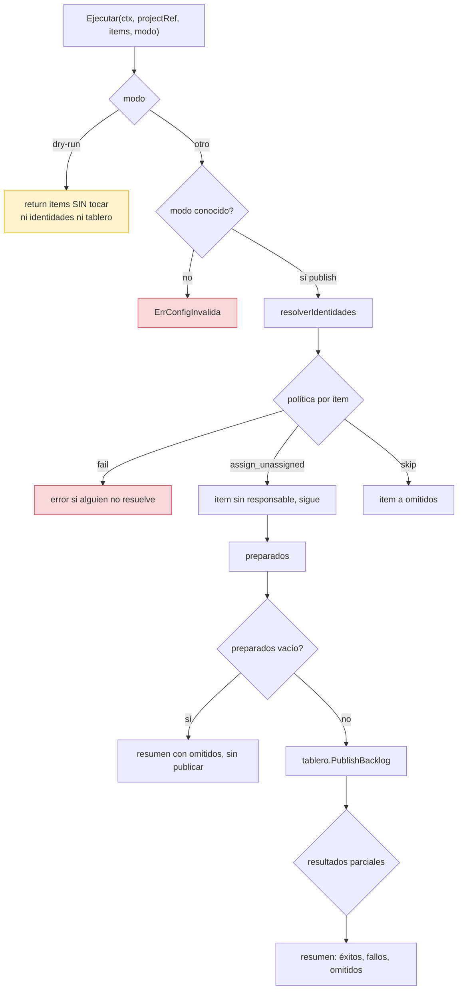
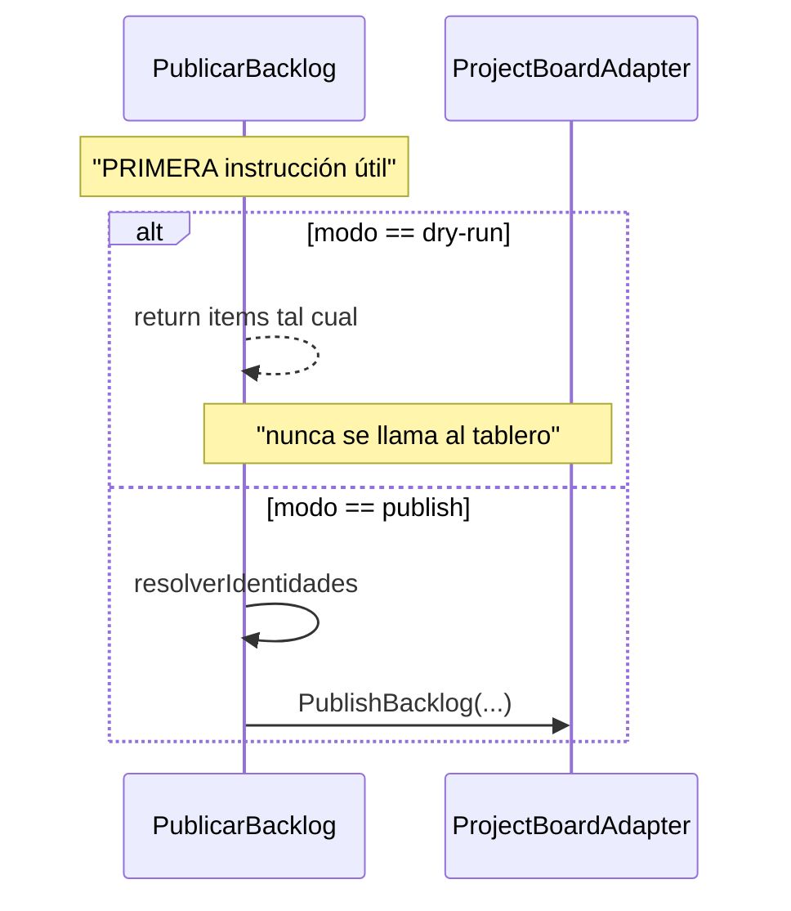
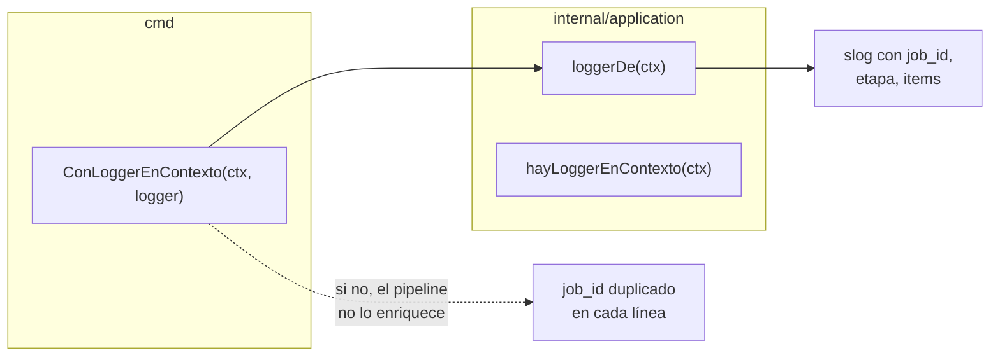

# `internal/application` — los casos de uso

La capa que **sabe el QUÉ** y no sabe el CÓMO. Orquesta; no implementa.

**Cobertura: 96,4 %.**

## Los tres casos de uso y el pipeline



`Pipeline.Ejecutar` es el **único** sitio donde importa los tres casos de uso.
Por eso el orden de las etapas y el punto de fallo de cada una se prueban sin
lanzar un proceso, y por eso `cmd/` no tiene lógica de orquestación que probar.

## `Pipeline`

```go
type PipelineEtapa string

const (
    EtapaIngesta    PipelineEtapa = "ingesta"
    EtapaExtraccion PipelineEtapa = "extraccion"
    EtapaDespacho   PipelineEtapa = "despacho"
)
```

### Máquina de estados



`EtapasCompletadas()` devuelve las etapas que se pasaron con éxito, y es lo que
la salida JSON reporta como `etapas`. Con eso, un fallo en la tercera etapa
distingue "no leyó el archivo" de "el LLM no collaboró".

### `ErrorEtapa`

```go
type ErrorEtapa struct {
    Etapa PipelineEtapa
    Err   error
}

func (e *ErrorEtapa) Unwrap() error { return e.Err }
```

`Unwrap` es lo que hace útil el tipo. Sin él, `errors.Is(err,
domain.ErrPublicacionFallida)` sería `false` dentro del envoltorio, y la CLI no
podría distinguir "el tablero devolvió 422" de "el token caducó".

Dos funciones de consulta, usadas por la CLI para elegir el código de salida:

```go
func EsFalloDePublicacion(err error) bool
func EtapaDelError(err error) PipelineEtapa
```

Ambas toleran `nil` y errores ajenos: devuelven `false` y `""` respectivamente.
La CLI las llama con errores de configuración, que no llevan etapa.

## `IngestTranscriptor`

Dos puntos de entrada, porque son problemas distintos:

| Método | Quién es dueño del archivo | Contexto |
|---|---|---|
| `DesdeRuta(ctx, ruta)` | El caso de uso: `defer f.Close()` | Ruta real |
| `DesdeReader(ctx, r)` | El llamante | Cualquier fuente |

`DesdeRuta` cierra el archivo **inmediatamente** después de abrirlo, no al
terminar el proceso. Procesar cientos de documentos sin cerrarlos agota los
descriptores del proceso, y el fallo aparece en un archivo *distinto* al que lo
provocó.

### Detección: extensión primero, contenido después



El orden importa: **la extensión válida gana**. Si se invirtiera y la detección
por contenido se ejecutara siempre primero, un `.txt` que empiece por
`PK\x03\x04` se interpretaría como `.docx`. La detección por contenido existe
para cuando la extensión **miente**, no para competir con ella.

`DetectarPorContenido` devuelve `(nil, nil)` cuando nada encaja, y eso **no** es
un error: significa "prueba con la extensión". El error real es "la extensión no
la conozco tampoco".

## `ExtractBacklog`

El corazón del retry loop con autocorrección.



### Tres reglas de este bucle

**1. Un error del proveedor no se reintenta.** Si la red cayó o la credencial es
inválida, repetir la misma llamada dará el mismo error. Se propaga de inmediato y
lo reintenta la política de red del propio cliente HTTP, que sí sabe distinguir
un 503 de un 401.

**2. Los errores se acumulan, no se sustituyen.** Un reintento puede corregir
varios problemas de golpe, así que el prompt lleva la lista completa de lo que
falló, no solo el último.

**3. La espera entre intentos no es decorativa.** La mayoría de los fallos de
formato son transitorios: el mismo prompt con el error adjunto produce una
respuesta distinta en el siguiente muestreo. Reiniciar el sampling **es** parte
del mecanismo de corrección.



### Las tres capas de validación

| Capa | Qué hace | Qué detecta |
|---|---|---|
| 1 | `jsonschema.Validar` | Tipos, campos obligatorios, longitudes, enumeraciones |
| 2 | `normalizarEnums` | `"high"` en vez de `"HIGH"` — el LLM no siempre recuerda las mayúsculas |
| 3 | `json.Unmarshal` al dominio | Invariantes de Go que el schema no puede expresar |

**La normalización es una decisión deliberada.** Solo actúa sobre lo que el
schema declara como `enum`, y solo convierte mayúsculas/minúsculas. Un
`"urgente"` se sigue rechazando: inventar valores sería hacer que el sistema
aceptase prioridades que nadie pidió.

El motivo es concreto y frecuente: el error más común de un LLM con salida
estructurada es el detalle de las mayúsculas. Gastar los tres reintentos en eso
es absurdo.

> Hay un segundo bug escondido aquí: la capa 3 deserializaba del documento
> **crudo**, no del ya normalizado, de modo que normalizar no arreglaba nada. Se
> descubrió al arreglar el primero.

## `PublicarBacklog`



### El orden dry-run / publish



El modo se comprueba **antes de tocar identidades**. Es la diferencia entre «no
se resuelve nada» y «se resuelve todo y luego no se publica», y la segunda
haría llamadas de red en un modo que promete cero red.

**Cómo se demuestra:** `tableroQueFalla` es un adaptador cuyo `PublishBacklog`
llama a `t.Fatal`. Si el dry-run lo tocara, el test fallaría con la pila dentro
del adaptador. No hace falta contar llamadas de red: basta con que la más
perjudicial de todas tumbe el test.

### Fallo parcial ≠ error

Si se crean tres de cinco tarjetas, `PublicarBacklog` **no devuelve error**:
devuelve un resumen con `éxitos: 3, fallos: 2`. Devolver error haría que el
usuario creyera que no se publicó nada, cuando cinco tarjetas existen.

## `contexto.go` — el logger en el contexto



Tres reglas:

1. **El pipeline no enriquece el logger.** Si lo hiciera, y la CLI ya lo hubiera
   hecho, el `job_id` aparecería dos veces en cada línea.
2. **`ConLoggerEnContexto` sustituye un `ctx` nil por `context.Background()`.**
   `context.WithValue` con padre nil entra en pánico, y lo hacía.
3. **Un fallo de inyección no se propaga.** Si el contexto no lleva logger, se
   usa el global. Perder la correlación de un `job_id` no justifica abortar una
   publicación ya empezada.

## Ficheros

| Fichero | Responsabilidad |
|---|---|
| `pipeline.go` | `Pipeline`, `ErrorEtapa`, consultas de etapa |
| `ingest.go` | Lectura, selección de parser, marcas de tiempo |
| `extract_backlog.go` | Retry loop, validación en tres capas, normalización |
| `publish_backlog.go` | Identidades, política, despacho, garantía de dry-run |
| `contexto.go` | Propagar el logger por el contexto |

## Relacionado

- [Flujo de extracción](flujos/02-extraccion.md)
- [Flujo de publicación](flujos/04-publicacion.md)
- [ADR-0006 — El dry-run se decide en el caso de uso](../adr/0006-dry-run-por-defecto.md)