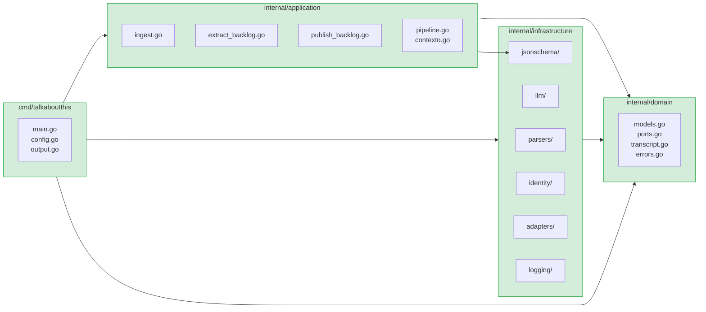
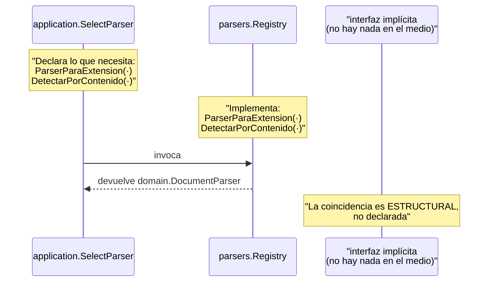

# Las capas

## Resumen

| Capa | Ruta | Puede importar | Nunca importa |
|---|---|---|---|
| Núcleo | `internal/domain` | `stdlib` | Todo lo demás |
| Aplicación | `internal/application` | `internal/domain`, `stdlib` | `internal/infrastructure`, `cmd`, `pkg` |
| Infraestructura | `internal/infrastructure` | `internal/domain`, `stdlb` | `internal/application` |
| CLI | `cmd/talkaboutthis` | Todo | — |

## Grafo de dependencias permitido



Las dependencias permitidas, contadas:

```
cmd        → application, infrastructure, domain
application→ domain, infrastructure/jsonschema   ← el validador NO es infraestructura
infra/*    → domain
domain     → (nada del proyecto)
```

**La única excepción aparente** es `application → jsonschema`. El validador vive
bajo `infrastructure/` por coherencia de ubicación, pero no depende de ningún
detalle externo: es lógica pura sobre `map[string]any`. Es un validador, no un
adaptador. Está documentado en [ADR-0005](../adr/0005-validador-propio.md).

## Por qué `application` no importa `infrastructure`

Es la restricción que más trabajo costó, porque `SelectorDeParser`,
`ConstructorDePrompt` y el validador son cosas que *viven* en infraestructura.

La solución: `application` **define su propia interfaz mínima** para lo que
necesita. No importa la interfaz real; declara la que le sirve y espera que el
adaptador la satisfaga. En Go, una interfaz se satisface de forma implícita, así
que el adaptador no necesita saber que la interfaz existe.



Lo que gana esto:

- `parsers` podría extraerse a otro repositorio sin tocar `application`.
- Los tests de `application` usan fakes de tres líneas, no el registro real.
- El texto literal de un prompt, que es una decisión de infraestructura, se
  decide en infraestructura.

## Reglas de dependencia, verificables

### 1. El dominio es agnóstico

```
internal/domain  ✗→  infrastructure
                 ✗→  application
                 ✗→  cmd
                 ✗→  pkg/sdk
                 ✗→  net/http, net/url, os/exec
                 ✗→  dependencias de terceros
```

Vigilada por `internal/domain/architecture_test.go`, que analiza el árbol de
imports con `go/parser`.

La detección de dependencias de terceros usa una heurística: si el primer
segmento de la ruta contiene un punto (`github.com/...`, `golang.org/x/...`),
es externa. La biblioteca estándar no lo tiene.

### 2. Ninguna capa sube

```
application ⇏ infrastructure
```

Si el caso de uso necesita una capacidad de un adaptador, **se declara un puerto**
y el adaptador lo implementa. Este es el mecanismo que permite añadir un tablero
nuevo, un proveedor nuevo o un formato nuevo sin tocar el núcleo.

### 3. `pkg/` es público, `internal/` es privado

```
externo ──puede importar──→ pkg/
externo ✗──no──→          internal/
```

Ver [`pkg/sdk/README.md`](../../pkg/sdk/README.md).

## El coste, dicha con claridad

Esta disciplina tiene un precio real:

- **Duplicación de interfaces.** `SelectorDeParser` en `application` y el
  registro real en `parsers` declaran métodos parecidos en sitios distintos.
- **Un paso extra al depurar.** Un método que "no existe" sí existe, en otro
  fichero.
- **Un fichero más por cada capacidad.** Cuatro parsers, cuatro proveedores,
  dos tableros.

Se paga porque el dominio tiene **100 % de cobertura y cero imports de
infraestructura**. Un núcleo así se puede mover, probar y extender sin arrastrar
el resto. Con cobertura del 100 %, cualquier cambio de comportamiento en el
dominio rompe un test antes de llegar a producción.

## Comprobación rápida

```bash
# Las guardas arquitectónicas, que son tests
go test ./internal/domain/ -run 'Arquitectura|Dependencias' -v
go test ./pkg/... -v

# Y el árbol de dependencias, a ojo
go list -deps ./internal/domain
```

`go list -deps ./internal/domain` no debe mostrar **ninguna** ruta del proyecto:
solo la biblioteca estándar.