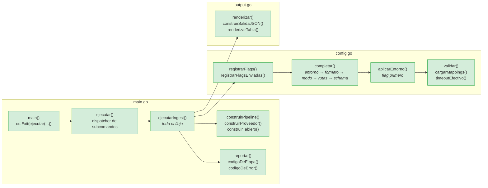
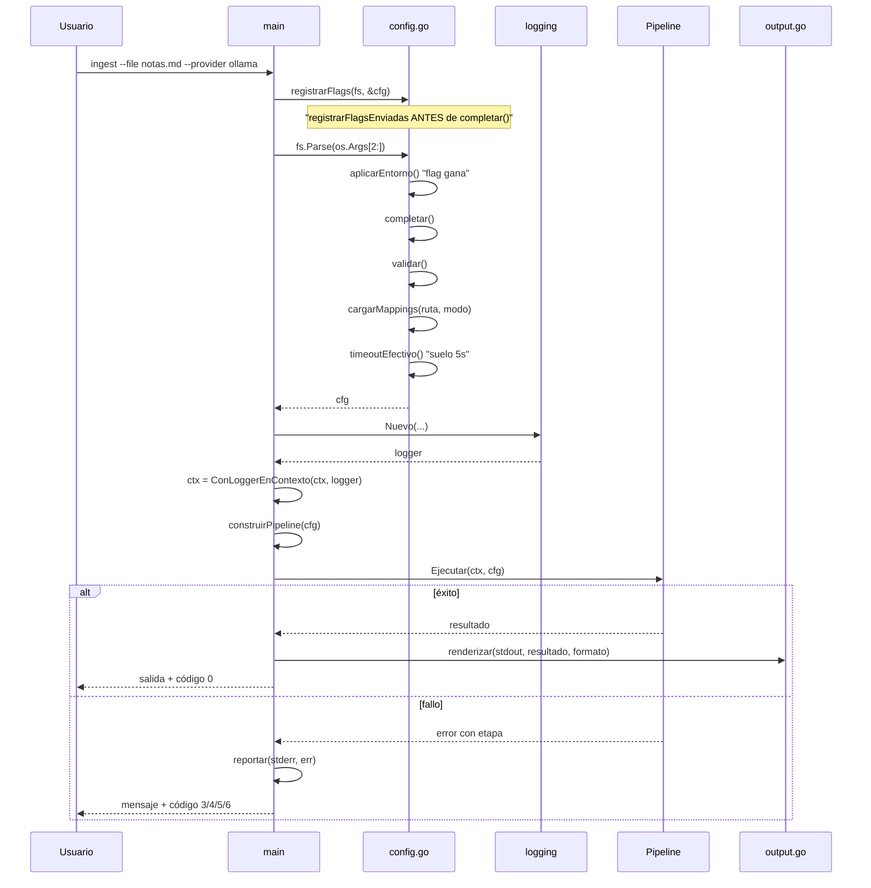
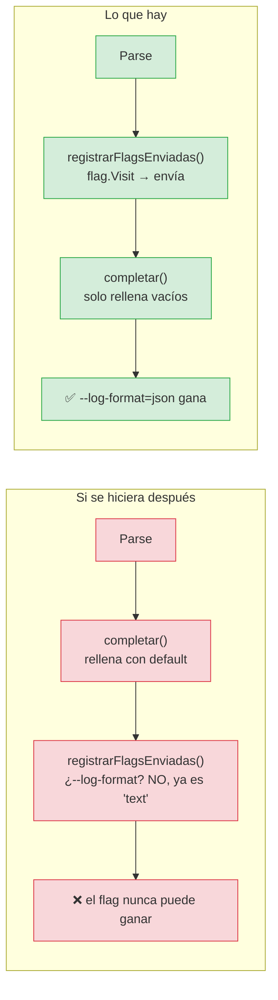
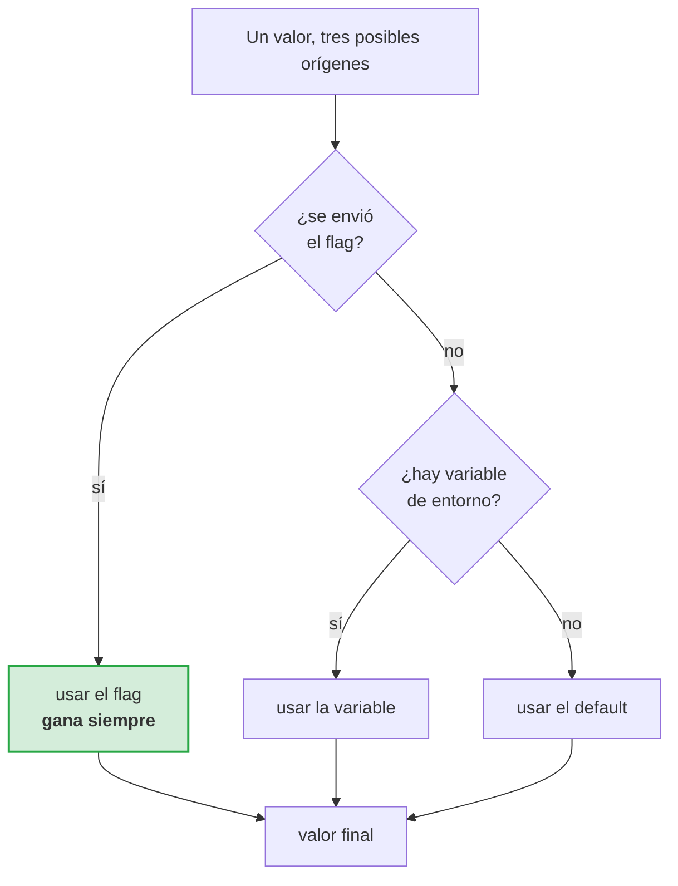
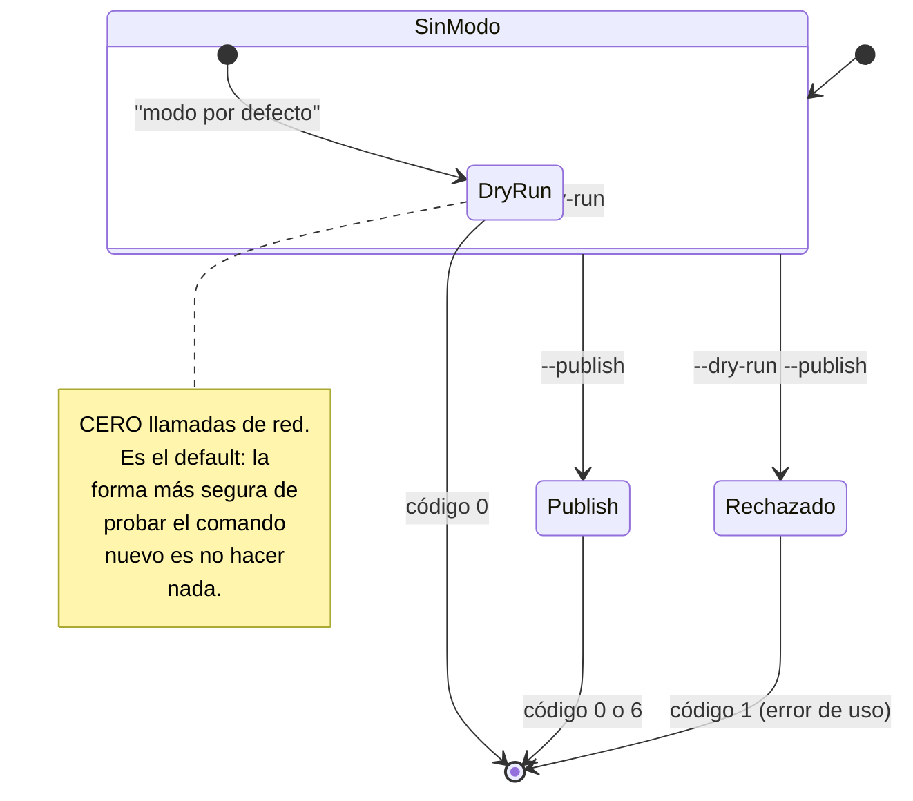
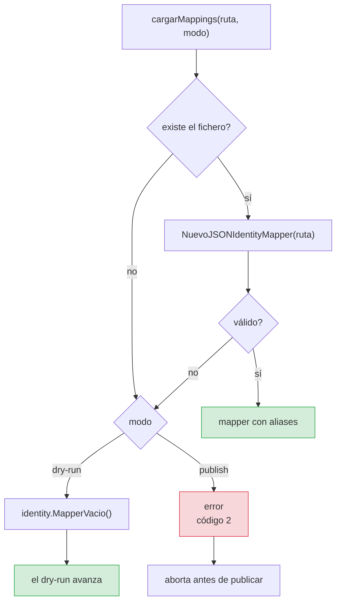
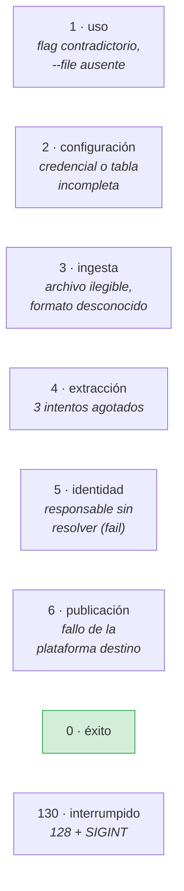
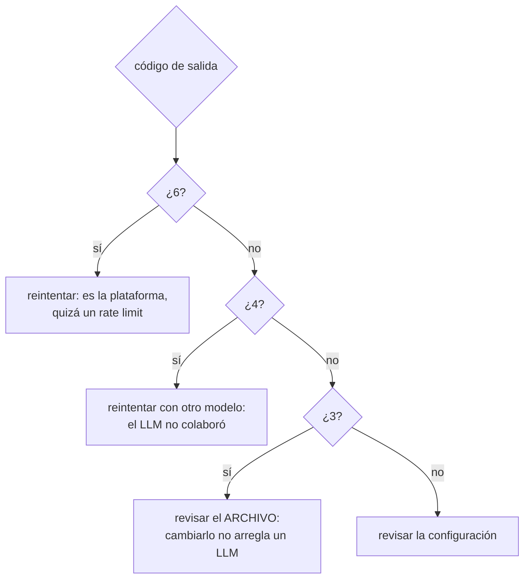
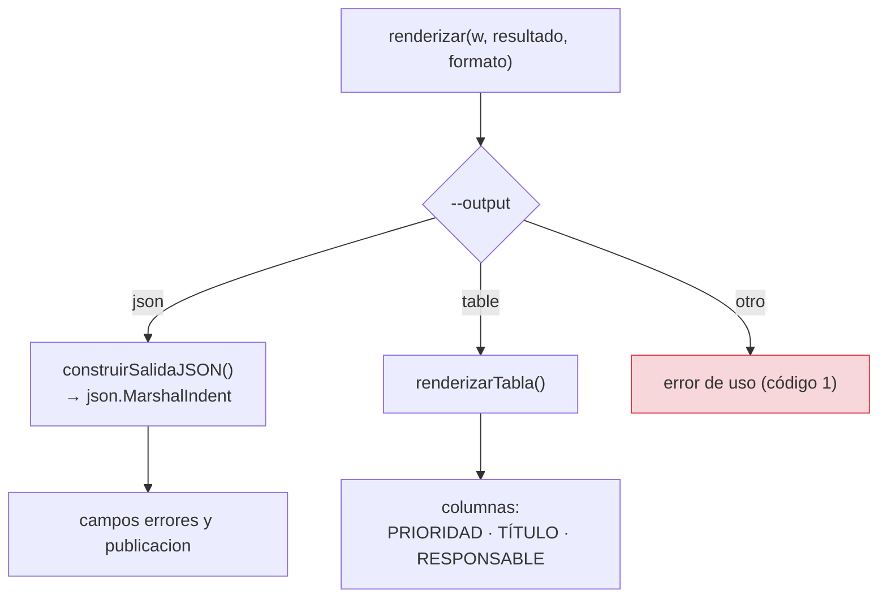
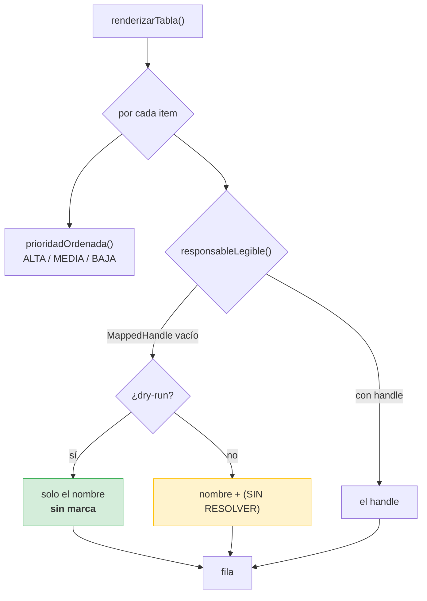

# `cmd/talkaboutthis` — la CLI

**Composition root.** El único sitio del programa que conoce las cuatro capas a
la vez. Aquí se decide qué adaptador se usa y con qué valores.

**Cobertura: 92,3 %.**

## Por qué existe esta capa

Sin un composition root, cada caso de uso tendría que crear sus propias
dependencias y el flujo no existiría como algo ejecutable y testeable. Aquí:

Los tres ficheros tienen una responsabilidad cada uno, y ninguno solapa:

| Fichero | Responsabilidad |
|---|---|
| `main.go` | Dispatcher, construcción del grafo, códigos de salida |
| `config.go` | Banderas, entorno, validación, valores por defecto |
| `output.go` | Presentación: JSON o tabla |

## El ciclo de `ejecutarIngest`

El orden de `ejecutarIngest` no es arbitrario, y dos de sus pasos parecen
invertidos hasta que se entiende por qué.

### `registrarFlagsEnviadas` antes de `completar()`

`completar()` rellena los campos vacíos con valores por defecto y del entorno.
Si se registrara qué banderas se enviaron **después**, ya no habría forma de
saber si `--log-format text` lo puso el usuario o el default.

El global `envios map[string]bool` se reinicia en cada invocación de
`ejecutarIngest`, porque `main()` es una función de biblioteca desde el punto de
vista de los tests.

## Precedencia flag → entorno → default

> **Bug real, encontrado al cerrar el proyecto.** La implementación era
> `primeroNoVacio(os.Getenv(...), cfg.Campo)`: el entorno se consultaba
> **primero**. Un `GITHUB_OWNER` exportado en la sesión de trabajo pisaba un
> `--owner` explícito, y el usuario que passeran horas arreglando un token sin
> descubrir por qué se ignoraba su bandera.

## Variables de entorno

| Variable | Flag equivalente |
|---|---|
| `LLM_PROVIDER` | `--provider` |
| `OLLAMA_BASE_URL`, `OLLAMA_MODEL` | — (configuración del motor) |
| `OPENAI_API_KEY`, `OPENAI_BASE_URL`, `OPENAI_MODEL` | — |
| `ANTHROPIC_API_KEY`, `ANTHROPIC_MODEL` | — |
| `GEMINI_API_KEY`, `GEMINI_MODEL` | — |
| `GITHUB_TOKEN` | — (credencial) |
| `GITHUB_OWNER` | `--owner` |
| `GITHUB_REPO` | `--repo` |
| `GITHUB_PROJECT_ID` | `--project` |
| `ASSIGNEE_POLICY` | `--assignee-policy` |
| `REQUEST_TIMEOUT` | `--timeout` |
| `LOG_LEVEL` | `--log-level` |
| `LOG_FORMAT` | `--log-format` |

> **Bug real.** `LOG_LEVEL` y `LOG_FORMAT` estaban documentados en
> `.env.example` desde el principio y **nunca se leían**. Documentar una variable
> que el programa ignora es peor que no documentarla: el usuario la ajusta, no
> ocurre nada, y pierde la confianza en todo lo demás.

## Modo: `--dry-run` y `--publish`

`--dry-run` es el default **por diseño**: la primera ejecución de un comando
nuevo contra un tablero real no debería poder crear veinte issues.

## `cargarMappings(ruta, modo)` — la tolerancia del dry-run

> **Bug real.** La tabla de mapeo era **obligatoria también en dry-run**, y el
> error salía con **código 5 (identidad)** cuando el problema era de
> configuración. Dos fallos en uno: una dependencia inexistente en el camino que
> promete cero dependencias, y un código de salida que mentía sobre la causa.

La clave es que el error distingue dos situations que antes compartían ruta:

- **Falta el fichero en dry-run** → `MapperVacio()`, se sigue.
- **Falta el fichero en publish** → error, código 2. Sin tabla, cualquier
  nombre quedaría sin responsable.

## Códigos de salida

Son distintos a propósito. Un proceso de CI tiene que poder responder:

Cada código apunta a una categoría de causa distinta. Un único código de error
—el diseño habitual— obligaría a leer el mensaje para decidir, y en un log de CI
el mensaje es la primera cosa que se pierde.

Detalle completo en [flujo de errores](flujos/05-errores-y-codigos.md).

## `output.go` — la presentación

La salida JSON es una estructura **estable**, pensada para que un script la
consuma: `job_id`, `modo`, `duracion_ms`, `etapas`, `archivo`, `resumen_reunion`,
`items[]`, `despacho`.

Tres cosas que se arreglaron aquí:

| Antes | Ahora | Por qué |
|---|---|---|
| `errores` a `null` | Siempre `[]` | En JSON, `null` y `[]` no son lo mismo y un consumidor riguroso falla con `null` |
| `plataforma` nunca rellenada | Se propaga desde `ResumenDespacho` | El campo estaba declarado y vacío: la salida no decía **dónde** se publicó |
| `modoDe(nil)` hacía panic | Comprueba `nil` | Un fallo de renderizado tumba el proceso **después** de haber hecho el trabajo bien |

### La tabla, y por qué no marca en dry-run

> **Bug real.** En dry-run **no** se consultan identidades (es la garantía de
> TC-05), así que el handle siempre está vacío. Marcando «SIN RESOLVER» en cada
> fila, la tabla levantaba una alarma que no correspondía: en dry-run no se
> intentó resolver nada, y el usuario ya sabe que no se publicó nada. Era ruido
> que enseñaba a ignorar la marca donde sí importa.

## Ficheros

| Fichero | Líneas | Contenido |
|---|---|---|
| `main.go` | ~430 | Dispatcher, construcción, códigos de salida, uso |
| `config.go` | ~400 | Banderas, entorno, validación, defaults |
| `output.go` | ~340 | Renderizado JSON y tabla, formateadores |
| `main_test.go` | | Comportamiento de la CLI por flags |
| `e2e_test.go` | | Flujo completo contra un servidor Ollama falso |
| `output_test.go` | | Formateadores, códigos de etapa, ayuda |

## Relacionado

- [Flujo completo](flujos/00-vision-general.md)
- [ADR-0007 — Precedencia flag sobre entorno](../adr/0007-precedencia-flag-sobre-entorno.md)
- [Errores y códigos de salida](flujos/05-errores-y-codigos.md)