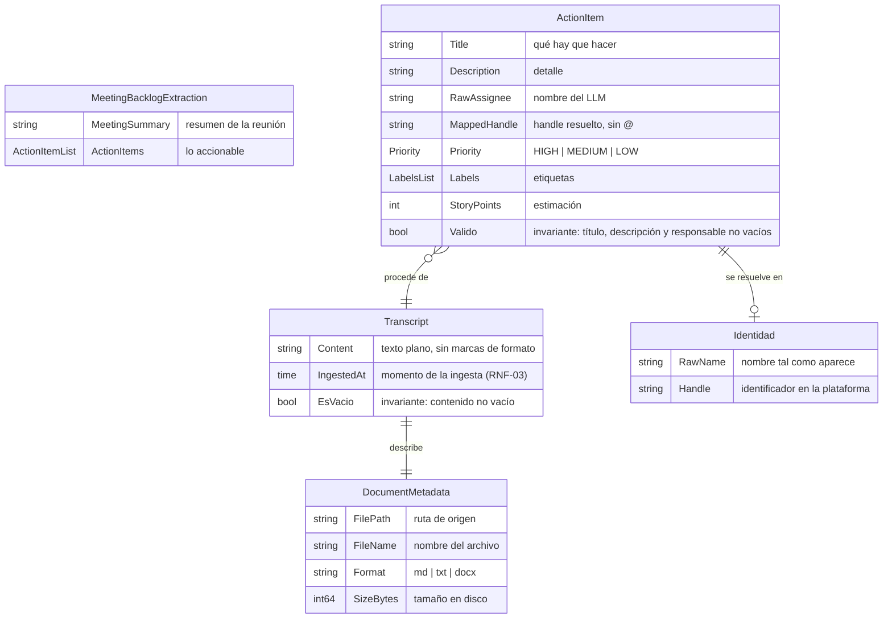
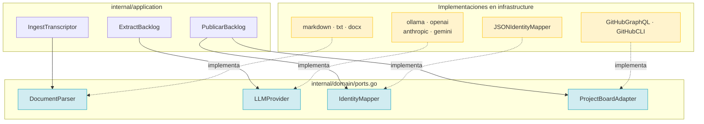
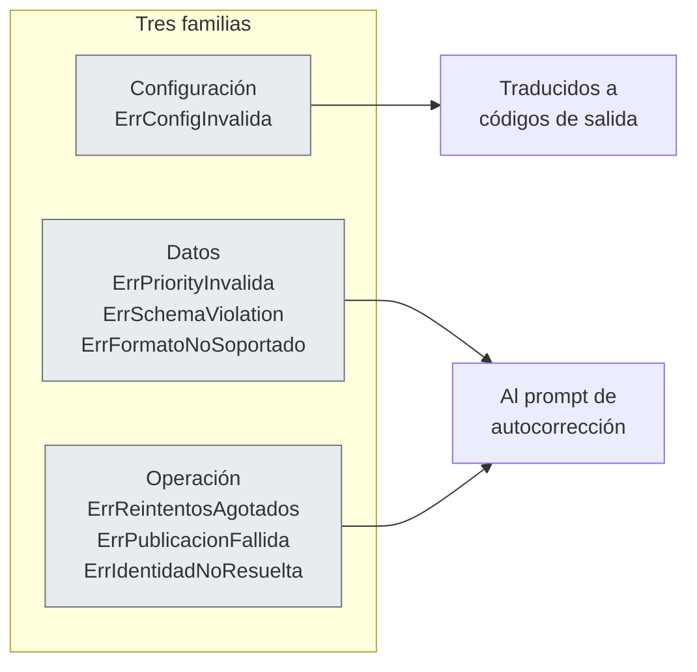
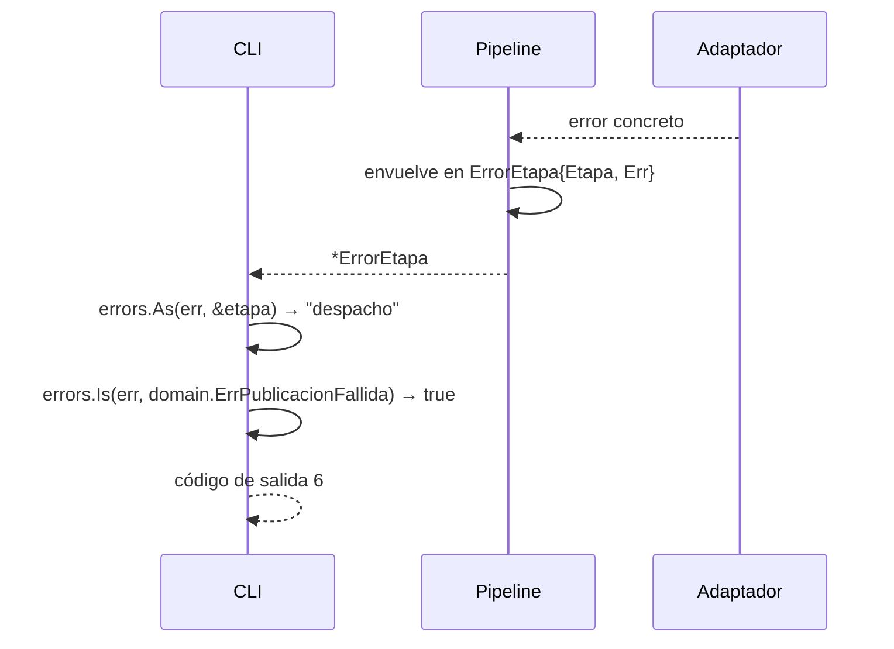

# `internal/domain` — el núcleo

La capa que no sabe qué es un archivo, ni un modelo de lenguaje, ni GitHub.

**Cobertura: 100 %.** Todo lo que hay aquí está probado.

## Vocabulario

| Término | Significado |
|---|---|
| **Transcript** | Texto plano extraído de un documento, más sus metadatos. |
| **Metadata** | De dónde vino: ruta, nombre, formato, tamaño. |
| **MeetingBacklogExtraction** | Lo que devuelve el LLM: un resumen y una lista de items. |
| **ActionItem** | Una tarea con título, descripción, responsable, prioridad. |
| **RawAssignee** | El nombre tal como sale del LLM: `Omar Hernández`. |
| **MappedHandle** | El identificador resuelto: `omarhernan`. **Sin `@`.** |
| **PublishResult** | Lo que la plataforma responde por cada tarjeta. |
| **PipelineEtapa** | En qué parte del flujo se produjo un fallo. |

## Modelo de datos



Los tipos `Labels`, `ActionItemList` e `Identidad` del diagrama son **listas**
(`[]string`, `[]ActionItem`) y valores lógicos; no son structs separados en el
código. El modelo real cabe en `models.go` y `transcript.go`.

## Los cuatro puertos



### `DocumentParser`

```go
type DocumentParser interface {
    Parse(ctx context.Context, r io.Reader) (string, error)
    CanParse(cabecera []byte) bool
    Name() string
}
```

`CanParse` recibe solo la **cabecera**, no el archivo entero: la detección por
contenido no debe leer un `.docx` de 40 MB para decidir que no es un `.docx`.

### `LLMProvider`

```go
type LLMProvider interface {
    GenerateStructuredOutput(ctx context.Context, prompt, schemaJSON string) ([]byte, error)
    Name() string
}
```

Devuelve **bytes**, no un struct. El adaptador no sabe qué significa `Priority`:
habla JSON. Quien interpreta es `ExtractBacklog`, porque necesita el detalle de
los fallos para construir el prompt de autocorrección.

### `IdentityMapper`

```go
type IdentityMapper interface {
    ResolveHandle(ctx context.Context, rawName string) (string, error)
}
```

### `ProjectBoardAdapter`

```go
type ProjectBoardAdapter interface {
    PlatformName() string
    PublishBacklog(ctx context.Context, projectRef string, items []ActionItem) ([]PublishResult, error)
}
```

Dos reglas que el puerto **exige** por contrato, y que ningún adaptador debe
cumplir por su cuenta:

1. **Tolerancia a fallos parciales.** Devolver `[]PublishResult` donde cada
   elemento refleja su propio éxito o fallo, en vez de abortar en el primer
   error. El usuario necesita saber cuántas tarjetas se crearon.
2. **No debe hacer dry-run por su cuenta.** Esa decisión ya se tomó antes de
   invocar el puerto (RF-06). Si el adaptador decidiera por su cuenta, el modo
   seco dejaría de ser una garantía.

## Invariantes y dónde se comprueban

| Invariante | Se valida en | Test |
|---|---|---|
| `Priority ∈ {HIGH, MEDIUM, LOW}` | `NewActionItem` | `models_test.go` |
| Título, descripción y responsable no vacíos | `NewActionItem` | `models_test.go` |
| `Transcript` no vacío | `EsVacio()` + ingesta | `models_test.go` |
| El handle **no** lleva `@` | `SetMappedHandle` | `models_test.go` |
| La definición JSON y el schema coinciden | `schema_sync_test.go` | `schema_sync_test.go` |

### El invariante del `@`

No es cosmético. Si el handle se guardara como `@omarhernan`:

- La llamada a la API de GitHub sería `@omarhernan`, que **no** acepta logins
  con arroba.
- El mismo item aparecería como `@omarhernan` en el log y `omarhernan` en la
  tarjeta, y comparar salida con resultado sería un ejercicio.

La normalización ocurre en el dominio, una sola vez, en el punto donde el
identificador entra al sistema. La infraestructura recibe lo que el dominio le
da y no vuelve a decidir.

### El schema no puede divergir

`schema_sync_test.go` compara `docs/specifications/backlog_schema.json` con los
structs Go de `models.go` y falla si un campo se añade en uno y no en el otro.
Es la razón por la que existe `BacklogSchema()` y `Validar()` en
`docs/specifications/embed.go`: **el schema es un artefacto compilado dentro del
binario**, no un fichero que hay que encontrar en tiempo de ejecución.

## Errores centinela



Son centinelas (`errors.New`) y se comparan con `errors.Is`. El pipeline los
envuelve en `ErrorEtapa`, que **encadena** la causa con `Unwrap`, de modo que la
CLI puede preguntar por la etapa y por el error en la misma llamada.



## Errores que se solapan entre paquetes

`identity` y `adapters` definen cada uno su propio `ErrConfigInvalida`. No es
una duplicación sin motivo: son paquetes que **no se importan entre sí**, y el de
dominio está conceptually en la frontera. La CLI compara contra los dos:

```go
errors.Is(err, domain.ErrConfigInvalida), errors.Is(err, adapters.ErrConfigInvalida)
```

Cuesta una línea, evita un acoplamiento y deja el dominio sin errores de
infraestructura.

## Ficheros

| Fichero | Contenido |
|---|---|
| `models.go` | `ActionItem`, `MeetingBacklogExtraction`, `PublishResult`, `Priority`, invariantes |
| `transcript.go` | `Transcript`, `DocumentMetadata`, `NewTranscript`, `EsVacio` |
| `ports.go` | Los cuatro puertos y sus contratos |
| `errors.go` | Errores centinela con su semántica documentada |
| `architecture_test.go` | Guardas de RNF-01 y RNF-02 |
| `schema_sync_test.go` | Schema ↔ structs, y prioridades del schema ↔ `Priority` |

## Relacionado

- [ADR-0003 — Los puertos viven en el núcleo](../adr/0003-puertos-en-el-nucleo.md)
- [Flujo de identidades](flujos/03-identidades.md)
- [Contrato de datos completo](../specs/06-contrato-de-datos.md)