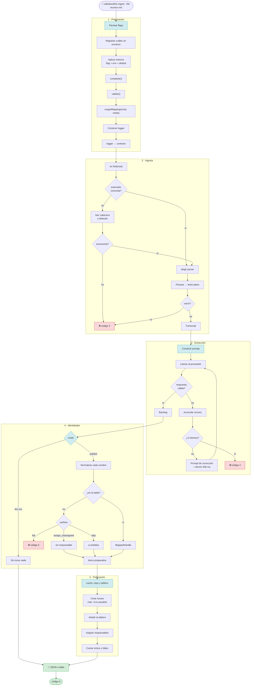
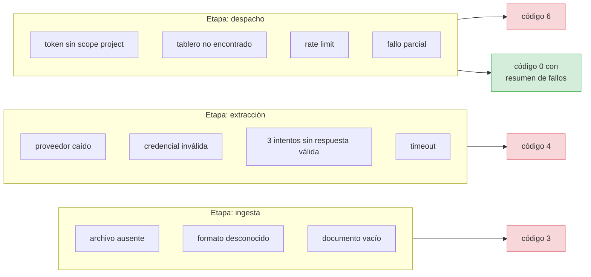

# Flujo de trabajo general

Un comando, de principio a fin.



## Diagrama de secuencia

```mermaid
sequenceDiagram
    autonumber
    actor U as Usuario
    participant CLI as cmd/talkaboutthis
    participant CFG as config.go
    participant LOG as logging
    participant PIPE as Pipeline
    participant ING as IngestTranscriptor
    participant PAR as parsers.Registry
    participant EXT as ExtractBacklog
    participant LLM as llm.Adapter
    participant VAL as jsonschema
    participant PUB as PublicarBacklog
    participant MAP as identity.Mapper
    participant BRD as adapters.GitHubGraphQL

    U->>CLI: ingest --file reunion.md
    CLI->>CFG: registrarFlags + Parse
    CLI->>CFG: aplicarEntorno → completar → validar
    CLI->>CFG: cargarMappings
    CLI->>LOG: Nuevo(level, format)
    CLI->>PIPE: ctx = ConLoggerEnContexto(ctx, logger)

    PIPE->>ING: DesdeRuta(ctx, ruta)
    ING->>PAR: ParserParaExtension(".md")
    PAR-->>ING: MarkdownParser
    ING->>PAR: Parse(ctx, reader)
    PAR-->>ING: "texto plano"
    ING-->>PIPE: Transcript

    PIPE->>EXT: Ejecutar(ctx, transcript)
    loop hasta 3 intentos
        EXT->>LLM: GenerateStructuredOutput(prompt, schema)
        LLM-->>EXT: bytes
        EXT->>VAL: Validar(documento, schema)
        VAL-->>EXT: errores (o ninguno)
    end
    EXT-->>PIPE: MeetingBacklogExtraction

    alt modo dry-run
        PIPE->>PUB: Ejecutar(ctx, ref, items, dry-run)
        PUB-->>PIPE: items sin tocar
    else modo publish
        PIPE->>PUB: Ejecutar(ctx, ref, items, publish)
        PUB->>MAP: ResolveHandle(ctx, nombre)
        MAP-->>PUB: handle o error
        PUB->>BRD: PublishBacklog(ctx, ref, preparados)
        BRD-->>PUB: []PublishResult
        PUB-->>PIPE: ResumenDespacho
    end

    PIPE-->>CLI: PipelineResultado
    CLI-->>U: salida + código de salida
```

## Línea de tiempo de una ejecución

```mermaid
gantt
    dateFormat X
    axisFormat %s

    section Preparación
    Flags y entorno          :0, 2
    Validación y mappings    :2, 3

    section Ingesta
    Stat y selección parser  :5, 5
    Lectura del documento    :10, 15

    section Extracción
    Intento 1                :25, 800
    Espera 400 ms            :825, 1
    Intento 2                :826, 800
    Espera 400 ms            :1626, 1
    Intento 3                :1627, 800

    section Publicación
    Resolver identidades     :2427, 5
    Crear issues (paralelo)  :2432, 400
```



**El tiempo lo domina el LLM**, no el código. Para una meeting de una hora, la
extracción tarda de 2 a 15 segundos; la publicación de 20 items, unos 2 segundos
con concurrencia 4.

RNF-03 fija un presupuesto de **15 minutos**, muy por encima: el límite existe
para detectar un LLM colgado, no para ser una restricción real.

## Los cuatro puntos donde el flujo puede morir



**El fallo parcial es el único que devuelve 0.** Y es deliberado: si se
publicaron tres de cinco tarjetas, el proceso *ha tenido éxito* y el resumen
informa de lo que falta. Devolver error haría que un pipeline de CI creyera que
no se publicó nada.

## Próximos documentos

| Flujo | Documento |
|---|---|
| Ingesta | [01-ingesta.md](01-ingesta.md) |
| Extracción | [02-extraccion.md](02-extraccion.md) |
| Identidades | [03-identidades.md](03-identidades.md) |
| Publicación | [04-publicacion.md](04-publicacion.md) |
| Errores | [05-errores-y-codigos.md](05-errores-y-codigos.md) |