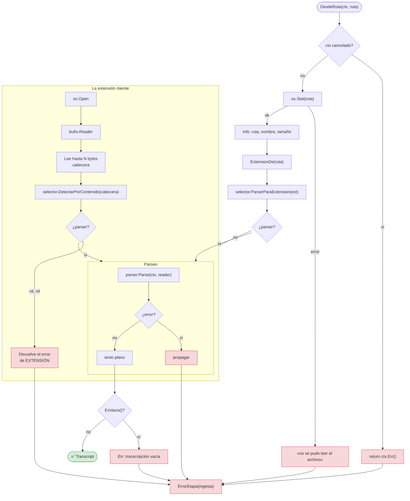
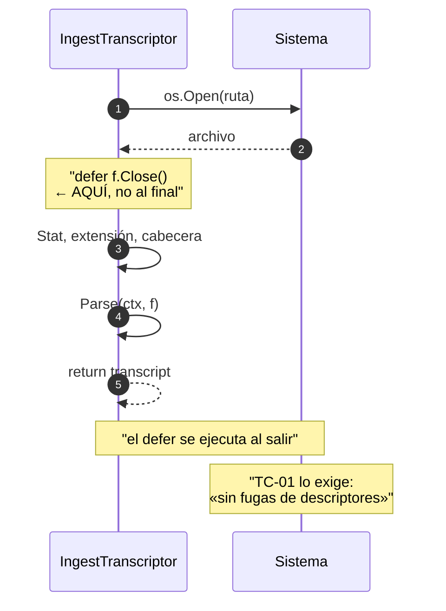
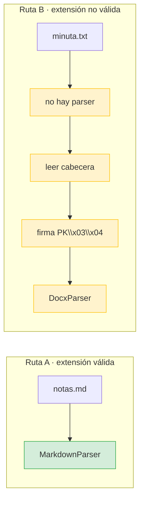
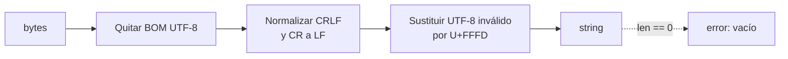
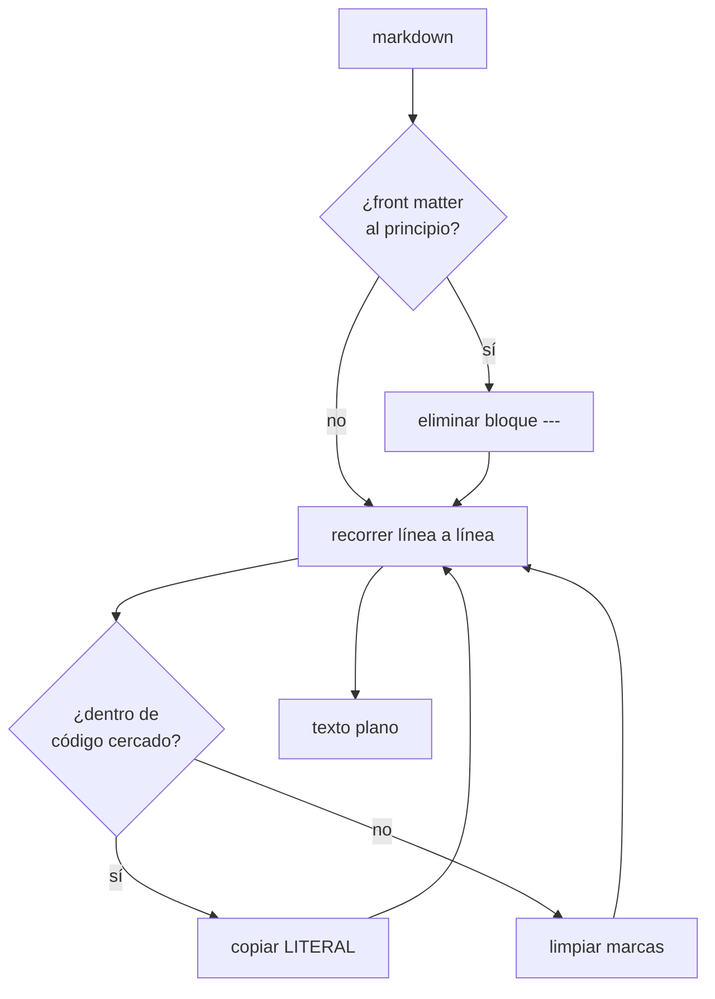
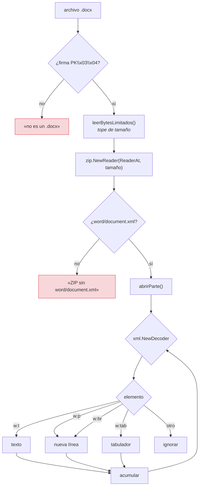
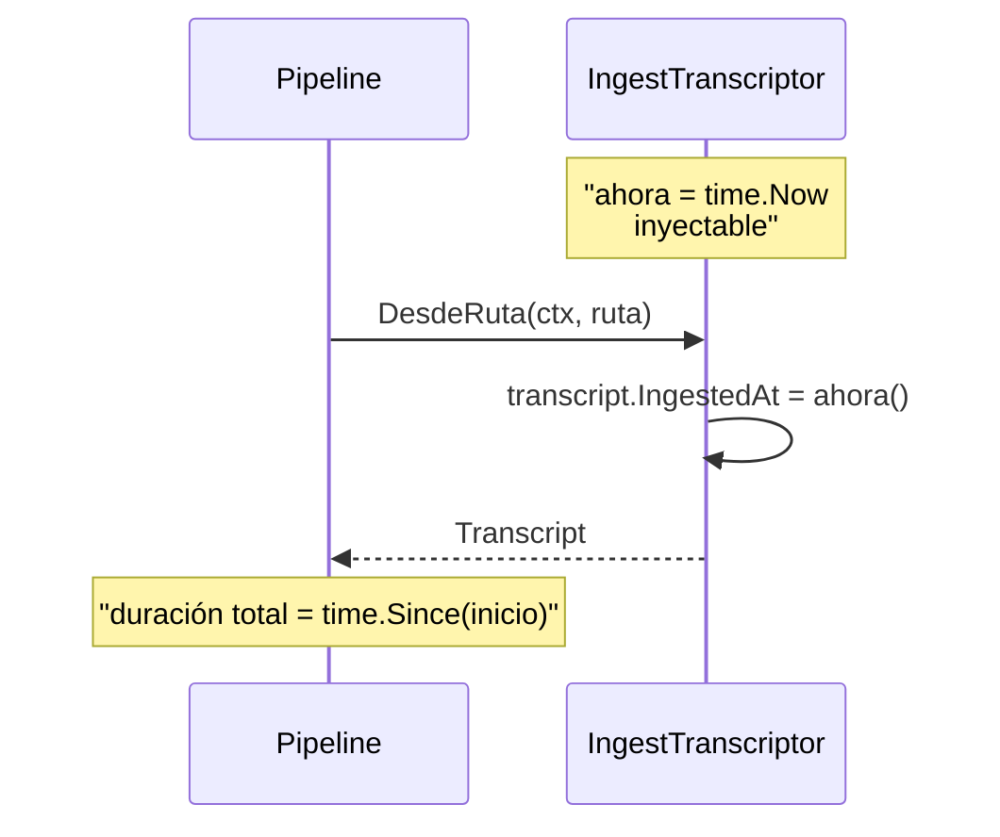

# Flujo: ingesta

**RF-01** · **TC-01** · `internal/application/ingest.go` ·
`internal/infrastructure/parsers/`

De un archivo en disco a un `Transcript`.

## Diagrama

## Dos puntos de entrada

| Método | El archivo lo cierra | Uso |
|---|---|---|
| `DesdeRuta(ctx, ruta)` | **El caso de uso** | La CLI |
| `DesdeReader(ctx, r)` | El llamante | Tests, streams, `io.Reader` arbitrario |

### Por qué el `defer Close` va al principio

Procesar cientos de documentos sin cerrarlos agota los descriptores del
proceso, y el fallo aparece en un archivo **distinto** al que lo provocó: es un
`too many open files` en el documento número 300 cuando el culpable fue el 12.

`TestTC01NoFugaDescriptores` abre y procesa muchas veces seguidas y verifica que
el número de descriptores no crece.

## Detección: extensión primero

**El orden importa.** Una implementación donde la detección por contenido se
ejecuta *siempre primero* interpretaría un `.txt` que empieza por `PK\x03\x04`
como un `.docx`. La detección existe para cuando la extensión **miente**, no
para competir con ella.

> Este fue el bug de la fase 2: la detección se ejecutaba, pero la extensión
> válida ganaba siempre, así que en la práctica el camino B **nunca se
 recorría**. El test de TC-01 pasaba y la función era código muerto.

## Qué hace cada parser

### `.txt` — `TextParser`

### `.md` — `MarkdownParser`

**Lo que se conserva a propósito:**

| Elemento | Por qué |
|---|---|
| Bloques de código cercados | Su contenido es el requisito técnico; quitarlo lo destruye |
| `código inline` entre acentos graves | Igual |
| Reglas `---` que no están al principio | Un acta separa secciones así |

**Lo que se quita:** encabezados `#`, énfasis `**`/`*`, comillas `>`, viñetas
iniciales, y los enlaces se quedan como su texto.

> La cursiva `*a* *b*` es **simétrica**. Una implementación que empareja el
> primer `*` con el último convierte dos cursivas en otra cosa. Se resolvió con
> límites de palabra: una cursiva solo empieza tras un separador, y solo termina
> si el siguiente carácter vuelve a ser un separador.

### `.docx` — `DocxParser`

Un `.docx` es un ZIP con XML dentro.

#### Tres trampas encontradas aquí

**1. `zip.NewReader` no acepta `io.LimitReader`.**

Su firma exige `io.ReaderAt` **y un tamaño**, porque el índice central del ZIP se
lee de forma aleatoria. Un `LimitReader` no lo es. La solución fue un
`io.SectionReader` sobre un lector acotado, es decir, un `ReaderAt` con tamaño
conocido.

**2. Un `.docx` corrupto puede ser enorme.** Sin tope de tamaño, un fichero
abierto a mano con una cabecera ZIP válida puede hacer que el proceso consuma
memoria hasta morir.

**3. `encoding/xml.Decoder` token a token.** Construir el árbol entero de
`document.xml` —que puede tener varios megabytes— para extraer texto es
desperdicio. El decoder es un `io.Reader`: se avanza elemento a elemento.

## La marca de tiempo y RNF-03

`NuevaIngestTranscriptorConReloj` permite fijar el reloj en los tests, que es lo
que hace comprobable el presupuesto de RNF-03 sin esperar de verdad.

Y aquí apareció un test frágil:

> `TestPipelineDryRunCompleto` afirmaba `resultado.Duracion > 0`. Con fakes, el
> pipeline entero termina en **menos de un milisegundo**, y la resolución del
> reloj de Windows devuelve `0` para `time.Since`. El test pasaba en Linux y
> fallaba en Windows, sin que hubiera ningún cambio de comportamiento.
>
> Ahora el extractor falso tiene un retardo programable de 25 ms y la aserción
> compara contra ese retardo conocido. El test verifica que **el pipeline mide**,
> no que el reloj tenga granularidad.

## Errores de esta etapa

| Situación | Error | Etapa | Código |
|---|---|---|---|
| Fichero inexistente | `os.Stat` envuelto | ingesta | 3 |
| Extensión y contenido desconocidos | `ErrFormatoNoSoportado` | ingesta | 3 |
| ZIP sin `document.xml` | error del parser | ingesta | 3 |
| Texto vacío tras parsear | `transcripción vacía` | ingesta | 3 |
| Contexto cancelado | `ctx.Err()` | ingesta | 130 |

## Lo que cubre TC-01

> **TC-01 — Ingesta DOCX.** Lectura de un `.docx` con párrafos y listas →
> retorno de un `string` UTF-8 limpio → integración sin pánicos ni fuga de
> descriptores.

| Criterio | Test |
|---|---|
| Retorno de texto UTF-8 limpio | `TestTC01IngestaDocxRetornaTextoLimpio` |
| Sin fugas de descriptores | `TestTC01NoFugaDescriptores` |
| Sin pánicos con entradas extrañas | `TestDocxRechazaArchivoQueNoEsZip`, `TestDocxRechazaZipSinWordDocument` |

## Relacionado

- [Flujo general](00-vision-general.md)
- [`internal/application`](../application.md#ingesttranscriptor)
- [`internal/infrastructure`](../infrastructure.md#parsers--de-documento-a-texto)