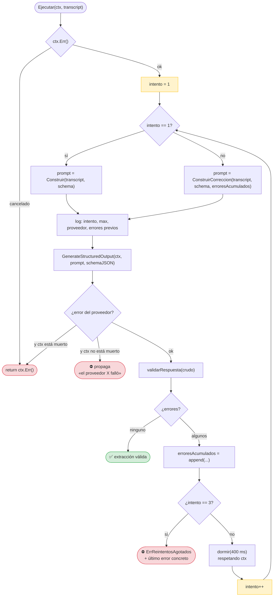
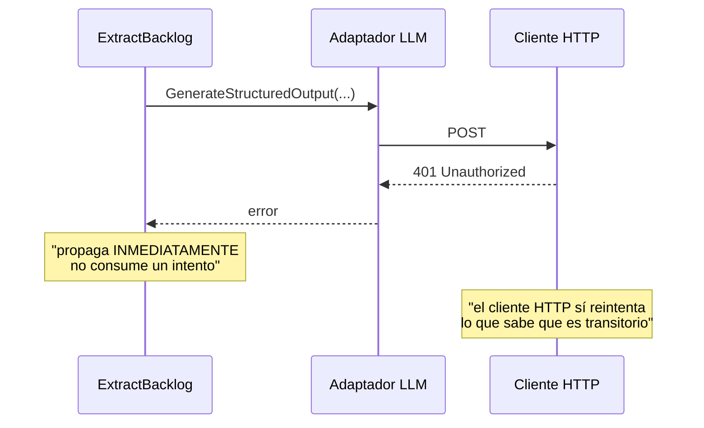
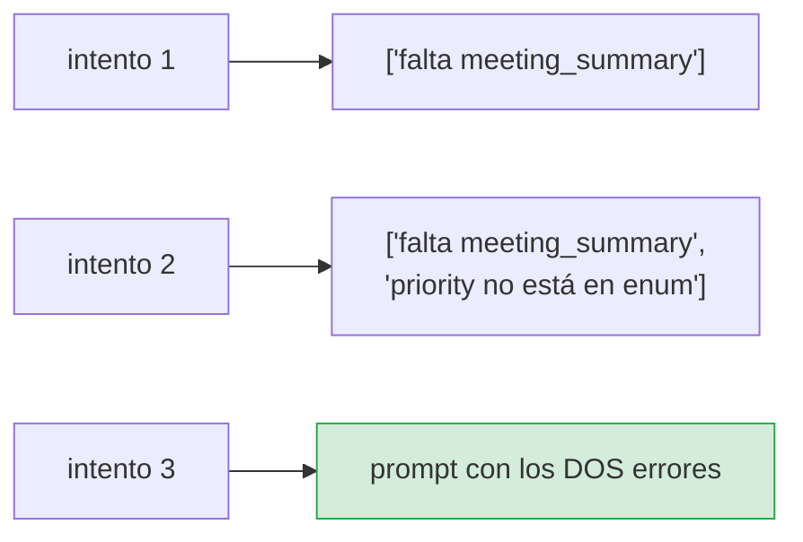
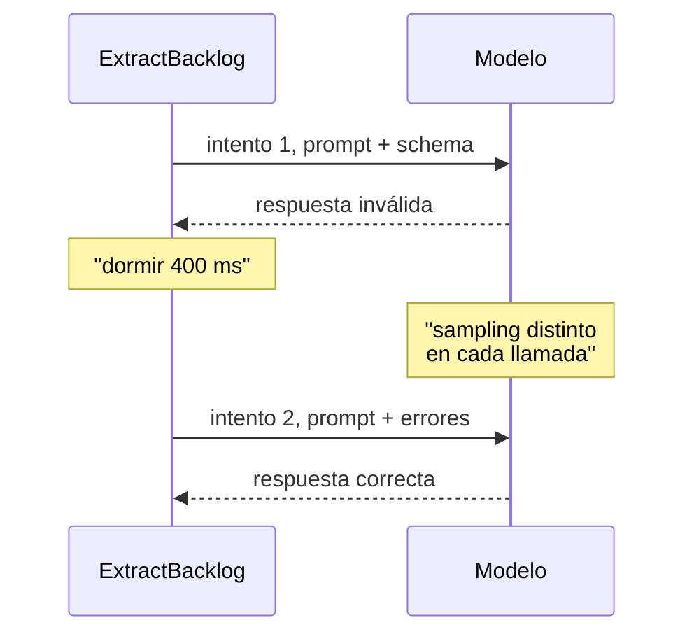
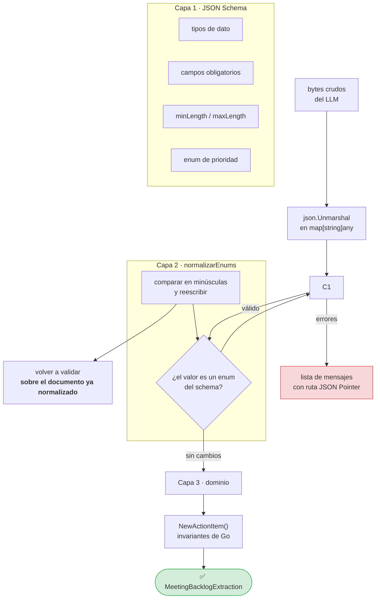
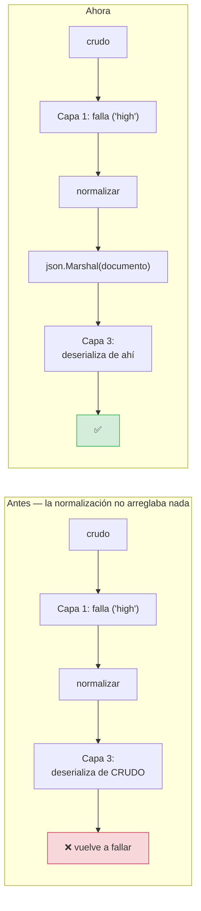
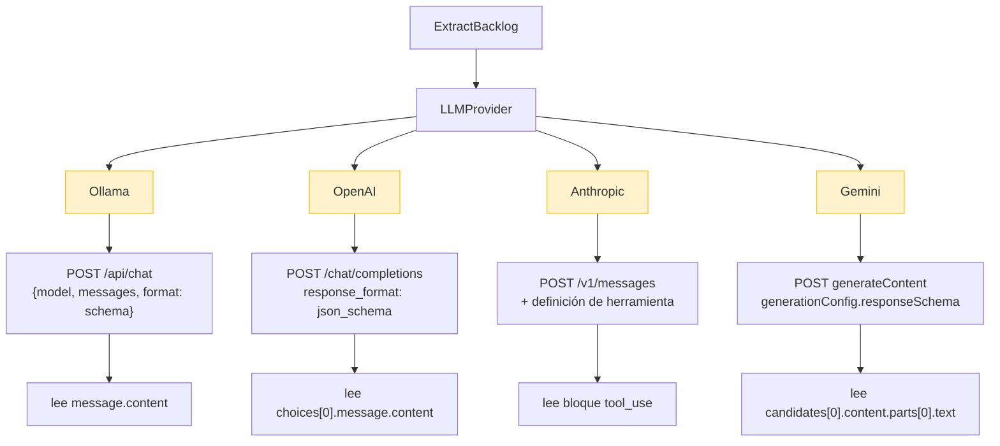
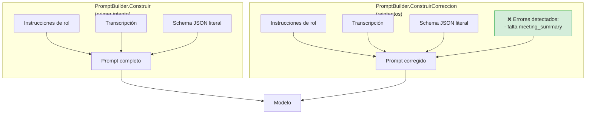
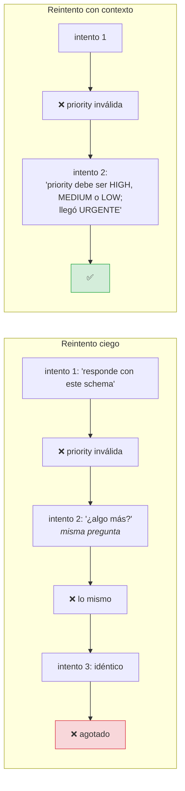

# Flujo: extracción con LLM

**RF-02, RF-03, RF-07** · **TC-02, TC-03** · `internal/application/extract_backlog.go` ·
`internal/infrastructure/llm/`

De un `Transcript` a un `MeetingBacklogExtraction` válido.

## El bucle completo



## Tres reglas que sostienen el bucle

### 1. Un error del proveedor NO se reintenta aquí



Repetir la misma llamada con la misma credencial inválida dará el mismo error
tres veces y consumirá tres veces el presupuesto. Lo que sí es transitorio —503,
429, corte de red— lo reintenta el cliente HTTP, que sabe distinguirlo del 401.

### 2. Los errores se acumulan



Sustituir en vez de acumular obligaría al modelo a corregir de uno en uno, con un
intento por problema. Y el tercer intento, con dos problemas ya identificados,
puede corregirlos de golpe.

### 3. La espera no es decorativa



La mayoría de los fallos de formato son **transitorios**: el mismo prompt con el
error adjunto produce una respuesta distinta en el siguiente muestreo.
Reiniciar el sampling **es** parte del mecanismo de corrección, no una pausa para
que el servidor respire.

En los tests, `dormir` es inyectable: la suite no paga las esperas reales.

## Las tres capas de validación



### Capa 2: por qué existe

| Lo que llega | Lo que el schema exige | Sin la capa 2 |
|---|---|---|
| `"high"` | `"HIGH"` | ✗ 3 intentos agotados |
| `"High"` | `"HIGH"` | ✗ 3 intentos agotados |
| `"urgent"` | `"HIGH" \| "MEDIUM" \| "LOW"` | ✗ rechazado — **correcto** |

La normalización **solo** toca valores que el schema declara como `enum`, y
**solo** convierte mayúsculas/minúsculas. No inventa prioridades: un `"urgente"`
se sigue rechazando, porque aceptar un valor que nadie pidió sería hacer que el
sistema publicara una urgencia inventada.

> **El error más común de un LLM con salida estructurada es el detalle de las
> mayúsculas.** Gastar los tres reintentos —con esperas de 400 ms entre ellos— en
> eso es absurdo.

### El segundo bug que escondía el primero

Al arreglar la normalización se descubrió que **la capa 3 deserializaba del
documento crudo**, no del ya normalizado:



Un test de cobertura habría pasado en ambos casos: la función `normalizarEnums`
se ejecutaba. Lo que no se mide es si su **efecto** llegaba a la capa 3.

## Los cuatro proveedores



### Por qué no es intercambiable de verdad

El puerto `LLMProvider` es idéntico para los cuatro. Debajo, cada API habla un
idioma distinto para pedir una salida estructurada, y **ese idioma no es
negociable**:

| Proveedor | Mecanismo | Restricción del schema |
|---|---|---|
| Ollama | `format` | Acepta el schema casi entero |
| OpenAI | `response_format` | Rechaza `additionalProperties` en algunos modelos |
| Anthropic | herramienta | `$schema`, `title`, `additionalProperties` no se permiten |
| Gemini | `responseSchema` | Tampoco `additionalProperties` ni `default` |

Por eso cada adaptador tiene su `esquemaParaXxx()`: **simplificar el schema es
responsabilidad del adaptador**, porque es lo que la API de destino no acepta.

Enviarlo tal cual produce un `400` con un mensaje que no dice qué campo sobra.

### La trampa de la respuesta

> `/api/chat` de Ollama devuelve el contenido en **`message.content`**. No en un
> campo `response`.
>
> Los dobles de test se escribieron leyendo la documentación equivocada, y
> aceptaron una forma `{"response": "..."}`. El smoke test contra un servidor
> real con la forma de `/api/chat` fue lo que destapó la diferencia: TC-02
> pasaba en verde contra el doble y fallaría contra cualquier Ollama del mundo.
>
> **Regla: un doble de test que imita una API debe imitar sus rarezas, no su
> forma ideal.**

## El prompt



### El prompt por defecto, y el bug que tenía

`NewExtractBacklog` funciona sin inyectar prompt. La primera versión:

```go
func (promptPorDefecto) ConstruirCorreccion(transcript, schemaJSON string, errores []string) string {
    return transcript   // ← solo la transcripción
}
```

Se parecía a un método con un parámetro sin usar. Era un **reintento a ciegas**:
la misma petición con distinto muestreo y ninguna pista sobre qué había fallado.



Es exactamente lo que TC-03 pide («re-intento automático **con contexto de
error** antes de fallar») y lo que el test comprueba ahora:
`TestPromptPorDefectoConstruyeCorreccion` exige que el prompt de corrección sea
**más largo** que el inicial, porque lleva el diagnóstico.

## Errores de esta etapa

| Situación | Comportamiento | Etapa | Código |
|---|---|---|---|
| Red caída / credencial inválida | Se propaga, sin gastar intentos | extracción | 2 o 4 |
| Respuesta no conforme × 3 | `ErrReintentosAgotados` + último error | extracción | 4 |
| Respuesta vacía | Error del adaptador → reintento | extracción | 4 |
| Timeout del cliente | `ctx.Err()` → no reintenta | extracción | 4 o 130 |
| `Name()` vacío | No ocurre: los cuatro lo implementan | — | — |

## TC-02 y TC-03

> **TC-02 — Ollama Adapter.** Envío de prompt a Ollama local → estructura
> `MeetingBacklogExtraction` deserializada sin errores.
>
> **TC-03 — Retry Loop.** Respuesta con JSON corrupto → re-intento automático
> con contexto de error antes de fallar.

| Criterio | Test |
|---|---|
| Deserialización sin errores de JSON | `TestTC02OllamaDeserializaSinErrores` |
| El schema viaja al modelo | `TestOllamaEnviaElSchema` |
| Reintento con contexto de error | `TestPromptDeCorreccionIncluyeErrores`, `TestPromptPorDefectoConstruyeCorreccion` |
| Se respetan los 3 intentos | `TestReintentosAgotadosDevuelveCodigoDeExtraccion` |
| `context.WithTimeout` respetado | `TestClienteRespetaTimeout`, `TestClienteCancelaConContexto` |
| Prompt determinista | `TestPromptEsDeterminista` |

## Relacionado

- [Flujo general](00-vision-general.md)
- [`internal/application/extract_backlog.go`](../application.md#extractbacklog)
- [Manejo de errores](../../criticas/manejo-de-errores.md)