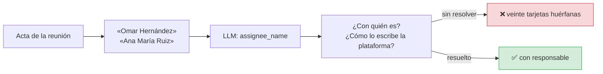
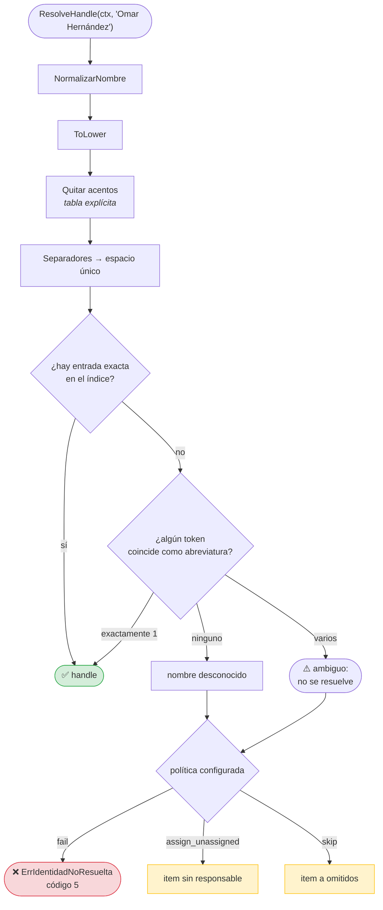
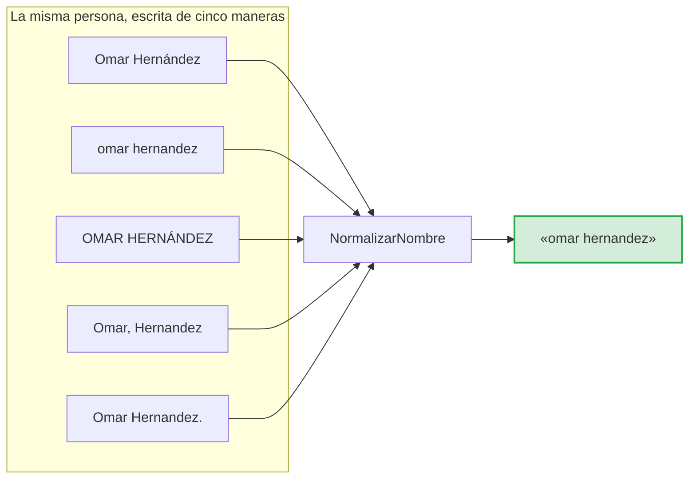
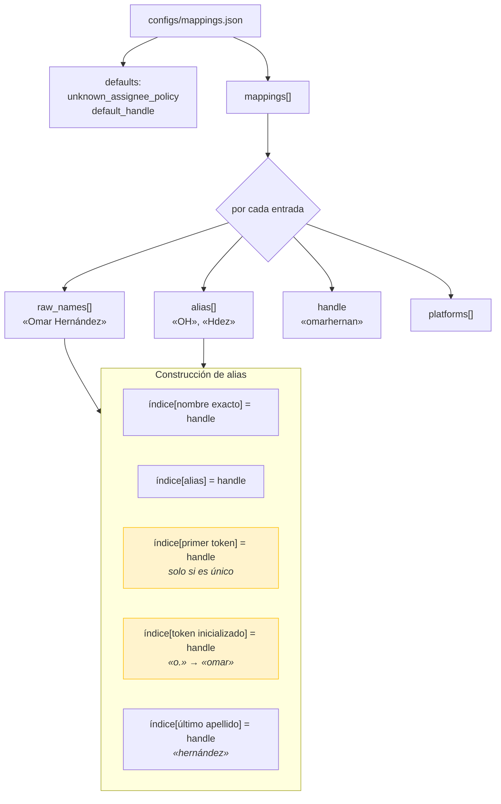
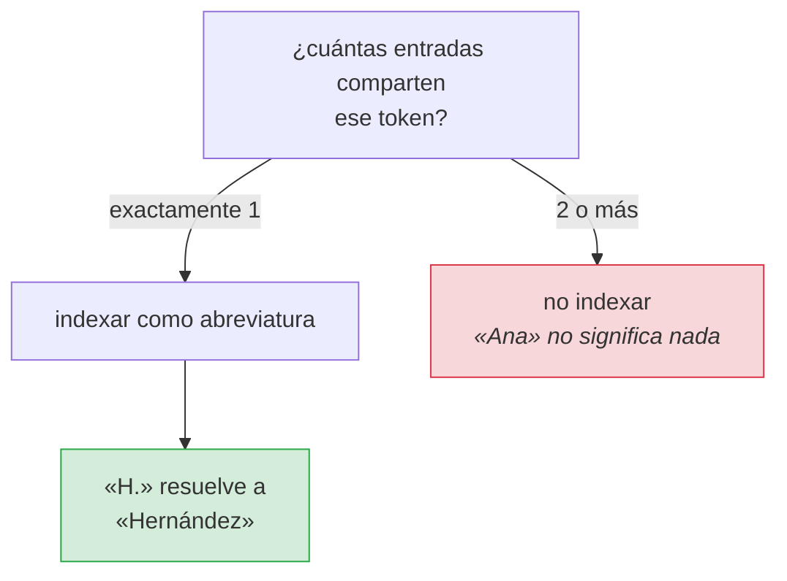
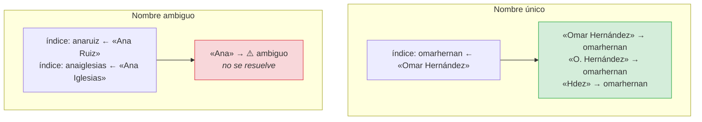
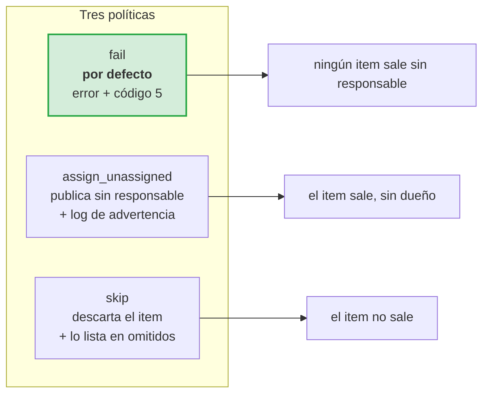
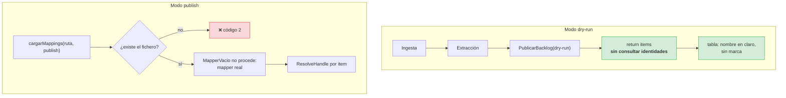
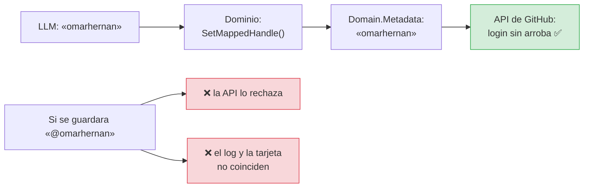

# Flujo: identidades

**RF-04** · **TC-04** · `internal/infrastructure/identity/json_mapper.go` ·
`internal/application/publish_backlog.go`

De `"Omar Hernández"` a `omarhernan`.

## El problema

El LLM devuelve nombres como aparecen en la minuta. La plataforma de destino
exige identificadores. Hacer la conversión a mano es una tarea de 20 minutos por
reunión, y **el error silencioso es el peor resultado posible**: publicar veinte
tarjetas sin responsable y que nadie se entere hasta las retrospectivas.

## El flujo

## La normalización

### Por qué la tabla de acentos es explícita

La biblioteca estándar de Go **no normaliza Unicode**: no hay NFC ni NFD fuera de
`golang.org/x/text`, y ese es justo el paquete que RNF-01 prohíbe. La tabla cubre
el rango latino, que es lo que aparece en nombres:

| Entrada | Salida | Por qué |
|---|---|---|
| `á à ä â` | `a` | |
| `é è ë ê` | `e` | |
| `í ì ï î` | `i` | |
| `ó ò ö ô` | `o` | |
| `ú ù ü û` | `u` | |
| `ñ` | `n` | `Hernández` y `Hernandez` son la misma persona |
| `ç` | `c` | |

La enye es la más importante: es la que aparece en la mayoría de los apellidos
hispanos, y sin ella un tercio de los nombres no resolvería.

## Cómo se construye el índice

### Las reglas de abreviatura

> **Bug encontrado.** La primera versión generaba el alias de abreviatura
> **solo a partir del último apellido**: `H.` resolvía a `Hernández`, pero
> `Omar H.` no, porque el token `H.` no aparecía entre los tokens del apellido.
> La regla corregida genera un alias **por cada token** de cada nombre, con la
> condición de unicidad.

## La unicidad, que es la parte difícil

Asignar `"Ana"` a una de las dos sería una moneda al aire. **No resolver** es el
comportamiento correcto: la política decide qué hacer después, y una política
`fail` convierte un nombre ambiguo en un error visible en lugar de una tarea mal
asignada.

## La política

**Por qué `fail` es el default.** Es la única política donde un nombre no
resuelto produce un fallo **visible**. Las otras dos producen trabajo hecho a
medias, que es más difícil de detectar.

Cuesta un fichero de mapeo. Se asume: publicar el backlog de una reunión sin
saber a quién se asigna no es un resultado útil.

## El dry-run y el mapper vacío

`MapperVacio()` existe para que el dry-run pueda inyectar una identidad sin
exigir el fichero de mapeo. Su documentación es explícita sobre el límite:

> **NO usarlo fuera de dry-run:** publicaría todo sin responsable, que es
> exactamente el fallo silencioso que TC-04 existe para evitar.

El dry-run **no marca** «SIN RESOLVER» porque no intentó resolver nada. Ver
[`cmd.md`](../cmd.md#la-tabla-y-por-qué-no-marca-en-dry-run).

## La `@` no se almacena

La normalización ocurre **en el dominio**, una sola vez, en el punto donde el
identificador entra. La infraestructura recibe lo que el dominio da y no vuelve
a decidir.

## Errores de esta etapa

| Situación | Comportamiento | Código |
|---|---|---|
| Nombre no está en la tabla | Política | 5 o 0 |
| Nombre ambiguo | Política (nunca se resuelve solo) | 5 o 0 |
| Fichero de mapeo ausente en publish | Error de configuración | 2 |
| Fichero de mapeo ausente en dry-run | `MapperVacio()`, sigue | 0 |
| JSON de mapeo inválido | Error, incluso en dry-run | 2 |

## TC-04

> **TC-04 — Identity Map.** «Omar Hernández» en la minuta → handle
> `@omarhernan` usando `JSONIdentityMapper` → mapeo case-insensitive exacto.

| Criterio | Test |
|---|---|
| Nombre real → handle | `TestTC04MapeaNombreRealAHandle` |
| Case-insensitive | `TestResolveHandleCaseInsensitive` |
| Acentos ausentes | `TestResolveHandleToleraAcentosAusentes` |
| Abreviaturas | `TestResolveHandleAceptaAbreviaturas` |
| Ambigüedad no se resuelve | `TestNombreDePilaAmbiguoNoSeResuelve` |
| Unicidad sí resuelve | `TestNombreDePilaUnicoSiSeResuelve` |
| Normalización completa | `TestNormalizarNombre`, `TestNormalizarNombreCobreTodasLasVocalesAcentuadas` |
| Tabla de mapeo real válida | `TestTablaRealDelProyectoEsValida` |
| Mapper vacío no inventa | `TestMapperVacioNoResuelveNada` |

## Relacionado

- [Modelo de dominio](../domain.md)
- [Publicación](04-publicacion.md)
- [Puertos e identidades](03-identidades.md#la-politica)