# Flujo: publicación

**RF-05, RF-06** · **TC-06** · `internal/application/publish_backlog.go` ·
`internal/infrastructure/adapters/`

De `[]ActionItem` a issues en un GitHub Project v2.

## Dos rutas

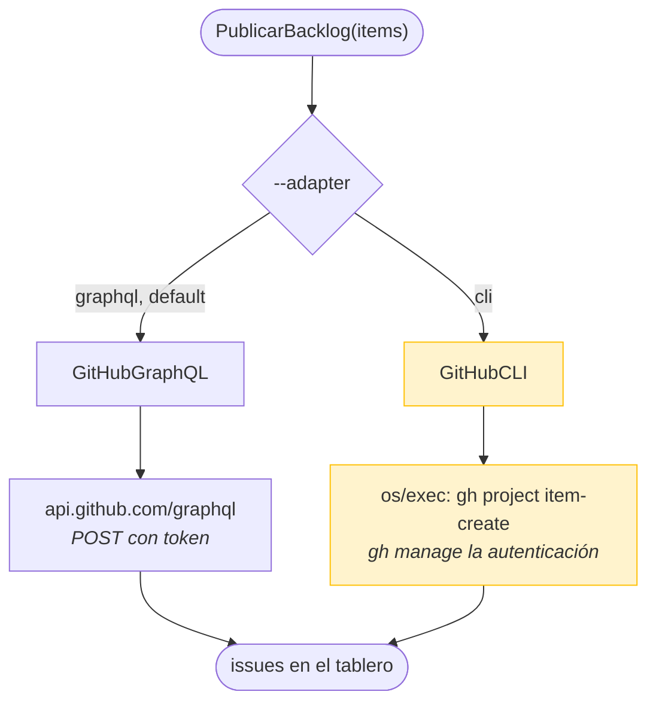

| | GraphQL (por defecto) | CLI |
|---|---|---|
| **Autenticación** | `GITHUB_TOKEN` en el entorno | La sesión de `gh auth` |
| **Latencia** | Una llamada HTTP por operación | Un proceso por operación |
| **Control de errores** | Total: se ve el mensaje de la API | Depende de la salida de `gh` |
| **Requiere instalar** | Nada | El binario `gh` |
| **Uso típico** | CI, automatización | Station, donde no se quiere un PAT en el entorno |

La ruta CLI existe por una razón concreta: en muchas máquinas de empresa el
token **no se puede exportar a un entorno**, pero `gh auth login` ya está hecho.

## La garantía de dry-run

Antes de nada, lo más importante del fichero:

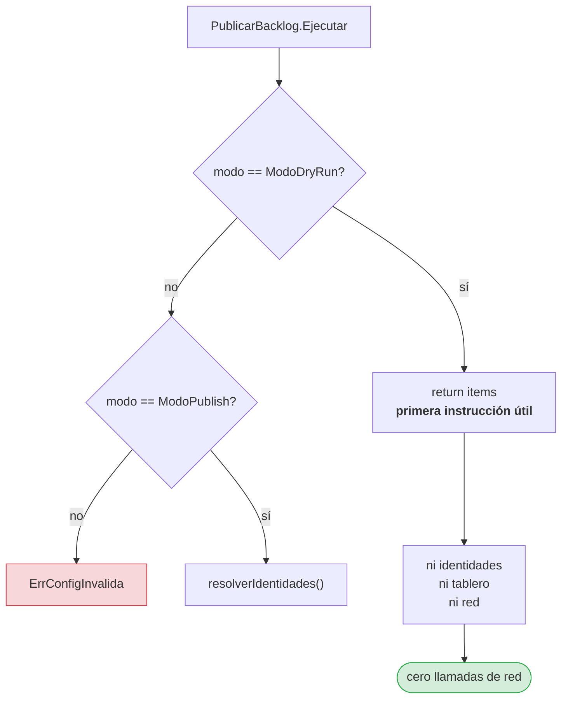

El modo se comprueba **antes de tocar identidades**. La diferencia importa:

| Diseño | En dry-run |
|---|---|
| Comprobar al final | Se resuelven 20 identidades y luego se descarta todo |
| **Comprobar al principio** | No se resuelve nada |

El primero hace llamadas de red en un modo que promete cero red, y para un
mapper respaldado por una API sería exactamente eso.

### Cómo se demuestra

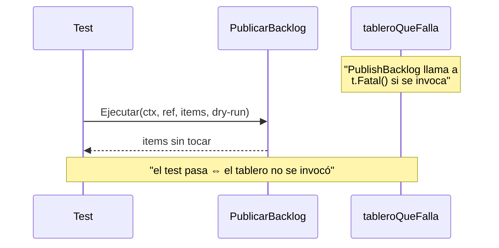

No hace falta contar llamadas de red: basta con que la más perjudicial de todas
—un adaptador que entra en panic— tumbe el test si se toca.

## Las operaciones GraphQL

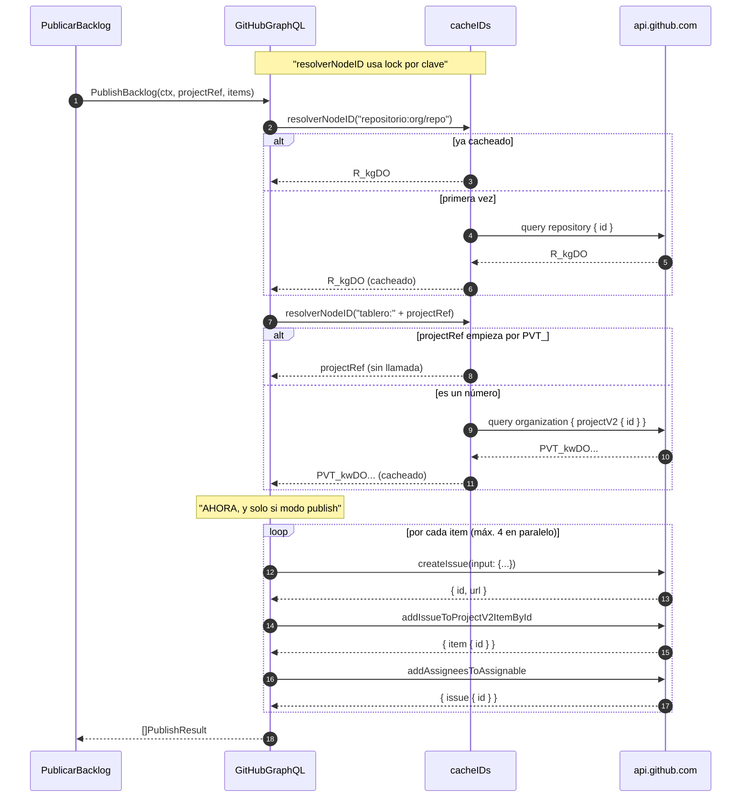

### `projectRef` acepta las dos formas

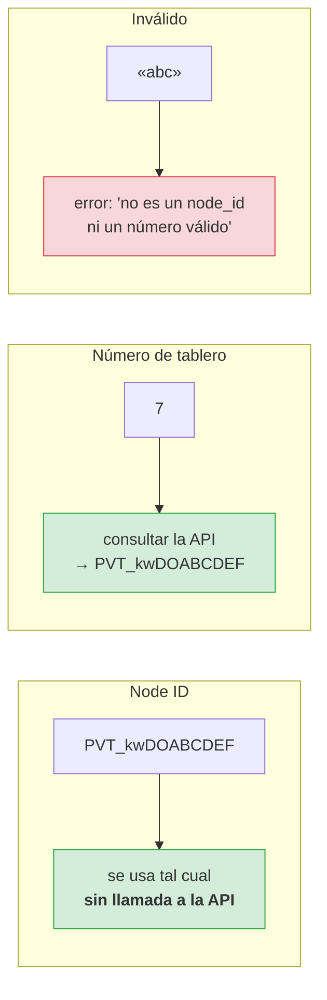

Aceptar las dos evita que el usuario tenga que descubrir un identificador opaco
a mano. Y si ya lo tiene, no se desperdicia una consulta.

### El `400` silencioso

> La API de GitHub responde con **`200` y datos vacíos** cuando el tablero no
> existe o no es visible para el token. No es un error HTTP: es un `data:
> {organization: {projectV2: null}}`.
>
> Sin la comprobación explícita del `id` vacío, el adaptador devolvería una
> cadena vacía y el fallo aparecería más tarde, como un error de mutación
> desconectado de su causa. El mensaje que sí es accionable es
> «no se encontró el proyecto número 7 en «organización»».

## La caché de identificadores

Publicar 20 items sin caché haría 20 búsquedas del **mismo** `node_id` del
repositorio. Y sin un lock por clave, peor.

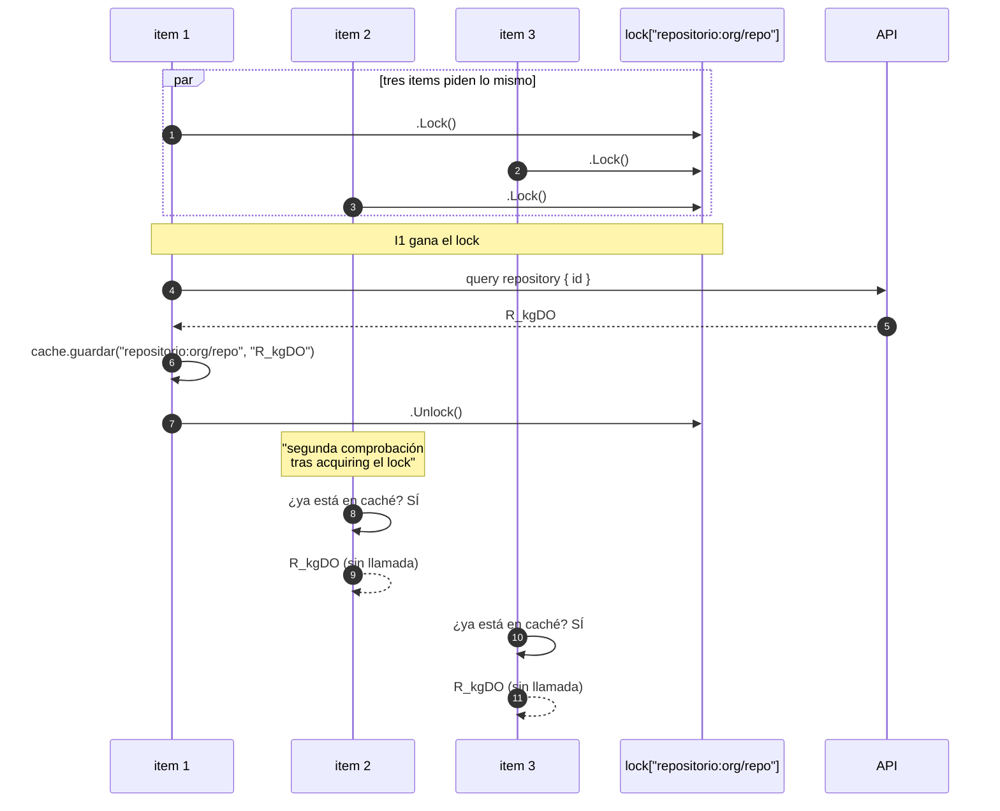

**Sin la segunda comprobación**, los tres items esperarían el lock y luego
lanzarían su propia consulta: tres llamadas idénticas. Es el
**cache stampede**, y la doble comprobación lo elimina.

**Con un mutex global**, resolver `usuario:ana` bloquearía la resolución del
repositorio. El lock es **por clave**, y solo se serializan quienes piden lo
mismo.

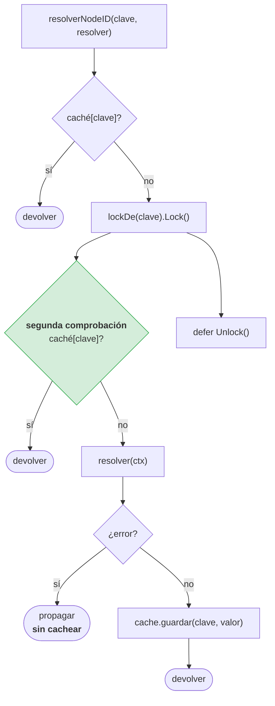

> **El error no se cachea.** Cachear un fallo convertiría un 503 transitorio en
> un fallo permanente durante toda la vida del proceso: el usuario tendría que
> relanzar la herramienta para volver a intentarlo.
>
> `TestResolverNodeIDPropagaElErrorYNoLoCachea` lo comprueba.

## La concurrencia

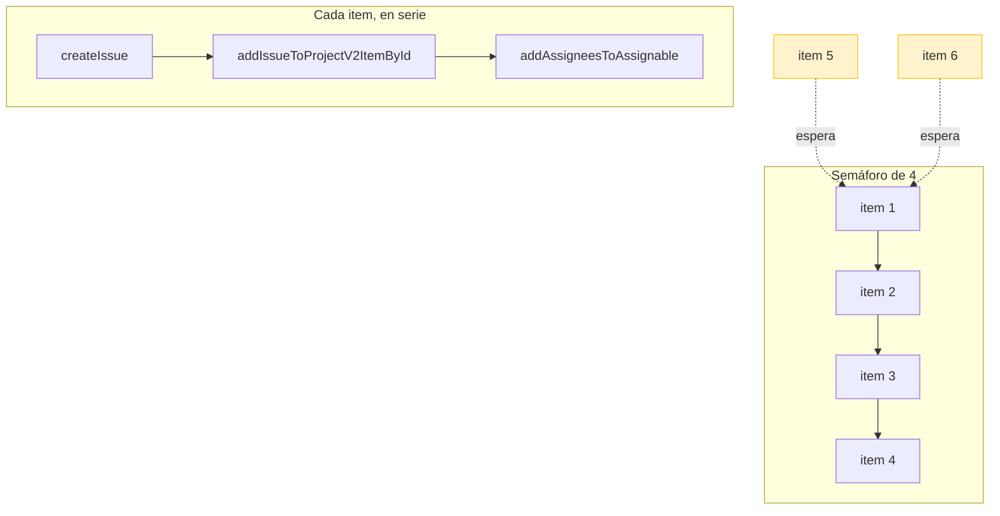

| Decisión | Elección | Motivo |
|---|---|---|
| Paralelismo | 4 items a la vez | La API de GitHub limita por segundo; más rápido = más rate limits |
| Dentro de un item | En serie | El `addIssueToProject` necesita el `id` del issue |
| Estructura | `WaitGroup` + `chan struct{}` | `errgroup` es una dependencia externa (RNF-01) |

`TestPublicacionParalelaRespetaElLimite` comprueba que nunca hay más de 4
simultáneos.

## El fallo parcial

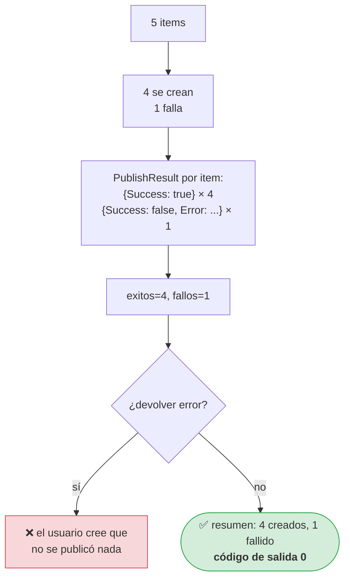

Es la razón por la que `PublishBacklog` devuelve `[]PublishResult` en vez de un
`error`: el llamante necesita saber **cuántas** tarjetas se crearon.

La salida JSON distingue las dos listas:

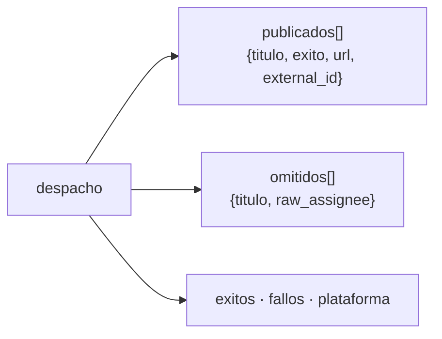

Un fallo parcial **no** es un error de la operación. Devolver error haría que un
pipeline de CI creyera que no se publicó nada, cuando cinco tarjetas existen.

## Errores reintentables

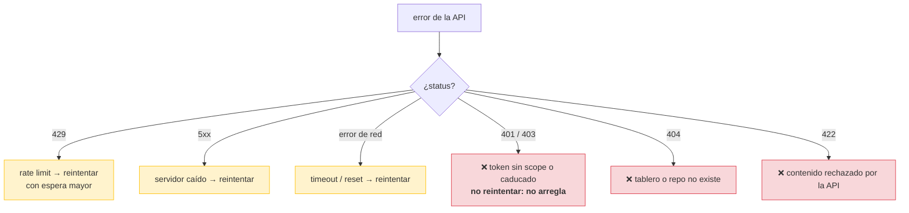

Los mensajes de error reintentables y los no reintentables se distinguen
explícitamente: esperar a un 401 no lo convierte en 200.

## TC-06

> **TC-06 — GitHub Project v2.** Petición de mutación GraphQL → creación de
> Issue y agregado del `item` al tablero → retorno con código de éxito e ID
> GraphQL generado.

| Criterio | Test |
|---|---|
| Crea issue y lo agrega al tablero | `TestTC06CreaIssueYAgregaAlTablero` |
| Las variables enviadas son las correctas | `TestTC06EmiteLasVariablesCorrectas` |
| Errores in-band → error de Go | `TestErroresInBandSeConviertenEnErrorDeGo` |
| Fallo parcial deja constancia | `TestFalloAlAgregarAlTableroDejaConstancia` |
| Límite de concurrencia respetado | `TestPublicacionParalelaRespetaElLimite` |
| Caché de identificadores | `TestCacheDeIdentificadores`, `TestResolverNodeIDEvitaElStampede` |
| El token nunca aparece en errores | `TestCredencialNoApareceEnErrores` |
| Token ausente falla antes de la red | `TestTokenAusenteFallaAntesDeLaRed` |

Ningún test toca la API real: todos usan `httptest` con un servidor local que
imita las respuestas GraphQL.

## Relacionado

- [Flujo general](00-vision-general.md)
- [Identidades](03-identidades.md)
- [Concurrencia](../../criticas/concurrencia.md)