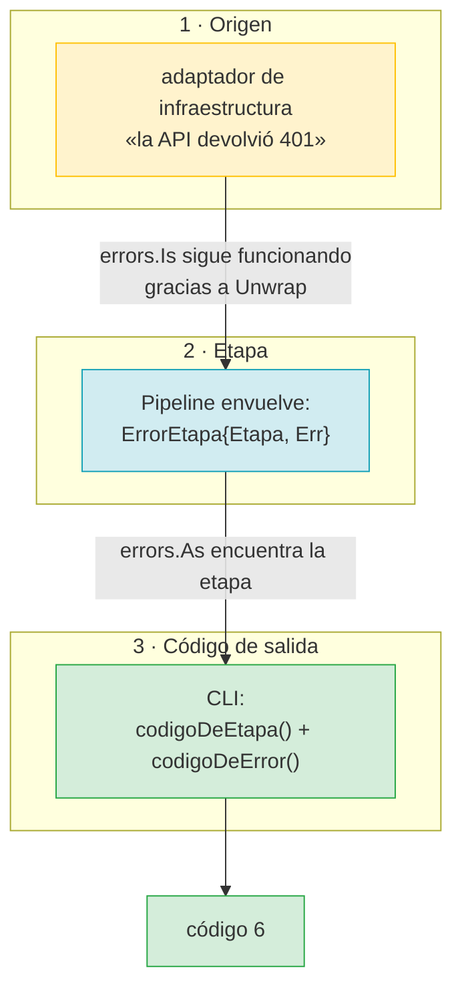
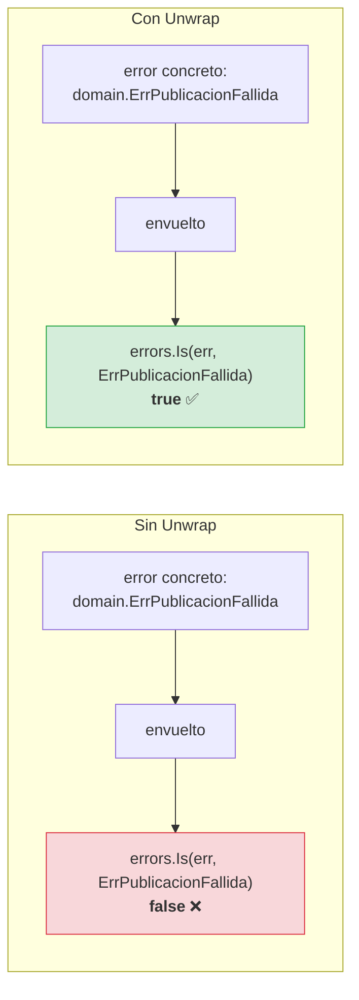
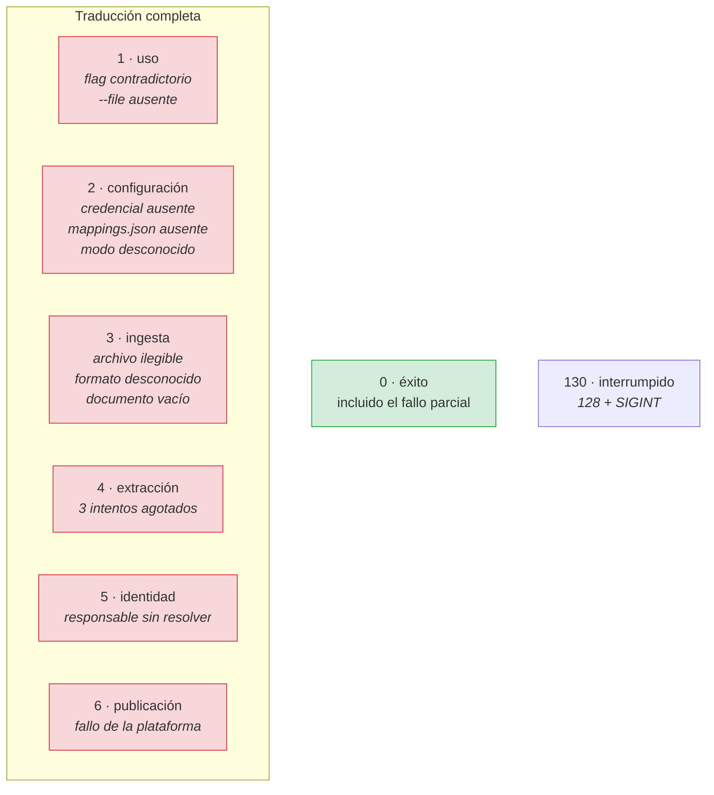
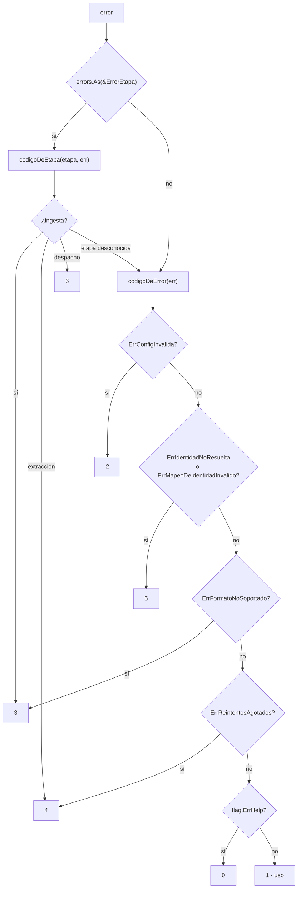
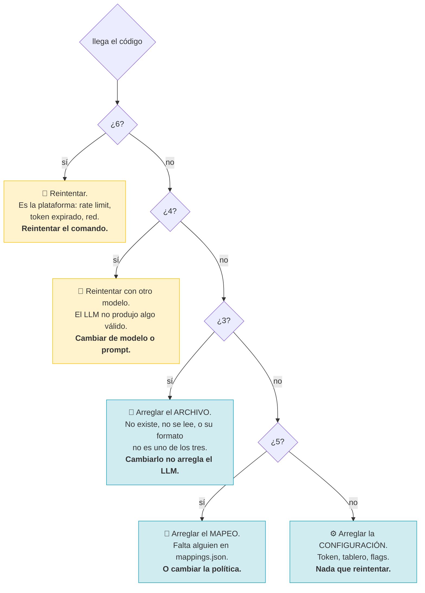
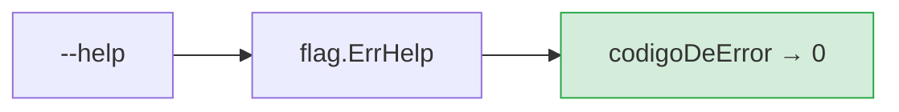
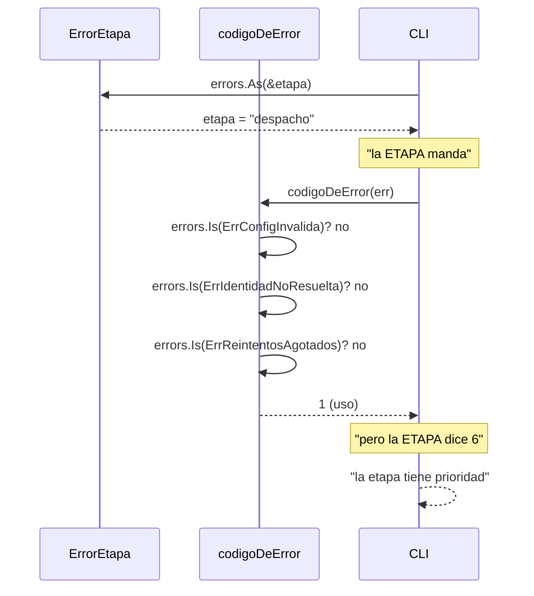
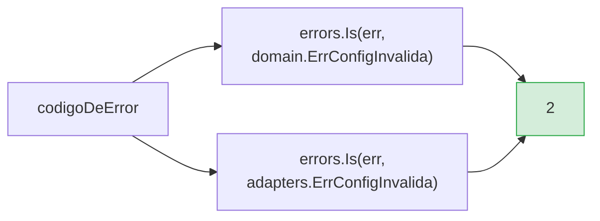

# Flujo: errores y códigos de salida

Cómo un fallo interno se convierte en un número que un proceso de CI puede usar.

## Los tres niveles



Los tres existen por razones distintas y **ninguno sustituye a los otros**.

## La envoltura

```go
type ErrorEtapa struct {
    Etapa PipelineEtapa
    Err   error
}

func (e *ErrorEtapa) Error() string { return fmt.Sprintf("fallo en la etapa de %s: %v", e.Etapa, e.Err) }
func (e *ErrorEtapa) Unwrap() error   { return e.Err }
```

### Por qué `Unwrap` no es opcional



Sin `Unwrap`, `errors.Is` se detiene en el envoltorio. La CLI no podría
distinguir «el tablero devolvió 422» de «el token caducó» ni de «el modo es
inválido»: los tres serían «fallo en la etapa de despacho».

### Y las consultas de etapa

```go
func EsFalloDePublicacion(err error) bool
func EtapaDelError(err error) PipelineEtapa
```

Ambas usan `errors.As`, de modo que funcionan aunque el error de etapa se
envuelva **otra vez** más arriba —por ejemplo en un `errors.Join`. Y ambas
toleran `nil` y errores ajenos: devuelven `false` y `""`.

| `errors.As` encuentra | `EtapaDelError` | `EsFalloDePublicacion` |
|---|---|---|
| `ErrorEtapa{despacho}` | `"despacho"` | `true` |
| `ErrorEtapa{extraccion}` | `"extraccion"` | `false` |
| `ErrorEtapa` anidado en un `Join` | `"despacho"` | `true` |
| `domain.ErrConfigInvalida` | `""` | `false` |
| `nil` | `""` | `false` |

## Los códigos



### Cómo se decide



## Por qué siete códigos distintos

Un único código de error —el diseño habitual— obligaría a **leer el mensaje**
para decidir qué hacer. En un log de CI, el mensaje es la primera cosa que se
pierde: la línea que dice por qué falla hace 40 líneas más arriba.



Cada código señala una categoría de causa **distinta**, y por tanto una acción
distinta. Es lo que hace que un pipeline de CI pueda reaccionar sin leer el
mensaje.

`TestCodigosDeSalidaSonDistintos` verifica que los seis códigos de error son
efectivamente distintos, y `TestCodigoDeErrorEncadenadoConEtapa` que funcionan
con el error envuelto.

## Los dos casos especiales

### `--help` devuelve 0



`--help` no es un fallo: el proceso terminó con éxito, solo que pidió otra
cosa. Tratarlo como error rompe scripts que hacen `tool --help && haz-cosas`.

### 130, para la interrupción

`128 + SIGINT`. Es la convención de Unix, y lo que un proceso recibe al pulsar
Ctrl-C. Distinguirlo de un error real permite que un supervisor reinicie el
proceso sin alertar a nadie.

## El orden de las traducciones



**La etapa manda.** Si el fallo ocurrió en la etapa de despacho, el código es 6,
aunque el error concreto tenga cara de «uso». La etapa describe **dónde**;
el error describe **qué**. Para decidir qué reintentar, importa más dónde.

La tabla de errores se recorre de arriba abajo y gana la primera coincidencia.
El orden importa: `ErrFormatoNoSoportado` se comprueba **después** de los de
configuración, y no antes, para que un error de configuración que lo envuelva
no se reporte como un problema de archivo.

## Errores que se solapan entre paquetes

`identity` y `adapters` definen cada uno su propio `ErrConfigInvalida`.



No es una duplicación sin motivo: son paquetes que **no se importan entre sí**, y
el del dominio está conceptualmente en la frontera. Cuesta una línea en la CLI y
evita un acoplamiento entre `application` y `infrastructure`.

## La tabla de decisiones

| Situación | Etapa | Error | Código |
|---|---|---|---|
| `--file` ausente | — | `errFaltanParametros` | 1 |
| `--dry-run --publish` | — | `errModoAmbiguo` | 1 |
| `--format` desconocido | — | — | 1 |
| `--log-format` desconocido | — | — | 1 |
| Proveedor desconocido | — | `ErrConfigInvalida` | 2 |
| Token ausente en publish | — | `ErrConfigInvalida` | 2 |
| `mappings.json` ausente en publish | — | `ErrMapeoDeIdentidadInvalido` | 2 |
| Modo desconocido | despacho | `ErrConfigInvalida` | 2 |
| Fichero inexistente | ingesta | error de `os.Stat` | 3 |
| Extensión y contenido desconocidos | ingesta | `ErrFormatoNoSoportado` | 3 |
| Transcripción vacía | ingesta | — | 3 |
| 3 intentos sin respuesta válida | extracción | `ErrReintentosAgotados` | 4 |
| Nombre no resuelto (política `fail`) | despacho | `ErrIdentidadNoResuelta` | 5 |
| Tablero inexistente | despacho | `ErrConfigInvalida` | 2 |
| API devolvió 4xx/5xx irrecuperable | despacho | error envuelto | 6 |
| Fallo parcial | despacho | — | **0** |

## Lo que este diseño NO cubre

| Situación | Por qué no se distingue | Cómo se compensa |
|---|---|---|
| Rate limit vs 500 vs red en la etapa 6 | Los tres son código 6 | El **mensaje** los distingue, y `EsReintentable` está disponible |
| Timeouts en la etapa 4 | Todos son código 4 | El mensaje nombra el proveedor y el intento |
| Dos items con nombres desconocidos | Uno solo código 5 | El resumen lista **todos** los omitidos |

La regla es: **el código responde a «qué tipo de acción tomaría», y el mensaje
responde a «qué pasó exactamente»**. Cuando una distinción no cambia la acción,
no consume un código.

## Relacionado

- [Flujo general](00-vision-general.md)
- [Manejo de errores](../../criticas/manejo-de-errores.md)
- [Puertos e identidad](../domain.md#errores-centinela)