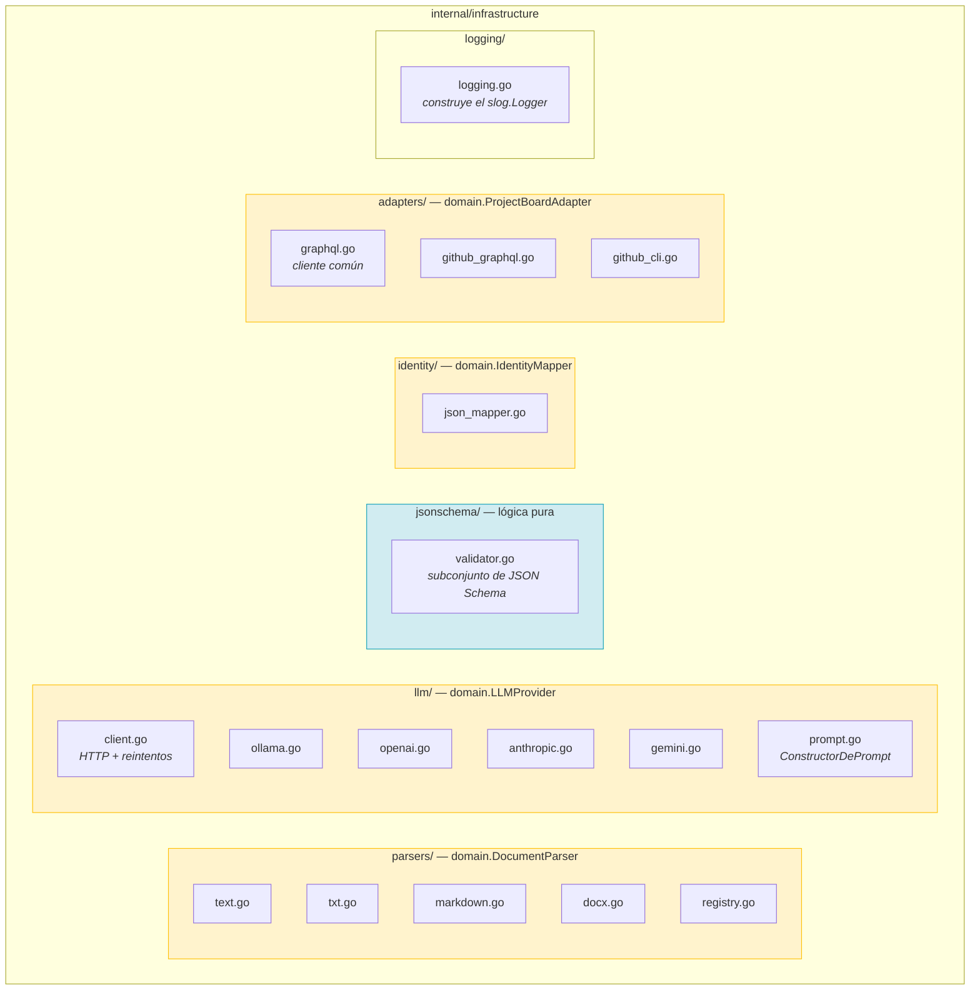
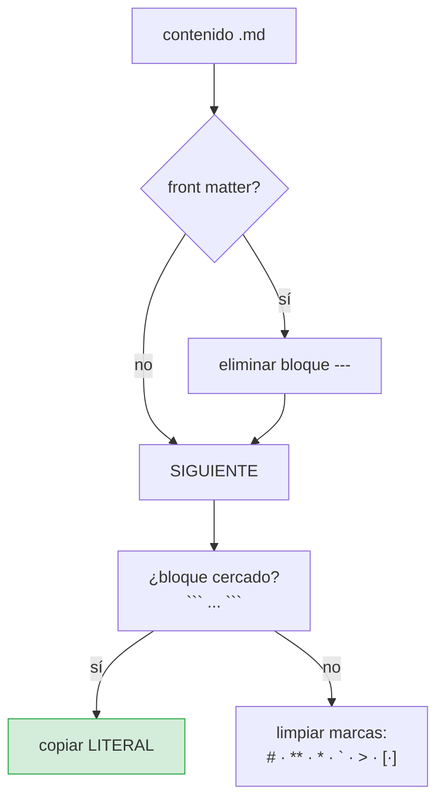
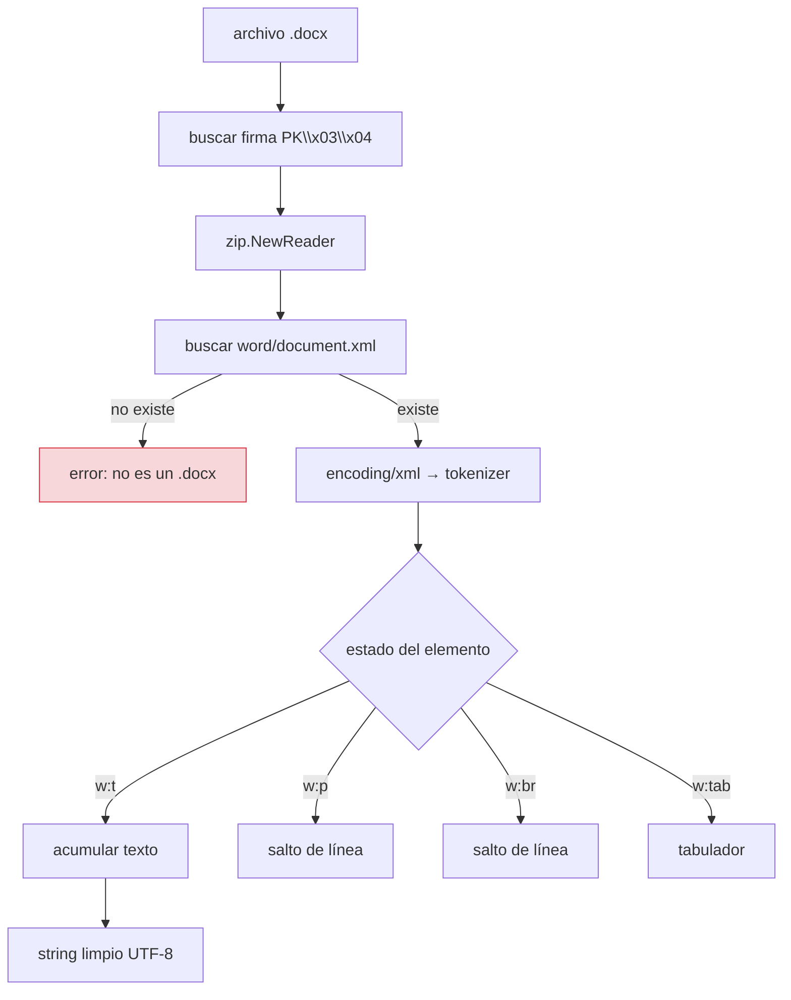
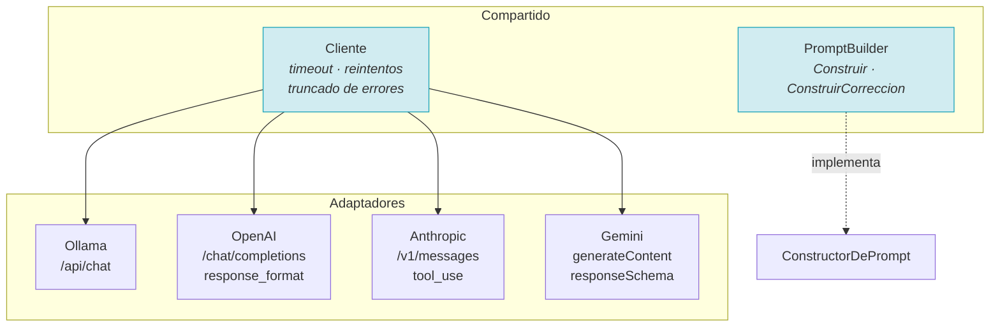
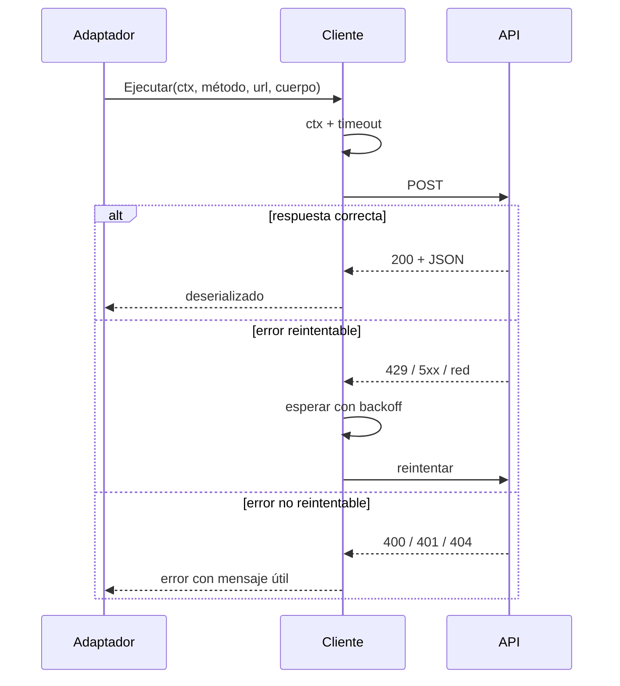
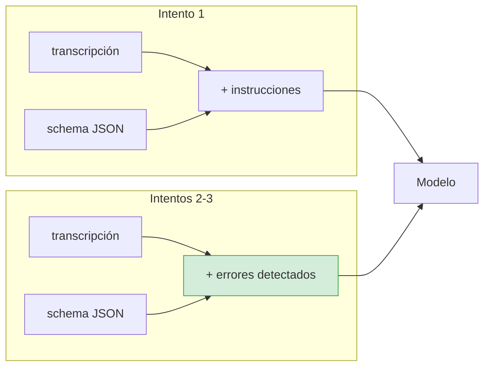
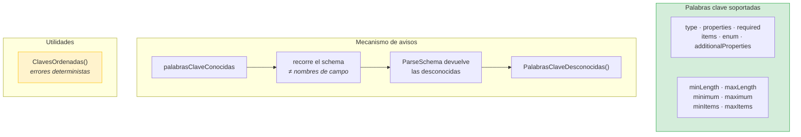
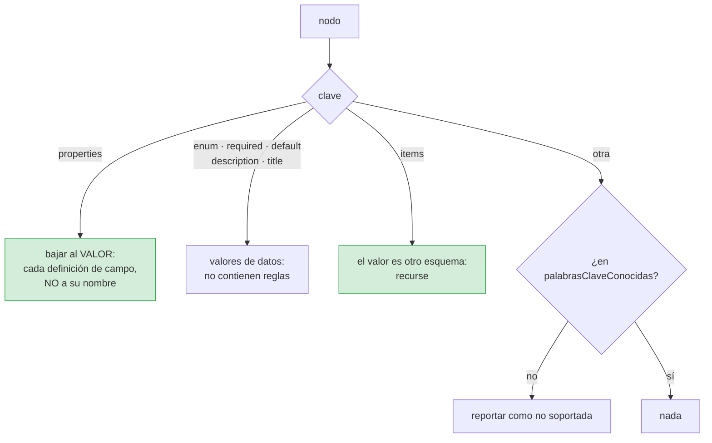
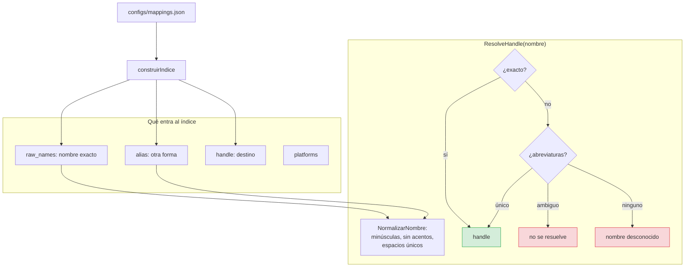
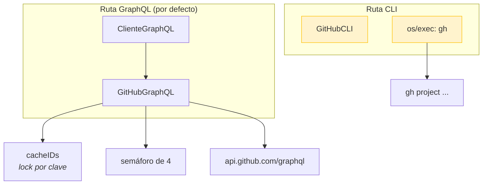

# `internal/infrastructure` — los adaptadores

Todo lo que sabe cómo hablar con el mundo exterior.

**Cobertura global de la capa: 89,4 % – 98,7 %.**

Cada subpaquete implementa un puerto del dominio. Ninguno importa
`application`: knows qué hacer con los datos, no para qué.

## Mapa



## `parsers/` — de documento a texto

### Los cuatro parsers

| Parser | Extensión | Qué hace |
|---|---|---|
| `TextParser` | `.txt` | Normaliza BOM y saltos de línea, tolera UTF-8 inválido |
| `MarkdownParser` | `.md` | Quita front matter y marcas de formato, **conserva** el código |
| `DocxParser` | `.docx` | Lee el ZIP y extrae `word/document.xml` |
| `Registry` | — | Resuelve extensión ↔ parser, y detecta por contenido |

### El parser de Markdown, y su tentación

Quitar marcas de formato es más difícil de lo que parece, porque
**código, tablas y enlaces contienen caracteres que parecen marcas**.



Dos decisiones que costaron un bug:

1. **La cursiva `*texto*` es simétrica: `*a* *b*`.** Una implementación que
   empareja el primer `*` con el último convierte dos cursivas en una cosa
   distinta. Con límites de palabra, no.

2. **La regla horizontal `---` se conserva como contenido**, no se interpreta
   como front matter si no está al principio del archivo. Un acta con una línea
   de separación entre secciones es un caso normal.

### El parser de DOCX, con `archive/zip` y `encoding/xml`

Un `.docx` es un ZIP con XML dentro. La estructura relevante:



Cuatro detalles que ya causaron problemas:

| Detalle | Por qué importa |
|---|---|
| `leerBytesLimitados` | `zip.NewReader` **no** acepta `io.LimitReader`: necesita un `ReaderAt` con tamaño conocido |
| Límite de tamaño | Un `.docx` malicioso o corrupto no debe cargarse entero en memoria |
| `defer f.Close()` | TC-01 lo exige explícitamente |
| Streaming del XML | `encoding/xml.Decoder` token a token, sin construir el árbol entero |

## `llm/` — los cuatro proveedores



### Cómo pide cada uno una salida estructurada

Cada API tiene su propio idioma, y ese idioma no es negociable:

| Proveedor | Mecanismo | Lectura de la respuesta |
|---|---|---|
| **Ollama** | `format` = schema JSON | `message.content` |
| **OpenAI** | `response_format: json_schema` | `choices[0].message.content` |
| **Anthropic** | Definición de **herramienta** | Bloque `tool_use` |
| **Gemini** | `generationConfig.responseSchema` | `candidates[0].content.parts[0].text` |

> **Trampa real, documentada:** `/api/chat` de Ollama devuelve `message.content`.
> **No** devuelve un campo `response` como hacen algunos clientes. Un smoke test
> contra un servidor Python con la forma de Ollama detectó esto; si se hubiera
> escrito el adaptador leyendo `response`, el TC-02 habría pasado contra el
> doble de test y fallado contra el mundo real.

Cada uno **simplifica el schema** antes de enviarlo:

- **Anthropic** rechaza `$schema`, `title`, `additionalProperties`: su
  `input_schema` es un subconjunto.
- **Gemini** tampoco acepta `additionalProperties` ni `default`, y exige
  tipado explícito en cada propiedad.

Enviar el schema tal cual produce un `400` que no dice qué campo sobra.

### El cliente HTTP compartido



Reglas del cliente:

- **Reintenta** 429, 5xx y fallos de red. **No** reintenta 4xx: un 401 no se
  arregla esperando.
- **El timeout se aplica por petición**, no por flujo, y tiene un suelo de 5 s
  (`timeoutEfectivo`): `--timeout 1ms` produce una batería de fallos
  instantáneos en vez de una espera.
- **Los cuerpos de error se truncan.** Una respuesta de GitHub puede pesar
  megabytes; volcarla entera en el log es su propia clase de denegación.

### El `PromptBuilder`



Y el **prompt por defecto**, que existe para que `NewExtractBacklog` funcione
sin inyectar nada:

```go
func (promptPorDefecto) Construir(transcript, schemaJSON string) string {
    return transcript + "\n\nResponde solo con JSON que cumple este esquema:\n" + schemaJSON
}
```

> **Bug encontrado al escribir los tests.** `ConstruirCorreccion` devolvía
> `return transcript`: el reintento era una segunda tirada **ciega** del mismo
> prompt, sin ninguna pista sobre qué había fallado. El modelo no puede adivinar
> cuál de varios requisitos incumplidos corregir, así que los tres intentos se
> agotaban con la misma respuesta inválida. Ahora el prompt de corrección
> incluye los errores acumulados. Es exactamente lo que pide TC-03 («re-intento
> automático **con contexto de error**») y lo que el test comprueba.

## `jsonschema/` — el validador propio

Un subconjunto de JSON Schema 2020-12, implementado sobre `map[string]any`.



### La palabra clave que más costó: `properties`

Recorrer el schema ingenuamente reporta **los nombres de los campos** como si
fueran palabras clave no soportadas:

```json
{
  "properties": {
    "action_items": { "type": "array" },
    "meeting_summary": { "type": "string" }
  }
}
```

Un recorrido plano ve `action_items`, `meeting_summary`, `type`… y acusa al
schema de usar reglas que no soporta. El ruido **oculta las ausencias reales**,
que es el único motivo por el que esa función existe.

La solución es distinguir dos sitios con reglas distintas:



### `ClavesOrdenadas` no es cosmético

Iterar un mapa de Go produce un orden **aleatorio**. Los errores de validación se
envían al LLM como lista, y un LLM que recibe las mismas instrucciones en un
orden distinto cada vez corrige de forma menos consistente. `ClavesOrdenadas()`
ordena alfabéticamente, y `TestClavesOrdenadasEsDeterminista` lo comprueba 20
veces seguidas.

### `PalabrasClaveDesconocidas` deja de mentir

> **Bug encontrado.** El método `PalabrasClaveDesconocidas()` devolvía
> `return nil` siempre, con un comentario que explicaba que se calculaba en otro
> sitio. Es decir: un método público que miente sobre su propio estado. Ahora
> `ParseSchema` guarda la lista en el `Schema` (deduplicada y ordenada) y el
> método la devuelve con copia defensiva.

## `identity/` — nombres a handles



Detalles que son decisiones, no accidentales:

- **Los acentos se eliminan.** `Hernández` y `Hernandez` son la misma persona.
  La tabla es explícita porque la stdlib de Go no normaliza Unicode.
- **La `@` no se almacena.** El dominio la quita; el mapper no la vuelve a poner.
- **Las abreviaturas generan un alias por token**, no solo por el último
  apellido: `Omar H.` y `Hernández Omar` deben converger.
- **`MapperVacio()`** devuelve un mapper que no resuelve nada. Existe para el
  dry-run: permite inyectar una identidad sin exigir el fichero de mapeo.

## `adapters/` — publicación



La ruta CLI existe para machines donde no se puede outputting un `PAT` en el
entorno: delega la autenticación en `gh auth`. A cambio, es más lenta y depende
de una herramienta externa.

Detalle en [flujo de publicación](flujos/04-publicacion.md).

## `logging/` — el logger

Un único punto donde se decide el formato, a partir de `--log-level` y
`--log-format`. `cmd` lo construye y lo inyecta en el contexto; **nadie más lo
construye**. Ver [Observabilidad](../criticas/observabilidad.md).

## Relacionado

- [Flujo de publicación](flujos/04-publicacion.md)
- [ADR-0002 — Cero dependencias externas](../adr/0002-cero-dependencias-externas.md)
- [ADR-0005 — Validador propio](../adr/0005-validador-propio.md)