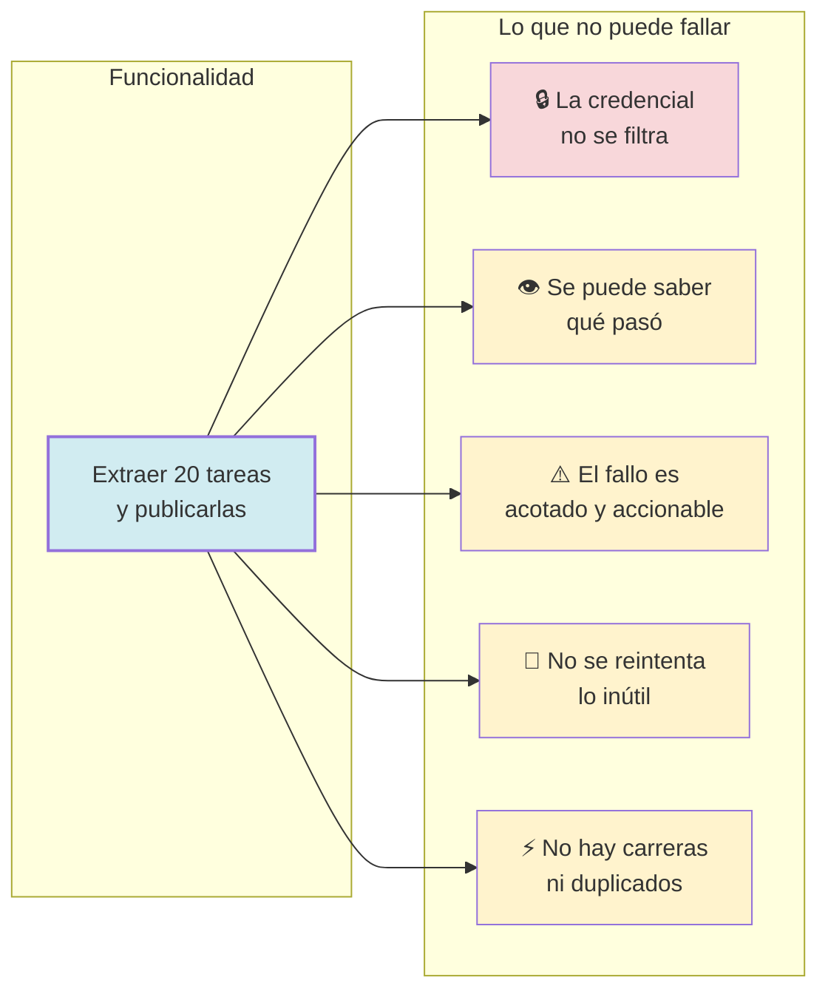
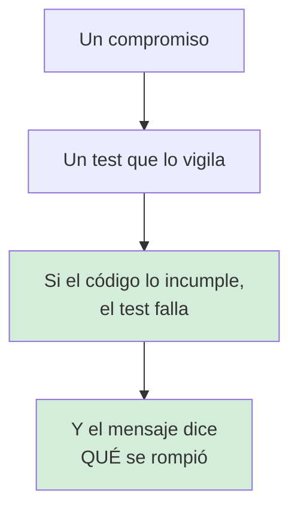

# Funcionalidades críticas

Los compromisos que **no se pueden romper** sin romper el proyecto.

No es documentación de módulos. `docs/architecture/` dice cómo está construido;
este directorio dice **qué tiene que seguir siendo cierto**, y qué se rompe cuando
deja de serlo.

## Índice

| Documento | La pregunta que responde |
|---|---|
| [seguridad-y-secretos.md](seguridad-y-secretos.md) | ¿Qué pasa con un token filtrado? |
| [observabilidad.md](observabilidad.md) | ¿Cómo se depura una ejecución que ya terminó? |
| [manejo-de-errores.md](manejo-de-errores.md) | ¿Qué pasa cuando algo falla? |
| [reintentos-y-timeouts.md](reintentos-y-timeouts.md) | ¿Cuándo se reintenta y cuándo no? |
| [concurrencia.md](concurrencia.md) | ¿Qué se ejecuta en paralelo y por qué es seguro? |

## Por qué estos cinco

Cada uno de estos cinco compromisos se rompe de una forma característica:

| Compromiso | Cómo se rompe | Cómo se detecta |
|---|---|---|
| Seguridad | Alguien pone el token en un mensaje de error | Un test que busca el token en los errores |
| Observabilidad | Una etapa deja de registrar su `job_id` | La mitad de las líneas sin correlación |
| Errores | Un error pierde su causa al envolverlo | Un `errors.Is` que devuelve `false` |
| Reintentos | Se reintenta un 401 | Tres llamadas idénticas y un fallo |
| Concurrencia | Se quita la doble comprobación de la caché | 32 llamadas idénticas a la API |

Ninguno se rompe de forma visible. Por eso tienen su propio documento y sus
propios tests.

## Cada uno tiene un compromiso verificable

Un compromiso que solo está en un documento **se erosiona**. Uno que está en un
test, no.

## Documentos relacionados

- [`docs/specs/`](../specs/) — qué debe hacer.
- [`docs/architecture/`](../architecture/) — cómo está construido.
- [`docs/adr/`](../adr/) — por qué está construido así.
- [`AGENTS.md`](../../AGENTS.md) — reglas operativas para agentes.