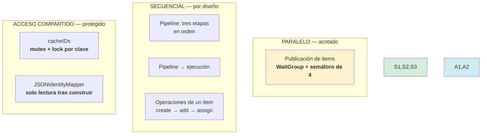
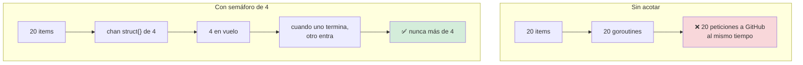
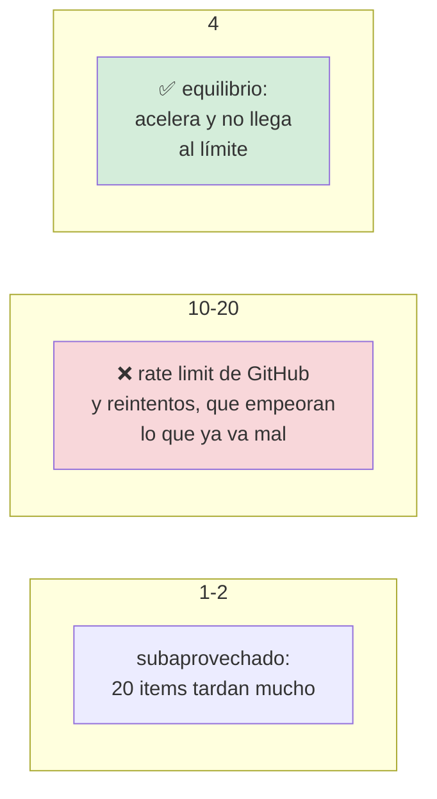
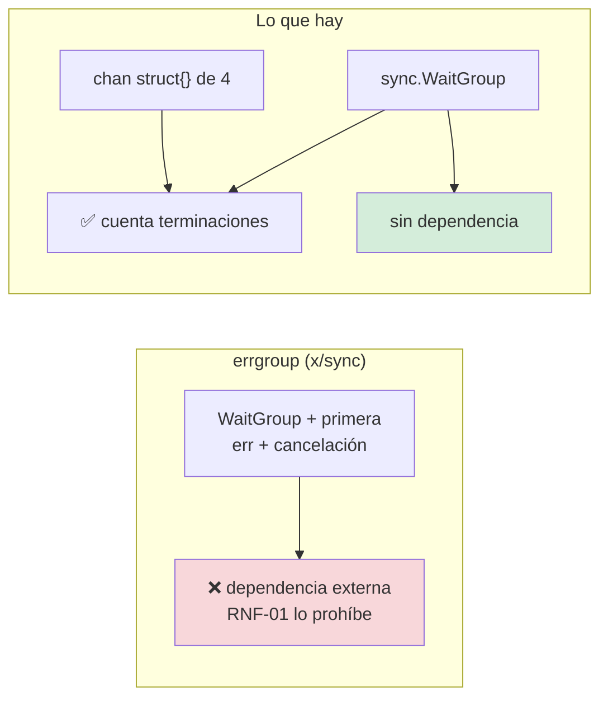
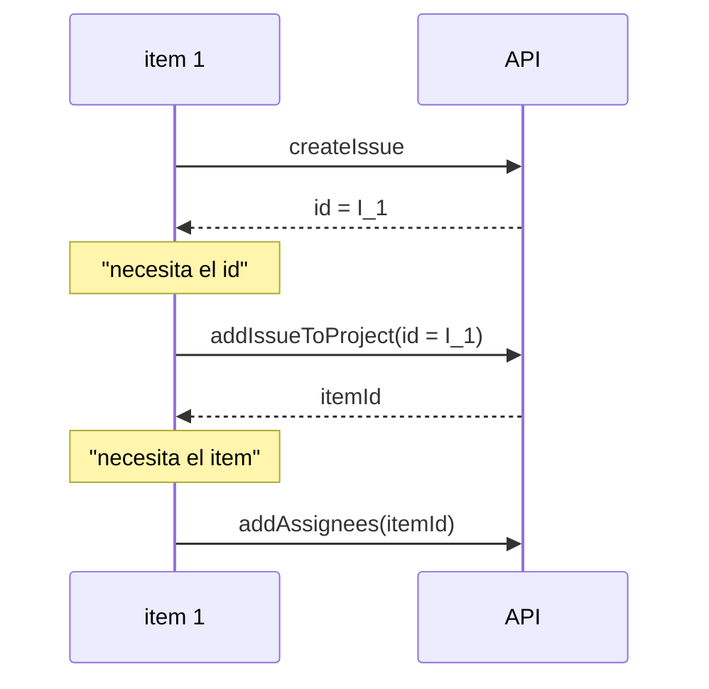
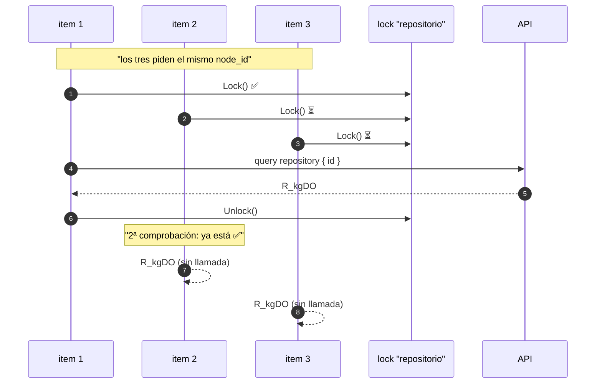
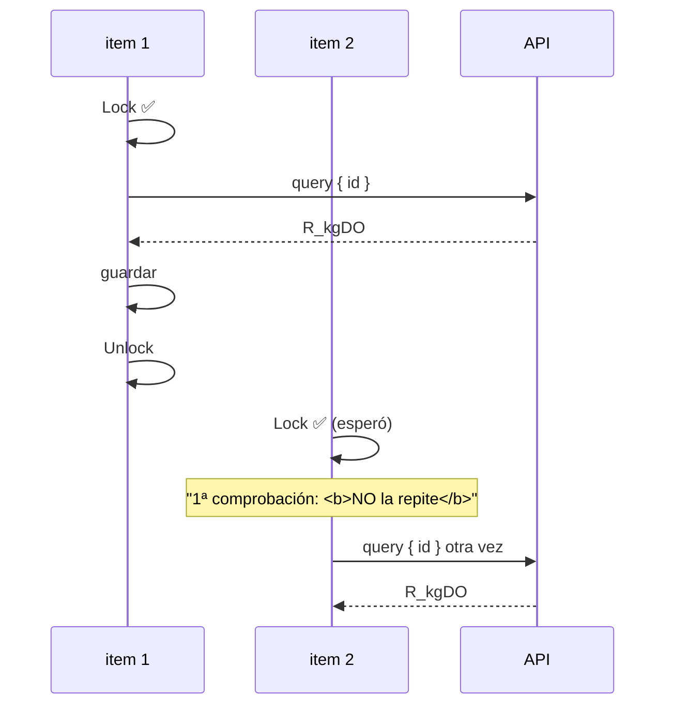
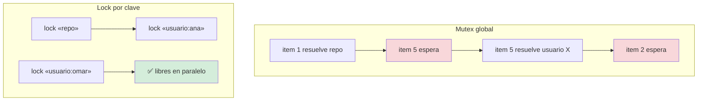
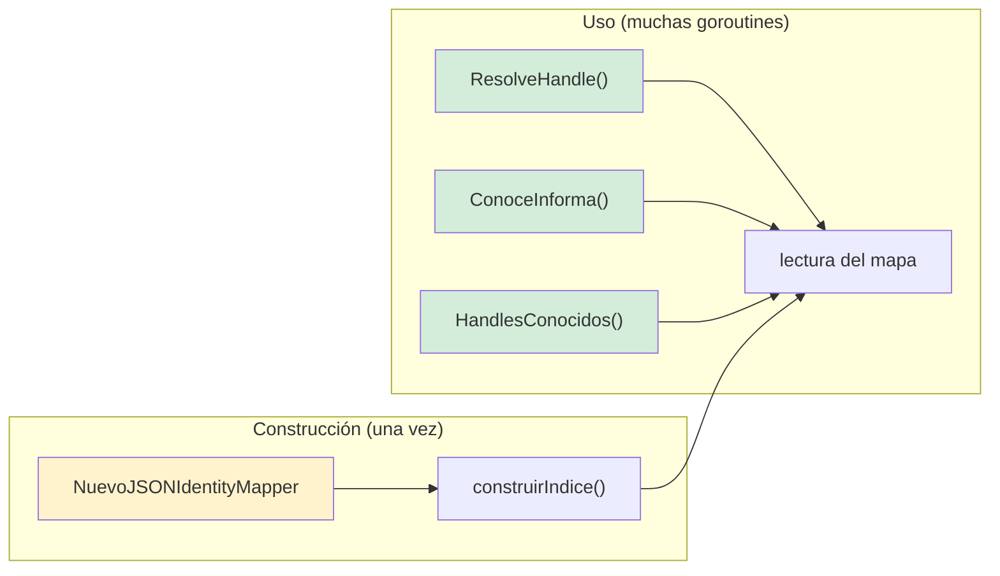

# Concurrencia

**RNF-05** (parcialmente)

## El compromiso

> **Donde hay paralelismo, está acotado y protegido. Donde no lo hace falta, no lo
> hay.**

## Dónde hay concurrencia



## La publicación en paralelo



### Por qué 4



## Por qué `WaitGroup` y un canal, y no `errgroup`



`AGENTS.md` mencionaba `errgroup` en un borrador. Se corrigió: la versión
actual usa `sync.WaitGroup` y un `chan struct{}` como semáforo. La funcionalidad es
la misma sin importar nada.

## Y por qué las operaciones de un item van en serie



`addIssueToProjectV2ItemById` necesita el `node_id` del issue, que **crea la
primera llamada**. Paralelizar dentro de un item no es posible sin magia.

El paralelismo está **entre** items, que es donde está el ganho real: crear 20
issues son 20 peticiones independientes.

## La caché: el danger real



### Sin la doble comprobación: cache stampede



Tres items, tres llamadas idénticas. Es exactamente lo que la caché debía evitar, y
solo se manifiesta **bajo concurrencia**: en una ejecución con un solo item nunca
ocurre.

### Y con un mutex global, correctísimo pero lento



Un mutex global sería **correcto**. Es serial. El lock por clave serializa solo a
quienes piden lo mismo.

## El mapper de identidades



**El índice se construye una vez y después solo se lee.** Eso lo hace seguro por
construcción: un mapa que solo se lee concurrentemente no necesita mutex en Go.

La condición: **nada escribe en el índice después de construirlo**. Si algún día se
añade un método que muta, hay que añadir el lock ahí. Es la deuda que compra esta
decisión, y está documentada en el propio `json_mapper.go`.

## El patrón del semáforo

```go
semaforo := make(chan struct{}, 4)

for _, item := range items {
    wg.Add(1)

    go func(it domain.ActionItem) {
        defer wg.Done()

        semaforo <- struct{}{}        // ocupa un hueco
        defer func() { <-semaforo }()  // lo libera, incluso en panic

        // … publicar
    }(item)
}

wg.Wait()
```

El `defer` que libera el hueco es lo que evita que una salida por error deje el
semáforo permanentemente lleno y detenga el resto.

## Resumen

| Dónde | Modelo | Protección |
|---|---|---|
| Publicación de items | Paralelo, máx. 4 | `WaitGroup` + `chan struct{}` |
| Operaciones de un item | Secuencial | Dependencia de datos |
| Pipeline | Secuencial | El orden importa |
| `cacheIDs` | Compartido | `sync.Mutex` + lock por clave |
| `JSONIdentityMapper` | Compartido | Solo lectura tras construir |
| El logger | Compartido | `slog` es seguro por diseño |

## Verificación

| Compromiso | Test |
|---|---|
| Nunca más de 4 en paralelo | `TestPublicacionParalelaRespetaElLimite` |
| Sin cache stampede (32 goroutines) | `TestResolverNodeIDEvitaElStampede` |
| La caché sirve sin resolver | `TestResolverNodeIDSirveDesdeCacheSinVolverALaRed` |
| El error no se cachea | `TestResolverNodeIDPropagaElErrorYNoLoCachea` |
| Claves separadas no se bloquean | `TestCacheIDsSeparaLasClaves` |
| El valor vacío no es caché | `TestCacheIDsIgnoraValoresVacios` |
| El mapper es seguro en concurrencia | `TestMapperEsSeguroEnConcurrencia` |
| El mapper vacío también | `TestMapperVacioEsSeguroEnConcurrencia` |

```bash
go test ./internal/infrastructure/adapters/ -run 'Paralela|Stampede|CacheIDs' -v
go test ./internal/infrastructure/identity/ -run Concurrencia -v
```

### Verificado por inyección de regresión

Quitar la doble comprobación de `resolverNodeID` produce:

```
se ejecuto el resolutor 32 veces, se esperaba 1 (cache stampede)
```

El test lanza 32 goroutines esperando exactamente una llamada. Un bug de
concurrencia que no se prueba bajo concurrencia **no está probado**.

### Con `-race`

```bash
go test ./... -race -count=1
```

Detecta accesos sin sincronizar. Es la comprobación que un test funcional no
puede hacer: el comportamiento puede ser correcto en una ejecución y estar roto
en la siguiente.

## Documentos relacionados

- [ADR-0009 — Caché con lock por clave](../adr/0009-cache-con-lock-por-clave.md)
- [Flujo de publicación](../architecture/flujos/04-publicacion.md)
- [`AGENTS.md`](../../AGENTS.md) — la regla de concurrencia sin `errgroup`.