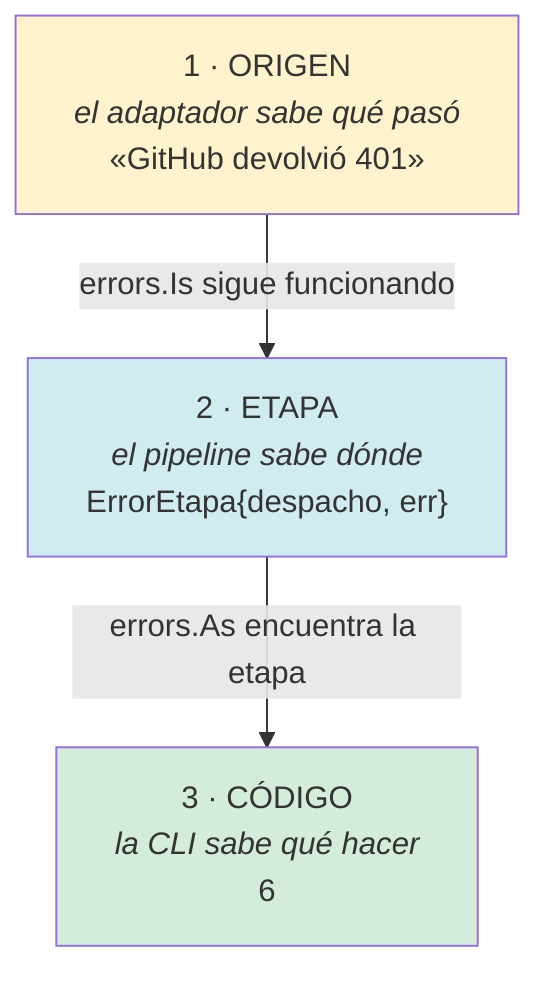
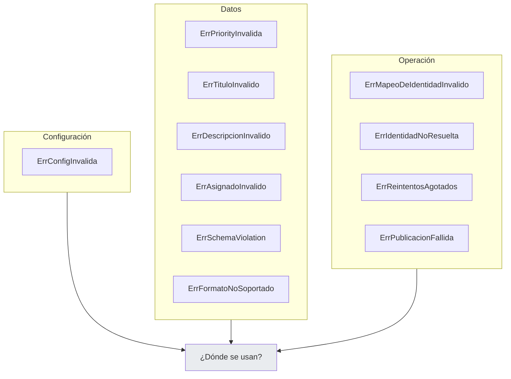
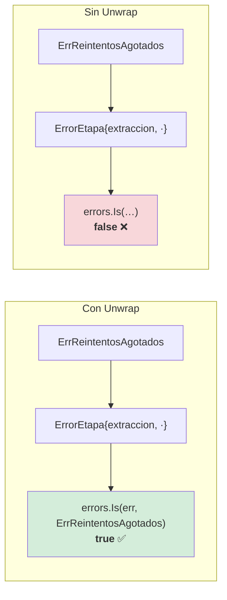
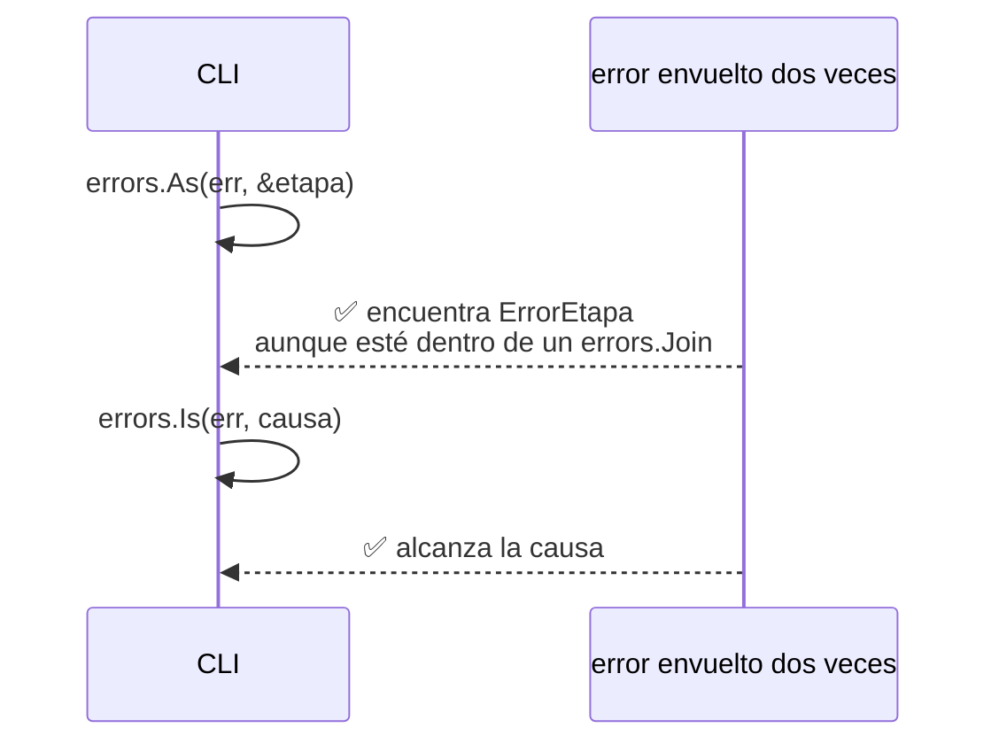
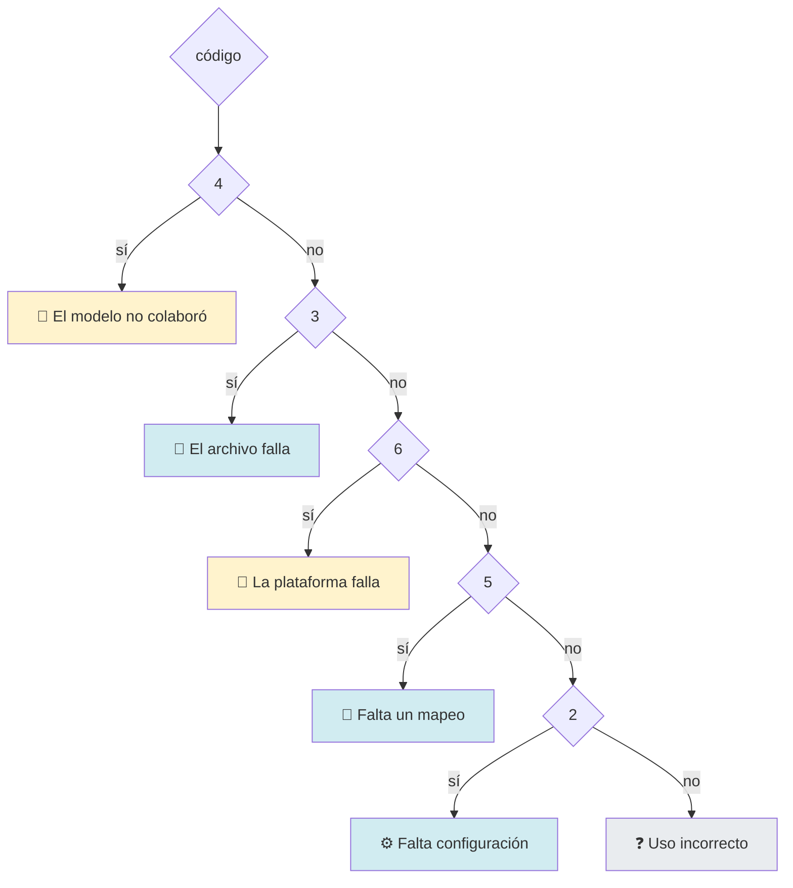
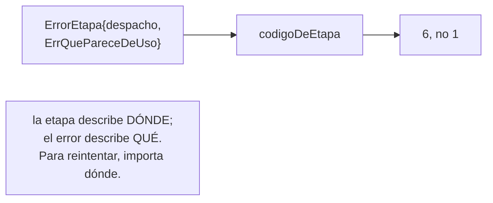
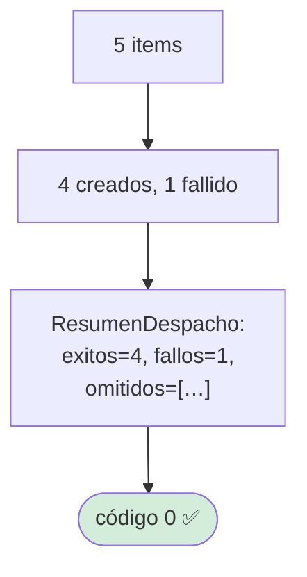
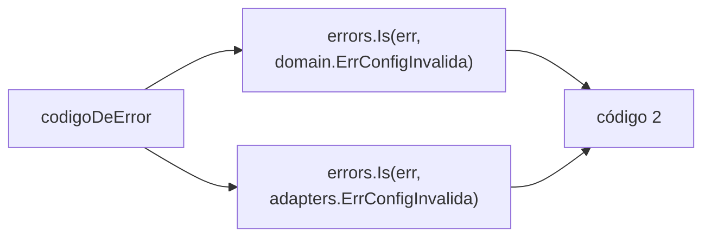
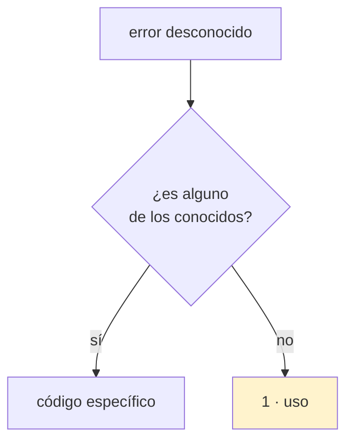

# Manejo de errores

## El compromiso

> **Todo error conserva su causa original a través de todas las capas, y se
> traduce a un código de salida que dice qué acción tomar.**

## Los tres niveles



## Los errores centinela

Todos son `errors.New`, y se comparan con `errors.Is`.



| Familia | Se comparan con | Se convierten en |
|---|---|---|
| **Configuración** | La CLI | Código 2 |
| **Datos** | El validador → **prompt de corrección** | Reintento |
| **Operación** | La CLI y los tests | Códigos 4, 5, 6 |

Cada centinela lleva un comentario que explica **por qué existe**, no qué dice.
Un error sin contexto obliga a buscar el mensaje completo en el código.

## El envoltorio: `ErrorEtapa`

```go
type ErrorEtapa struct {
    Etapa PipelineEtapa
    Err   error
}

func (e *ErrorEtapa) Error() string { return fmt.Sprintf("fallo en la etapa de %s: %v", e.Etapa, e.Err) }
func (e *ErrorEtapa) Unwrap() error   { return e.Err }
```

### `Unwrap` es la pieza crítica



> Sin `Unwrap`, todo error de la etapa de despacho sería indistinguible, y la CLI
> no podría elegir entre código 4, 5 y 6.

### Tolera el envoltorio anidado



Un `errors.Join` o un envoltorio añadido por un logger no rompe nada: `errors.As`
recorre la cadena.

### Y tolera errores que no son suyos

| Entrada | `EtapaDelError` | `EsFalloDePublicacion` |
|---|---|---|
| `nil` | `""` | `false` |
| `errors.New("sin etapa")` | `""` | `false` |
| `domain.ErrConfigInvalida` | `""` | `false` |
| `ErrorEtapa{despacho}` | `"despacho"` | `true` |

La CLI llama a estas funciones con errores de configuración, que no llevan etapa.
Una función que entra en pánico ahí tumba el proceso justo cuando iba a dar un
mensaje útil.

## Los códigos de salida



| Código | Significado | Acción |
|---|---|---|
| 0 | Éxito, incluido el fallo parcial | Nada |
| 1 | Uso | Arreglar la línea de comandos |
| 2 | Configuración | Arreglar credenciales o ficheros |
| 3 | Ingesta | Arreglar el archivo |
| 4 | Extracción | Cambiar de modelo o de prompt |
| 5 | Identidad | Arreglar el mapeo |
| 6 | Publicación | Reintentar el comando |
| 130 | Interrumpido (Ctrl-C) | Nada |

Cada código señala una **categoría de causa** distinta, y por tanto una acción
distinta. Ese es el criterio para decidir si merece un código: **si la acción
cambia, necesita un código propio**.

### La etapa manda



## El fallo parcial no es un error



Devolver error haría que un pipeline de CI creyera que no se publicó nada, cuando
cuatro tarjetas existen. La información de lo que falló va en el resumen y en el
log.

## Los mensajes: para personas y para el LLM

```mermaid
flowchart LR
    subgraph persona["Para una persona"]
        P1["«no se encontró el proyecto<br/>número 7 en «organización»»"]
    end

    subgraph llm["Para el LLM"]
        L1["«action_items[0].priority:<br/>se esperaba uno de HIGH, MEDIUM, LOW;<br/>se recibió \"urgent\"»"]
    end

    style P1 fill:#d1ecf1
    style L1 fill:#fff3cd
```

Los mensajes de validación van al prompt del LLM. «Valor inválido» obligaría al
modelo a adivinar; con la ruta y el enum, sabe exactamente qué corregir.

## La higiene de los mensajes

| Regla | Motivo |
|---|---|
| Nombrar **qué** se esperaba y **qué** se recibió | Es lo que hace el mensaje accionable |
| Incluir la **ruta** (`action_items[2].priority`) | Localiza el campo |
| Nombrar el **proveedor** que falló | «el proveedor fallo» no dice cuál |
| **Truncar** los cuerpos de error | Una respuesta puede pesar megabytes |
| **Nunca** incluir credenciales | [Seguridad](seguridad-y-secretos.md) |
| Mencionar la **variable** que falta | «falta `OPENAI_API_KEY`» es accionable |

## Errores que se solapan entre paquetes



`identity` y `adapters` definen cada uno su `ErrConfigInvalida`. No es duplicación
sin motivo: son paquetes que **no se importan entre sí**, y el del dominio está en
la frontera. Cuesta una línea en la CLI y evita un acoplamiento.

## La lista de errores está cerrada



Un error no reconocido se reporta como error de uso: es la elección conservadora,
porque significa «algo que no sabemos que hacer».

## Verificación

| Compromiso | Test |
|---|---|
| La causa sobrevive al envoltorio | `TestErrorEtapaEncadenaYExponeLaEtapa` |
| Tolera el envoltorio anidado | `TestErrorEtapaAguantaElEnvoltorioAnidado` |
| Tolera errores ajenos y `nil` | `TestEtapaDelErrorToleraErroresAjenos` |
| Cada etapa tiene su código | `TestCodigoDeEtapaMapeaCadaEtapaASuCodigo` |
| La etapa desconocida delega | `TestCodigoDeEtapaDesconocidaDelegaEnElError` |
| Los códigos son distintos | `TestCodigosDeSalidaSonDistintos` |
| Funcionan con error envuelto | `TestCodigoDeErrorEncadenadoConEtapa` |
| La tabla de errores | `TestCodigoDeError`, `TestCodigoDeErrorEncadenados` |
| `--help` devuelve 0 | `TestCodigoDeErrorDevuelveOKParaAyuda` |
| Un error desconocido da 1 | `TestCodigoDeErrorParaErroresDesconocidos` |
| El fallback parcial no es error | `TestFalloParcialNoEsErrorGlobal` |
| El error del validador es accionable | `TestValidarNombraElTipoEsperadoEnLosMensajes` |
| El último error concreto se conserva | `TestReintentosAgotadosDevuelveCodigoDeExtraccion` |

```bash
go test ./internal/application/ -run 'ErrorEtapa|EtapaDelError' -v
go test ./cmd/talkaboutthis/ -run 'Codigo' -v
```

## Documentos relacionados

- [Flujo de errores](../architecture/flujos/05-errores-y-codigos.md) — el diagrama completo.
- [Errores centinela del dominio](../architecture/domain.md#errores-centinela)
- [Reintentos y timeouts](reintentos-y-timeouts.md) — cuándo se reintenta.