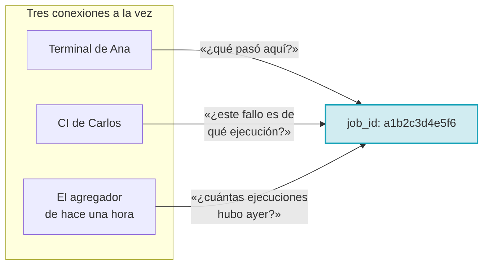
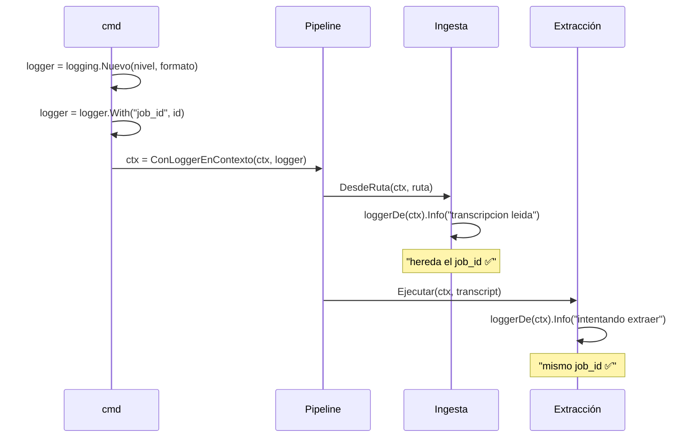
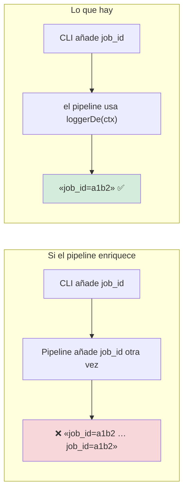
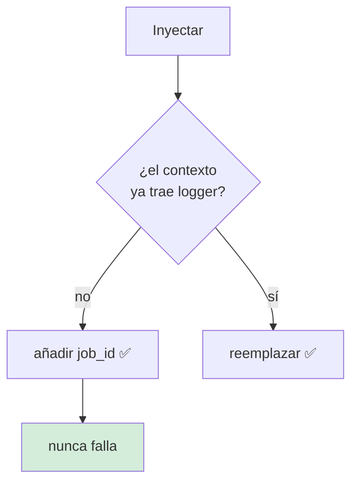
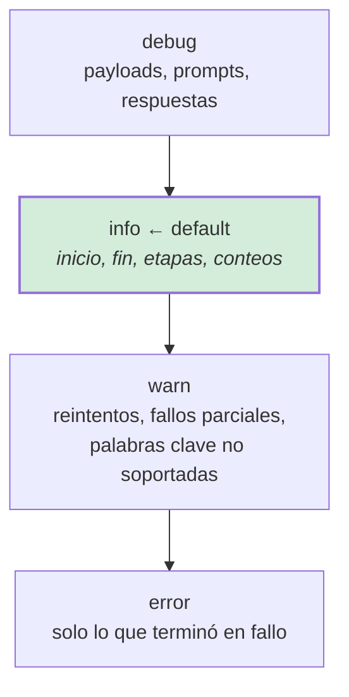
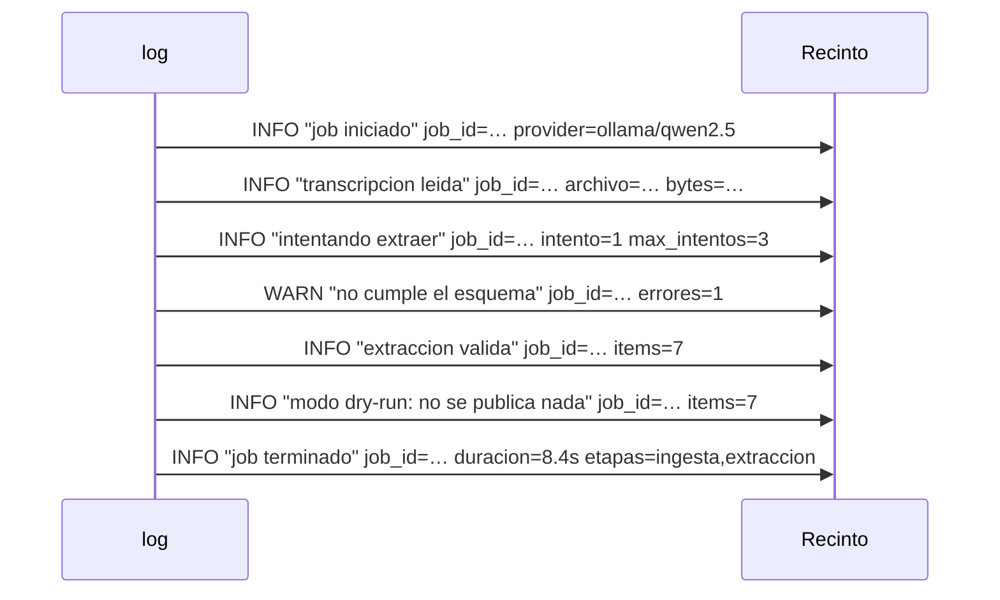
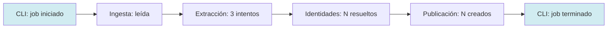

# Observabilidad

**RNF-06**

## El compromiso

> **Cada línea de log pertenece a una ejecución identificable, y cada ejecución se
> puede seguir de principio a fin.**

## Por qué el `job_id` es el eje de todo



Una ejecución es una sola línea de comandos, pero toca **muchos** sistemas: el
LLM, GitHub, tres reintentos, veinte issues. Sin un identificador común, reconstruir
qué pasó exige unir treinta líneas por la marca temporal y adivinar.

El `job_id` se genera con `crypto/rand`, no con el reloj: dos ejecuciones que
empiezan en el mismo nanosegundo no pueden colisionar.

## El contrato del logger en el contexto



### La regla: el pipeline **no** enriquece



> **Bug real, encontrado al cerrar el proyecto.** El `job_id` **aparecía dos veces
> en cada línea**. Se detectó porque el pipeline y la CLI los dos lo añadían.
>
> La corrección: `hayLoggerEnContexto(ctx)`. El pipeline respeta el logger del
> contexto sin enriquecerlo. Verificado por inyección de regresión
> (`TestPipelineNoDuplicaElJobIDDelInyector`).

## Las tres funciones de `contexto.go`

```go
// Inyecta el logger. Sustituye un ctx nil por Background() en lugar de entrar
// en pánico: context.WithValue con padre nil es un panic, y lo era.
func ConLoggerEnContexto(ctx context.Context, l *slog.Logger) context.Context

// Devuelve el logger del contexto, o el global si no hay.
func loggerDe(ctx context.Context) *slog.Logger

// Dice si el contexto trae logger. Lo usa el pipeline para NO duplicar campos.
func hayLoggerEnContexto(ctx context.Context) bool
```

### Por qué `ConLoggerEnContexto` no falla si falta logger



Inyectar es una operación que **nunca debe abortar una publicación ya empezada**.
Perder la correlación de un `job_id` es un inconveniente; perder cinco tarjetas
publicadas es un desastre. `loggerDe` cae al logger global en vez de propagar un
error.

### Y por qué `ctx` nil no entra en pánico

> `context.WithValue(padre, ...)` **entra en pánico si el padre es `nil`**. Es un
> fallo deliberado de la stdlib: un `context.Context` es una promesa de que hay
> un alcance, y `nil` no la cumple.
>
> `ConLoggerEnContexto` sustituye un `ctx` nil por `context.Background()`. El
> nombre está **exportado** (`Con`, no `con`) porque la CLI lo usa.

## Los niveles



| Nivel | Qué lleva | Cuándo |
|---|---|---|
| `debug` | El prompt completo, la respuesta cruda | Depurar una extracción |
| `info` | Inicio, fin de etapa, `duracion`, `items` | El registro por defecto |
| `warn` | Reintento, fallo parcial, `enum` no soportado | Cuando algo va mal pero sigue |
| `error` | El fallo final | Cuando termina en error |

**El default es `info`**: suficiente para saber que pasó y cuánto tardó, sin volcar
el prompt de un modelo de 7 000 tokens en cada ejecución.

## Los dos formatos

### `text` — para la terminal

```
time=2026-10-02T10:30:00.000Z level=INFO msg="transcripcion leida" job_id=a1b2c3d4e5f6 archivo=reunion.md bytes=18432
```

### `json` — para el agregador

```json
{"time":"2026-10-02T10:30:00.000Z","level":"INFO","msg":"transcripcion leida","job_id":"a1b2c3d4e5f6","archivo":"reunion.md","bytes":18432}
```

El formato se elige con `--log-format` o `LOG_FORMAT`.

> **Bug real.** `LOG_FORMAT` estaba documentado en `.env.example` desde el
> principio y **nunca se leía**. Documentar una variable que el programa ignora es
> peor que no documentarla: el usuario la ajusta, no ocurre nada, y pierde la
> confianza en todo lo demás.

## Los campos de una ejecución completa



Cinco puntos de anclaje: **inicio**, **entrada leída**, **cada intento**, **salida**,
**fin**. Con esos cinco se localiza un fallo sin ninguna otra información.

## Qué NO se registra

| No | Por qué |
|---|---|
| El token | [Seguridad](seguridad-y-secretos.md) |
| El prompt completo | Ruido enorme, y contiene la minuta |
| La respuesta cruda del LLM | Ídem, salvo en `debug` |
| Los `handle`s resueltos | dato semiprivado |
| El contenido de la minuta | es del usuario, y puede ser confidencial |

## Verificación

| Compromiso | Test |
|---|---|
| `--log-format` se lee | `TestParseFormato` |
| `--log-level` se lee | `TestNuevoNiveles` |
| Un formato inválido se rechaza | `TestNuevoFormatoInvalido` |
| Los formatos válidos se aceptan | `TestFormatosValidos` |
| El nivel filtra eventos | `TestNivelFiltraEventos` |
| El JSON es parseable y trae `job_id` | `TestJSONEsParseableYTraeElJobID` |
| `With` tolera un receptor nil | `TestConJobIDToleraNil` |
| Los `job_id` son únicos | `TestJobIDSonUnicos` |
| El `job_id` lleva prefijo | `TestJobIDTienePrefijo` |
| El `job_id` del contexto se recupera | `TestJobIDEnContexto` |
| Un contexto nil no rompe | `TestJobIDDeContextoNil` |
| El `job_id` **no** se duplica | `TestPipelineNoDuplicaElJobIDDelInyector` |

```bash
go test ./internal/infrastructure/logging/ -v
go test ./internal/application/ -run JobID -v
```

### Verificado por inyección de regresión

Volver a añadir el `job_id` en el pipeline produce:

```
el job_id aparece 2 veces en una linea
```

## Correlación de principio a fin



Un único `job_id` atraviesa las cuatro capas. Se puede reconstruir la ejecución
entera con:

```bash
grep 'job_id=a1b2c3d4e5f6' ejecucion.log
```

O, en formato JSON, con cualquier agregador.

## Documentos relacionados

- [Seguridad](seguridad-y-secretos.md) — qué no se registra y por qué.
- [RFC-06 en `INIT.md`](../../INIT.md)
- [La CLI](../architecture/cmd.md) — quién construye el logger.