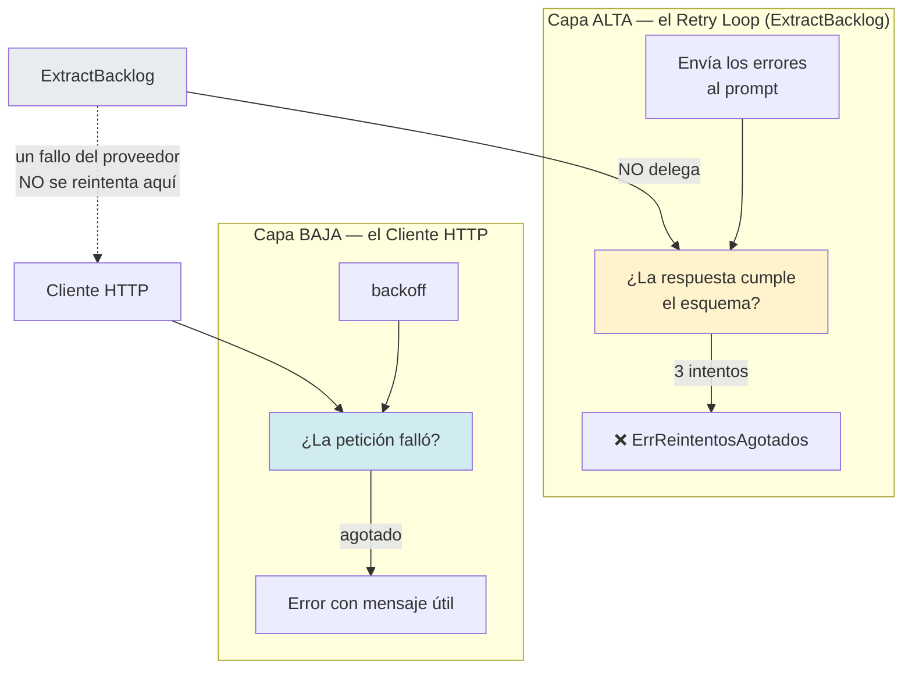
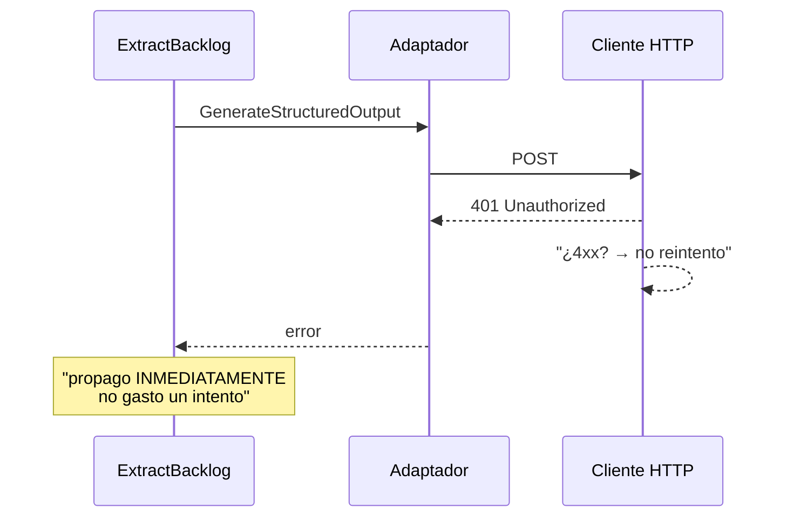
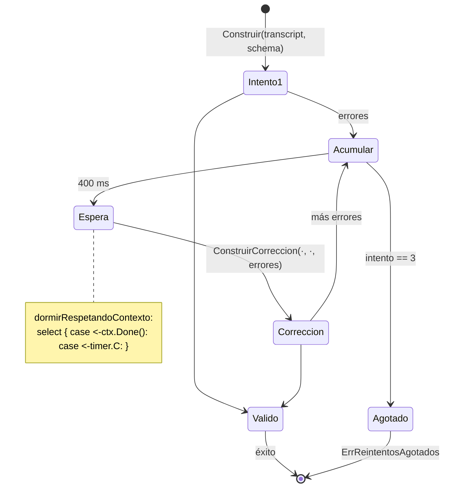
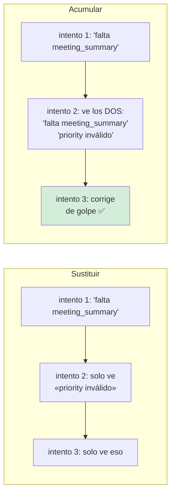
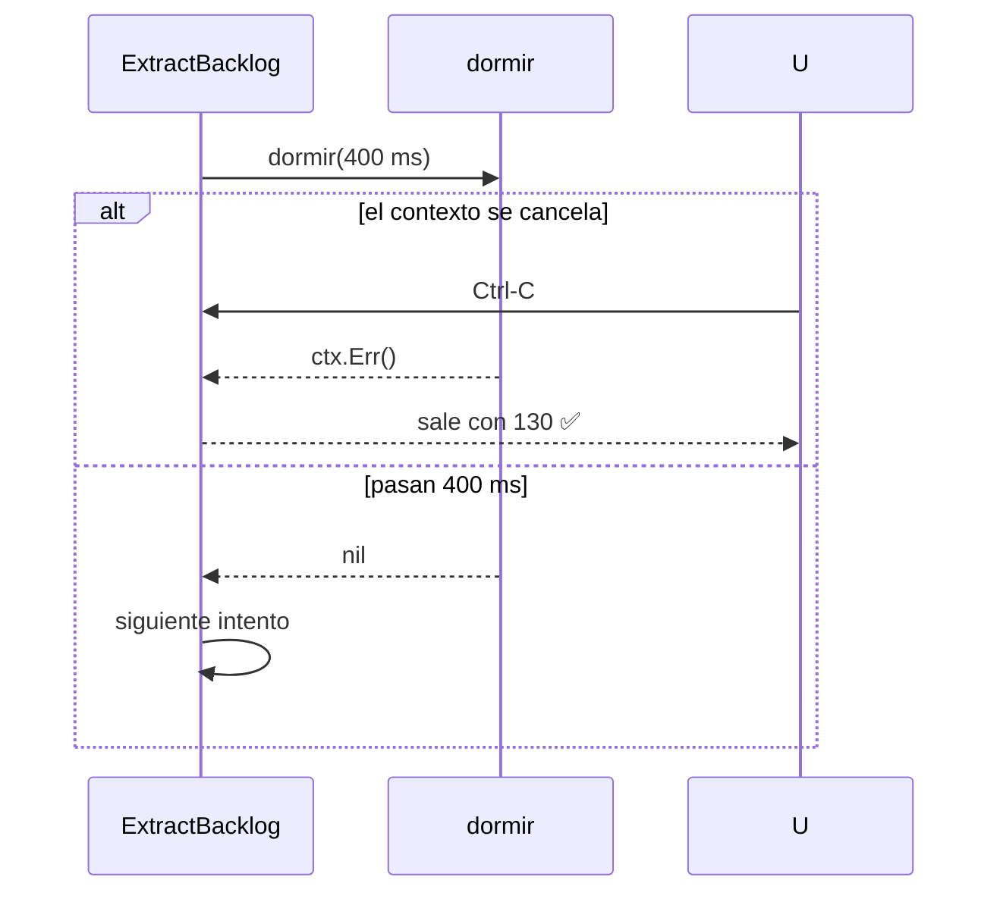
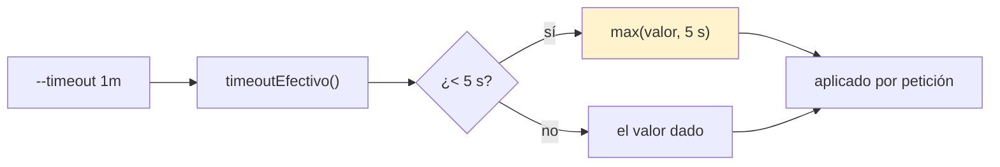
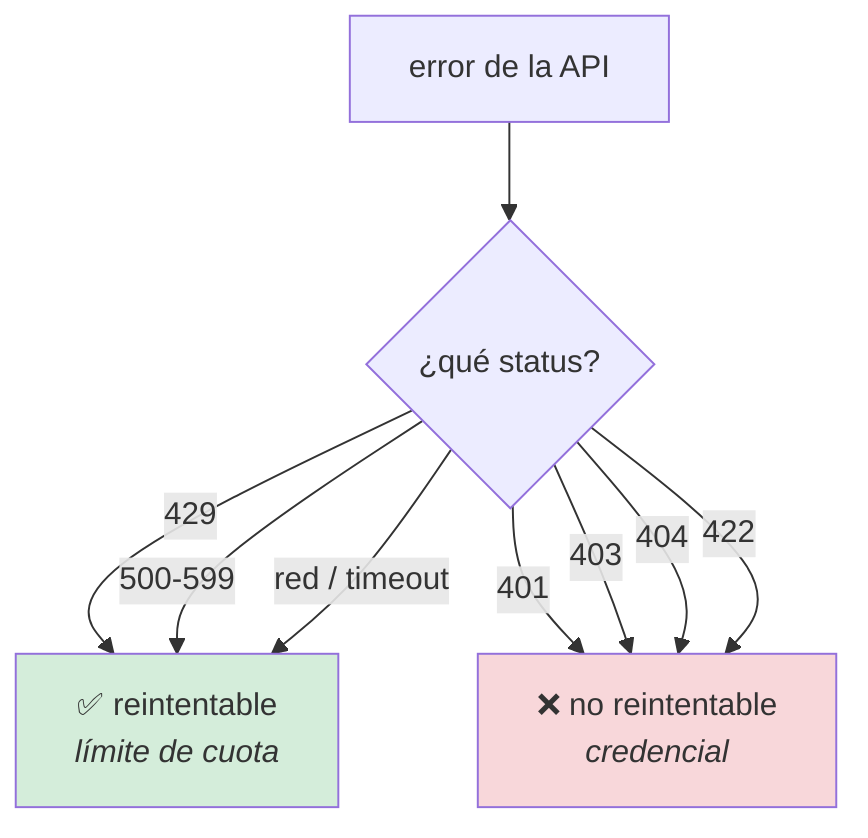

# Reintentos y timeouts

**RNF-03**

## El compromiso

> **Solo se reintenta lo que puede mejorar con la espera, y toda espera respeta el
> contexto.**

## Los dos reintentos, que no son el mismo



| | Retry loop (alto) | Cliente HTTP (bajo) |
|---|---|---|
| **Reintenta** | Respuesta que no cumple el schema | 429, 5xx, fallo de red |
| **No reintenta** | Error del proveedor | 4xx |
| **Espera** | 400 ms fijos | Backoff exponencial |
| **Al agotarse** | `ErrReintentosAgotados` + último error | Error con código HTTP |
| **Modifica el prompt** | **Sí** | No |

## Por qué un error del proveedor no se reintenta arriba



Repetir la misma llamada con la misma credencial inválida da el mismo error tres
veces, consume tres esperas de 400 ms y tres intentos del presupuesto, y vuelve a
fallar.

**Lo transitorio lo sabe mejor el cliente HTTP**, que sabe distinguir un 503 de un
401. La separación es deliberada: cada capa reintenta lo que ella entiende.

## El retry loop: cómo funciona



| Parámetro | Valor | Por qué ese valor |
|---|---|---|
| `MaxIntentosExtraccion` | **3** | Uno original y dos correcciones |
| `EsperaEntreIntentos` | **400 ms** | Reiniciar el sampling es parte de la corrección |
| Los errores | **Acumulados** | Un reintento puede corregir varios problemas |
| El último error concreto | **Conservado** | Para que el usuario sepa QUÉ falló |

### Por qué 400 ms y no 0

La mayoría de los fallos de formato son **transitorios**: el mismo prompt con el
error adjunto produce una respuesta distinta en el siguiente muestreo. Sin pausa,
los tres intentos serían casi la misma llamada tres veces.

Y por qué no más: a partir de unos segundos, esperar cuesta más que devolver el
error y dejar que el usuario decida. Tres es el punto donde seguir reintentando
cuesta más que devolver el error.

### Por qué se acumulan los errores



## La espera respeta el contexto

```go
func dormirRespetandoContexto(ctx context.Context, d time.Duration) error {
    select {
    case <-ctx.Done():
        return ctx.Err()
    case <-time.After(d):
        return nil
    }
}
```



Un `time.Sleep(400 * time.Millisecond)` a secas haría que un Ctrl-C tardara medio
segundo en notarse. Con `--timeout 1s` y tres intentos, casi tres segundos.

`dormir` además es **inyectable**: los tests no pagan esperas reales.

## El presupuesto de RNF-03: 15 minutos

```mermaid
gantt
    dateFormat X
    axisFormat %s

    section Escenario normal
    Ingesta                    :0, 1
    Extracción 1 intento       :1, 12
    Espera                     :13, 1
    Extracción 2 intento       :14, 12
    Identidades                :26, 1
    Publicación 20 items       :27, 3

    section Peor caso (3 intentos)
    Extracción 3 intentos      :0, 40
    Publicación 20 items       :40, 5
```



| Tramo | Típico | Peor caso |
|---|---|---|
| Ingesta | 50 ms | 500 ms |
| Una extracción | 2–15 s | 60 s |
| Tres intentos | 6–45 s | 180 s |
| Publicación de 20 items | 2 s | 30 s |
| **Total** | **10–60 s** | **~4 min** |

El presupuesto de 15 minutos es un **techo de seguridad**, no una restricción: existe
para detectar un LLM colgado. Los 400 ms entre intentos son ruido a esa escala.

## Los timeouts



**El suelo de 5 s.** `--timeout 1ms` no significa «quiero fallar rápido»: significa
«quiero esperar poco». Sin suelo, un valor accidentalmente pequeño produce una
batería de fallos instantáneos en vez de una espera, y el diagnóstico apunta al
problema equivocado.

El timeout se aplica **por petición**, no por flujo, y lo hereda el contexto: un
`ctx` con deadline de 5 s corta tanto la espera como la llamada.

## `EsReintentable`



Esperar a un 401 no lo convierte en 200. Y reintentar un 403 tres veces solo gasta
tiempo antes de decir lo mismo.

## Verificación

| Compromiso | Test |
|---|---|
| Los transitorios se reintentan | `TestClienteReintentaErroresTransitorios` |
| Los no transitorios no | `TestClienteNoReintentaErroresNoTransitorios` |
| `EsReintentable` | `TestEsReintentable` |
| El timeout se respeta | `TestClienteRespetaTimeout` |
| El contexto cancela | `TestClienteCancelaConContexto` |
| Contexto cancelado en el parser | `TestTxtRespetaContextoCancelado` |
| Contexto cancelado en la extracción | `TestPublishRespetaContextoCancelado` |
| Contexto cancelado en el tablero | `TestConsultarProjectIDRespetaContextoCancelado` |
| Contexto cancelado en la CLI | `TestContextoCancelado` |
| Tres intentos y se rinde | `TestReintentosAgotadosDevuelveCodigoDeExtraccion` |
| El prompt lleva los errores | `TestPromptDeCorreccionIncluyeErrores` |
| El prompt por defecto también | `TestPromptPorDefectoConstruyeCorreccion` |
| El rate limit se identifica | `TestRateLimitSeIdentifica` |
| La duración se mide | `TestPipelineDryRunCompleto` |

```bash
go test ./internal/infrastructure/llm/ -run 'Reintenta|Timeout|Cancela' -v
go test ./internal/application/ -run 'Reintentos|PromptDeCorreccion' -v
```

### El fallo parcial no se reintenta

Un item que falla al publicar **no se reintenta**: `PublishBacklog` propaga el error
del tablero y el resumen registra el fallo. Reintentar una creación de issue tiene
un riesgo real de duplicado: si la primera llamada creó la tarjeta y la respuesta se
perdió, un reintento crea una segunda.

## Documentos relacionados

- [Flujo de extracción](../architecture/flujos/02-extraccion.md)
- [Manejo de errores](manejo-de-errores.md)
- [RFC-03 en `INIT.md`](../../INIT.md)