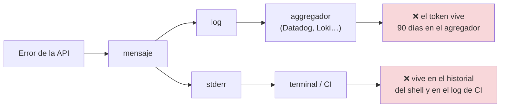
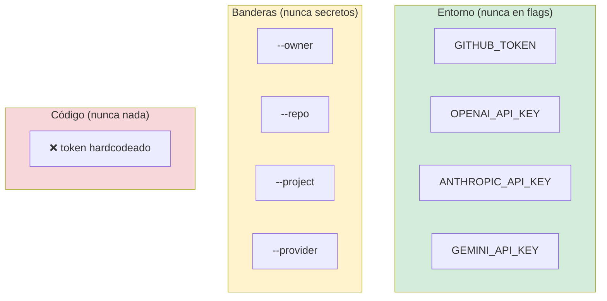
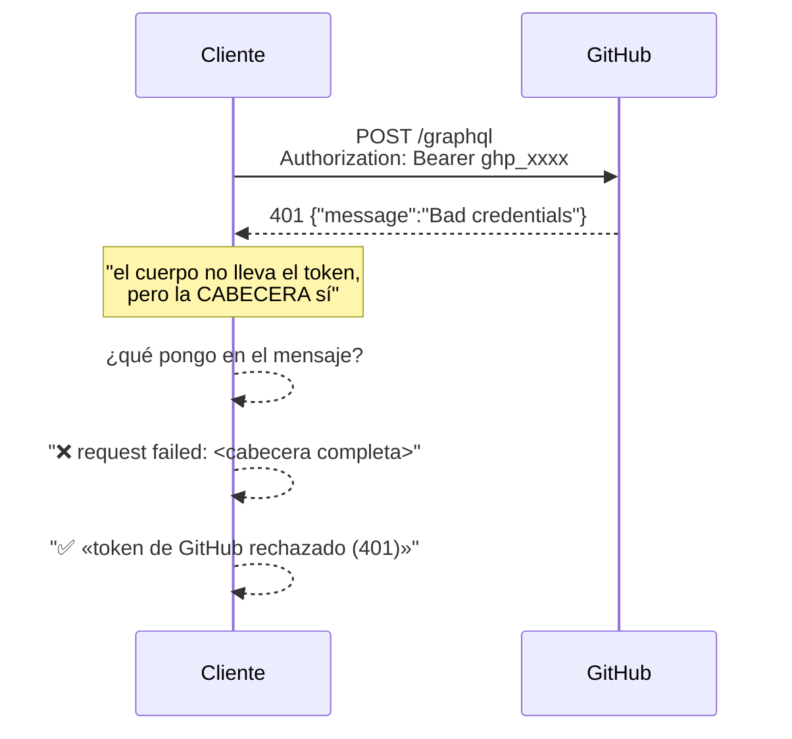
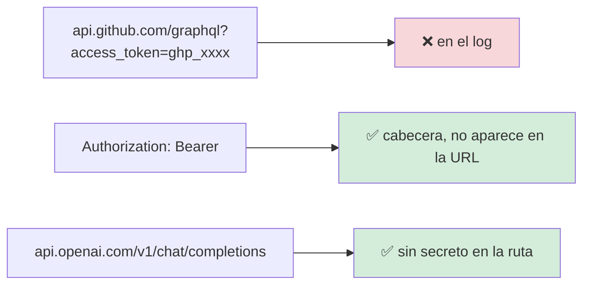
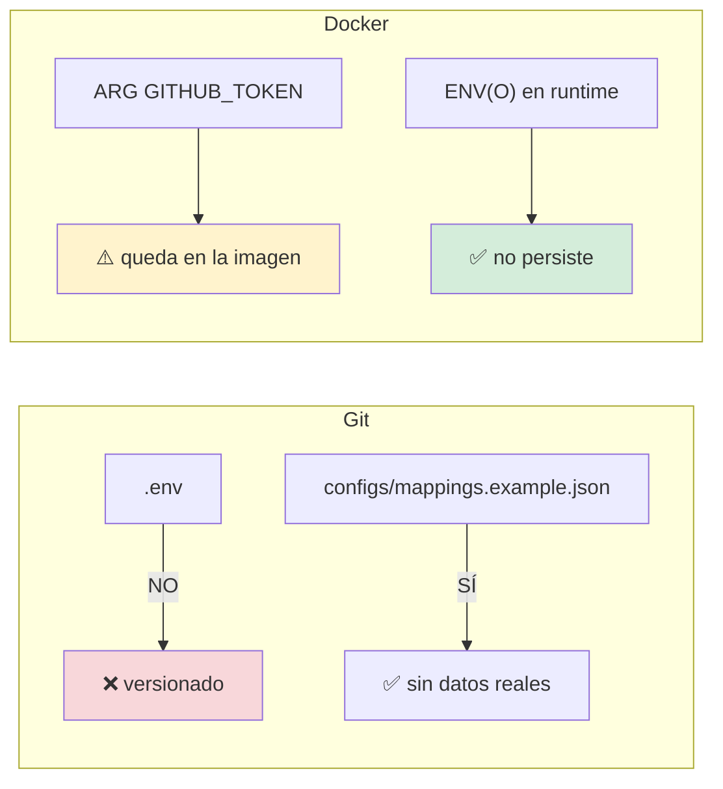
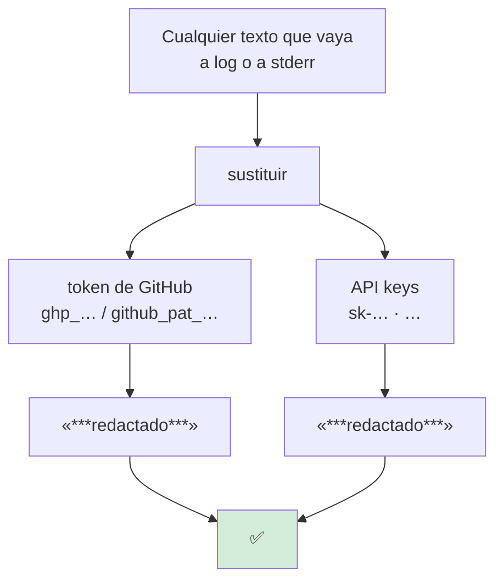
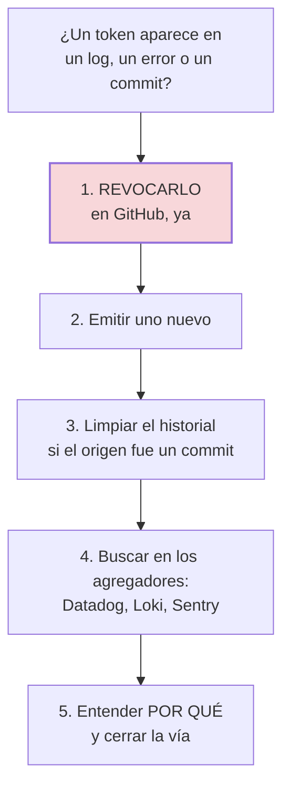

# Seguridad y secretos

**RNF-04**

## El compromiso

> **Ninguna credencial aparece nunca en un log, un mensaje de error ni la salida
> de la CLI.**

No «normalmente no aparece». **Nunca.**

## Por qué es crítico aquí



Un token de GitHub con scope `project` puede **crear y modificar issues** en
cualquier repositorio al que tenga acceso. Y los logs son, típicamente, el sitio
más persistente y menos controlado de la organización.

Un error que incluye la URL de una API autenticada con el token en la query —o en
una cabecera que el cliente Decide incluir— es suficiente.

## Dónde vive cada credencial



**La regla es simétrica:**

- Los **secretos** van por variable de entorno. Nunca por flag: un flag acaba en
  el historial del shell y en `ps aux`.
- Los **ajustes no secretos** pueden ir por ambos.

## Los cuatro vectores de fuga

### 1. El mensaje de error de la API



La respuesta de la API no contiene el token. El **peligro** es que el mensaje de
error del cliente incluya la petición completa, cabeceras incluidas.

**Mitigación:** los mensajes de error se construyen con un texto fijo más el
código HTTP y un cuerpo **truncado y saneado**. Nunca se vuelca la petición.

### 2. La URL



Todas las APIs usadas aceptan la credencial en una **cabecera**, no en la query.
Es una decisión que evita una clase entera de fugas: una URL con secreto acaba en
los logs del proxy HTTP aunque el código no la registre.

### 3. El volcado del entorno

Un `%+v` de una estructura de configuración que contenga el token lo imprime.

```go
// ❌
slog.Info("configuración", "cfg", cfg)

// ✅
slog.Info("configuración",
    slog.String("provider", cfg.Provider),
    slog.Bool("has_token", cfg.Token != ""),  // solo presencia
)
```

Solo se registra **si** hay token, nunca el token.

### 4. Los ficheros



`.gitignore` incluye `.env`. `.env.example` **está** versionado y **no** contiene
valores reales: es la plantilla.

## El filtro



## Comportamientos de seguridad implementados

| Comportamiento | Dónde | Por qué |
|---|---|---|
| Falta de credencial → error **antes** de la red | `clientes HTTP` | Un error de autenticación tras tres reintentos es ruido |
| El mensaje **nombra la variable** que falta | `clientes HTTP` | «falta `OPENAI_API_KEY`» es accionable; «error 401» no |
| La credencial se filtra en los errores | `errores` | Es lo que hace que el test pueda demostrarlo |
| Los cuerpos de error se **truncan** | `llm/client.go`, `adapters/graphql.go` | Una respuesta puede pesar megabytes |
| El registro es de **presencia**, no de valor | `cmd` | Un `%+v` de la config filtraría el token |
| `--publish` sin credenciales → código 2 | `cmd` | Falla antes de leer el documento |
| dry-run **no necesita** ninguna credencial | `application` | Es la razón por la que el dry-run es el default |

## Verificación

| Compromiso | Test |
|---|---|
| La credencial no aparece en los errores | `TestCredencialNoApareceEnErrores` |
| La credencial de Gemini no se filtra | `TestGeminiNoFiltraLaCredencialEnErrores` |
| Falta de credencial falla antes de la red | `TestOpenAISinCredencialFallaSinLlamar` |
| Sin `OPENAI_API_KEY` | `TestOpenAISinOpciones` |
| Sin `ANTHROPIC_API_KEY` | `TestAnthropicSinCredencial` |
| Sin `GEMINI_API_KEY` | `TestGeminiSinCredencial` |
| Sin `GITHUB_TOKEN` | `TestTokenAusenteFallaAntesDeLaRed` |
| `--publish` sin credenciales | `TestPublishExigeCredenciales`, `TestPublishExigeToken` |
| Un token rechazado da un mensaje útil | `TestTokenRechazadoDaMensajeUtil` |
| `.env` ignorado por git | `.gitignore` |

```bash
go test ./internal/infrastructure/adapters/ -run 'Credencial|Token' -v
go test ./internal/infrastructure/llm/ -run Credencial -v
```

### Cómo funciona el test de no-filtración

```go
func TestCredencialNoApareceEnErrores(t *testing.T) {
    const token = "ghp_token_de_prueba_secreto"

    // se provoca un error real contra un servidor que devuelve 500
    err := adaptador.PublishBacklog(ctx, "PVT_1", items)

    if err == nil {
        t.Fatal("se esperaba un error")
    }

    if strings.Contains(err.Error(), token) {
        t.Errorf("EL TOKEN APARECE EN EL ERROR:\n%v", err)
    }
}
```

No busca «un token» en abstracto: comprueba **el token concreto** que se usó. Es
la forma de demostrarlo sin ambigüedad.

## RNF-04 en una frase

> Los secretos viajan por el entorno; los ajustes, por banderas. Ningún mensaje de
> error incluye un valor de entorno, y un test lo comprueba con el valor concreto.

## Si un token se filtra



**Revocar antes de investigar.** Un token filtrado sigue siendo válido hasta que
se revoque, y cada minuto cuenta.

## Documentos relacionados

- [Observabilidad](observabilidad.md) — qué se registra y qué no.
- [RFC-04 en `INIT.md`](../../INIT.md)
- [`.env.example`](../../.env.example) — la plantilla.