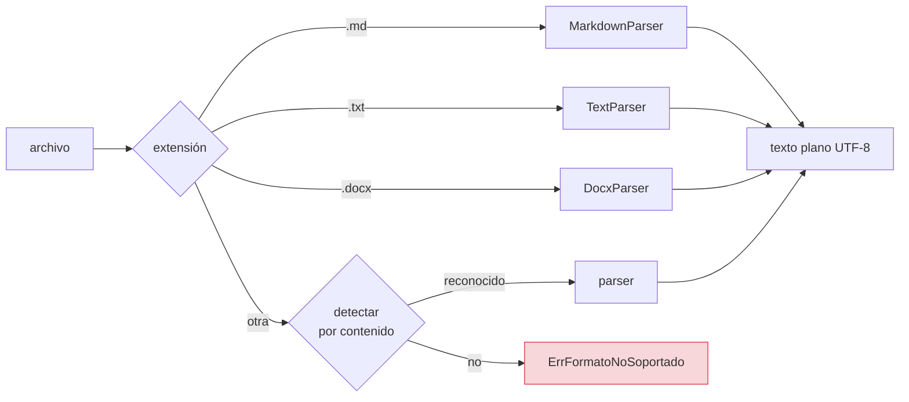
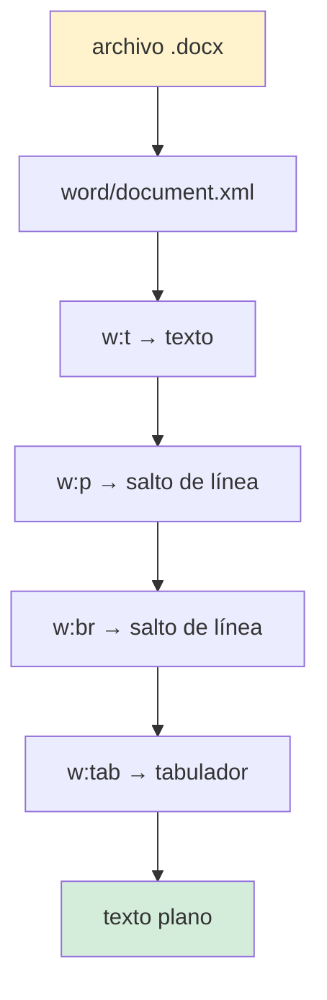
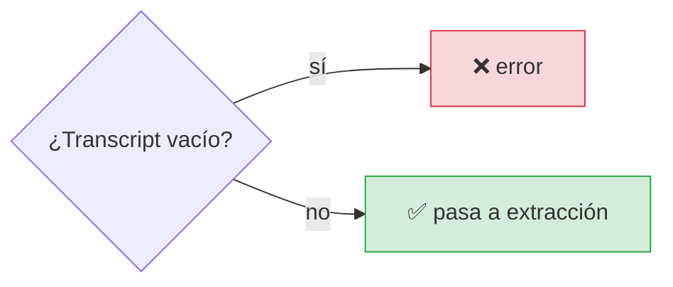

# Especificación 01 — Lectura de transcripciones

**RF-01** · **TC-01** · `internal/application/ingest.go` ·
`internal/infrastructure/parsers/`

## Requisito

> El sistema debe poder leer el contenido de una transcripción de reunión en
> formato `.md`, `.txt` o `.docx` y convertirlo en texto plano utilizable.

## Comportamiento



**La salida de los tres es idéntica en tipo:** un `string` UTF-8, sin marcas de
formato. Lo que hay por encima —qué documentos son válidos, qué se descarta— es
lo que distingue a cada parser.

## Los tres formatos

### `.txt` — `TextParser`

| Aspecto | Comportamiento |
|---|---|
| BOM UTF-8 | Se quita (si no, el primer carácter del texto es ``) |
| Saltos de línea | `\r\n` y `\r` → `\n` |
| UTF-8 inválido | Sustituido por `U+FFFD`, no por un error |
| Contexto cancelado | Se comprueba durante la lectura |

La tolerancia a UTF-8 inválido es deliberada: una minuta exportada desde un
programa que no codifica bien es un hecho, no un error de programación. Fallar
ahí deja al usuario sin ninguna salida.

### `.md` — `MarkdownParser`

| Se **conserva** | Se **elimina** |
|---|---|
| Contenido de bloques cercados | Encabezados `#` |
| `código inline` entre acentos graves | Énfasis `**` y `*` |
| Reglas `---` que no están al principio | Comillas `>` |
| URLs completas | Viñetas iniciales |
| Texto de los enlaces | Front matter al principio del archivo |

#### Las tres decisiones que costaron un bug

**1. La cursiva es simétrica.** `*a* *b*` son dos cursivas. Una implementación
que empareja el primer `*` con el último produce otra cosa. Se resolvió con
límites de palabra: una cursiva solo abre tras un separador, y solo cierra si el
carácter siguiente vuelve a ser un separador.

**2. El código se copia literal.** Un bloque cercado entre ``` puede contener
`*`, `` ` `` y `#`, y limpiarlo destruye el requisito técnico. Es la razón de ser
del parser.

**3. `---` no siempre es front matter.** Solo se elimina al principio del
archivo. Un acta que separa secciones con una línea de `---` es un caso normal.

### `.docx` — `DocxParser`

Un `.docx` es un ZIP con XML dentro:



Se procesa **token a token** con `encoding/xml.Decoder`, sin construir el árbol
XML entero.

## Casos límite

| Situación | Comportamiento | Motivo |
|---|---|---|
| La extensión no coincide con el contenido | Gana la **extensión válida** | Un `.txt` que empieza por `PK\x03\x04` no es un `.docx` |
| La extensión no existe pero el contenido sí | Detección por contenido | Un `.docx` renombrado a `.txt` |
| Ninguno de los dos | `ErrFormatoNoSoportado` | Y se devuelve el error de extensión |
| El documento parsea a cadena vacía | Error antes del LLM | Un archivo vacío no es una transcripción |
| El fichero no existe | Error de `os.Stat` | Con la ruta en el mensaje |
| Un `.docx` corrupto | Error: no es un ZIP | Sin panic |
| Un ZIP sin `word/document.xml` | Error explícito | No es un `.docx` |
| Un `.docx` enorme | Tope de tamaño | Un fichero malicioso agota la memoria |

### El orden de detección, y por qué importa

La detección por contenido **solo se ejecuta si la extensión no resuelve**. La
primera versión hacía siempre la detección primero, lo que hacía que:

- un `.txt` que empezara por la firma ZIP se interpretara como `.docx`;
- **la función fuera código muerto**, porque la extensión válida siempre ganaba.

TC-01 pasaba en ambos casos. El camino de detección por contenido nunca se
recorrió en toda la vida del proyecto hasta que se corrigió.

## Contrato

```go
// domain/ports.go
type DocumentParser interface {
    Parse(ctx context.Context, r io.Reader) (string, error)
    CanParse(cabecera []byte) bool
    Name() string
}
```

### `DesdeRuta` frente a `DesdeReader`

| Método | El archivo lo cierra | Uso |
|---|---|---|
| `DesdeRuta(ctx, ruta)` | **El caso de uso** | La CLI |
| `DesdeReader(ctx, r)` | El llamante | Tests, `io.Reader` arbitrario |

`DesdeRuta` abre, registra `defer f.Close()` **inmediatamente**, y cierra antes
de devolver. Procesar cientos de documentos sin cerrarlos agota los descriptores
del proceso, y el fallo aparece en un archivo **distinto** al que lo provocó.

## Invariante de la salida



**Antes de gastar una llamada al LLM.** Un archivo vacío o ilegible debe fallar
en la ingesta, no con un error confuso tres etapas después, cuando ya se ha
construido el prompt.

## Verificación — TC-01

> **TC-01 — Ingesta DOCX.** Lectura de un `.docx` con párrafos y listas →
> retorno de un `string` UTF-8 limpio → integración sin pánicos ni fuga de
> descriptores de archivo (`defer file.Close()`).

| Criterio | Test |
|---|---|
| DOCX con párrafos y listas → texto limpio | `TestTC01IngestaDocxRetornaTextoLimpio` |
| Sin fuga de descriptores | `TestTC01NoFugaDescriptores` |
| Reconoce la firma | `TestDocxDetectaFirma` |
| Rechaza un fichero que no es ZIP | `TestDocxRechazaArchivoQueNoEsZip` |
| Rechaza un ZIP sin `word/document.xml` | `TestDocxRechazaZipSinWordDocument` |
| BOM y saltos de línea en `.txt` | `TestTxtNormalizaBOMYSaltosDeLinea` |
| UTF-8 inválido en `.txt` | `TestTxtToleraUTF8Invalido` |
| Front matter eliminado | `TestMarkdownEliminaFrontMatter` |
| Bloques de código conservados | `TestMarkdownConservaBloquesDeCodigo` |
| Cursiva simétrica | `TestMarkdownCursivaSimetrica` |
| Código inline no se rompe | `TestMarkdownNoRompiaCodigoInline` |
| Regla horizontal conservada | `TestMarkdownConservaReglaHorizontalComoContenido` |
| Contexto cancelado | `TestTxtRespetaContextoCancelado` |
| Extensión normalizada a minúsculas | `TestExtensionDeRutaNormalizaElCaso` |
| No se confunde un texto con un formato | `TestRegistroDeteccionPorContenidoIgnoraNombresDeCampo` |

```bash
go test ./internal/infrastructure/parsers/ -v
go test ./internal/application/ -run Ingesta -v
```

## Fixtures

| Fichero | Formato | Para qué |
|---|---|---|
| `testdata/reunion-equipo.md` | Markdown | Camino feliz, nombres con acentos |
| `testdata/notas-rapidas.txt` | Texto | Sin formato, saltos de línea Windows |
| `testdata/minuta.docx` | Word | Párrafos, listas y una tabla |

`scripts/make_docx_fixture.py` regenera el `.docx` sin dependencias de Python:
construye el ZIP a mano con `zipfile`.

## Relacionado

- [Flujo de ingesta](../architecture/flujos/01-ingesta.md)
- [Infraestructura: parsers](../architecture/infrastructure.md#parsers--de-documento-a-texto)
- [RFC 01 en `INIT.md`](../../INIT.md)