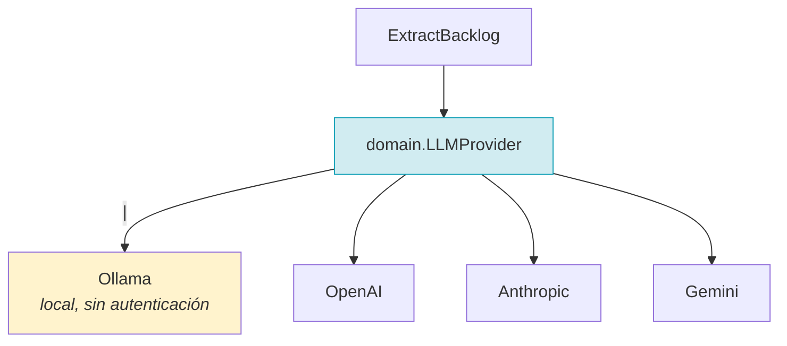
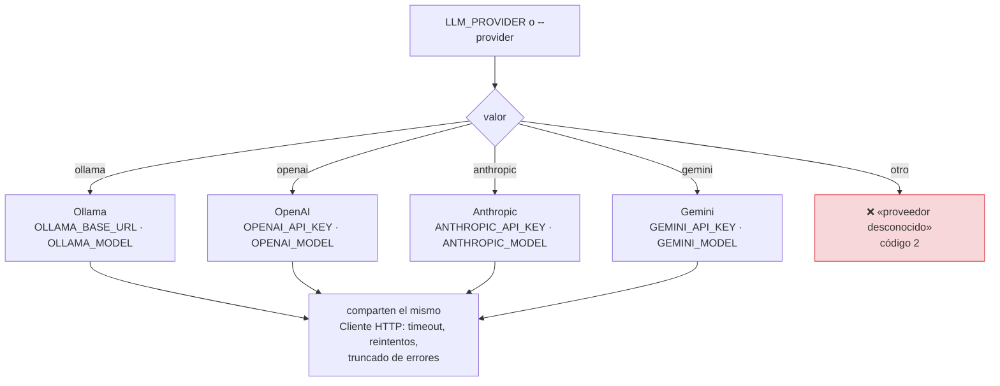
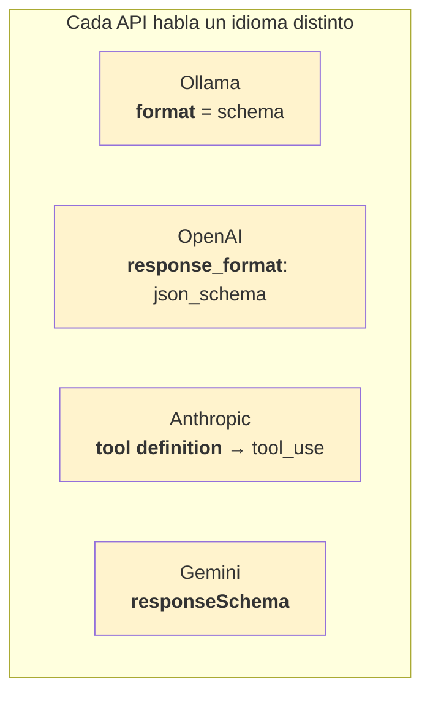
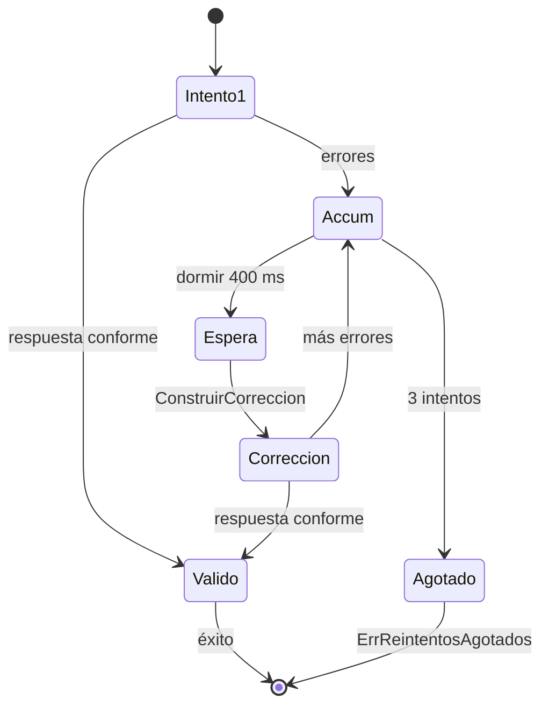
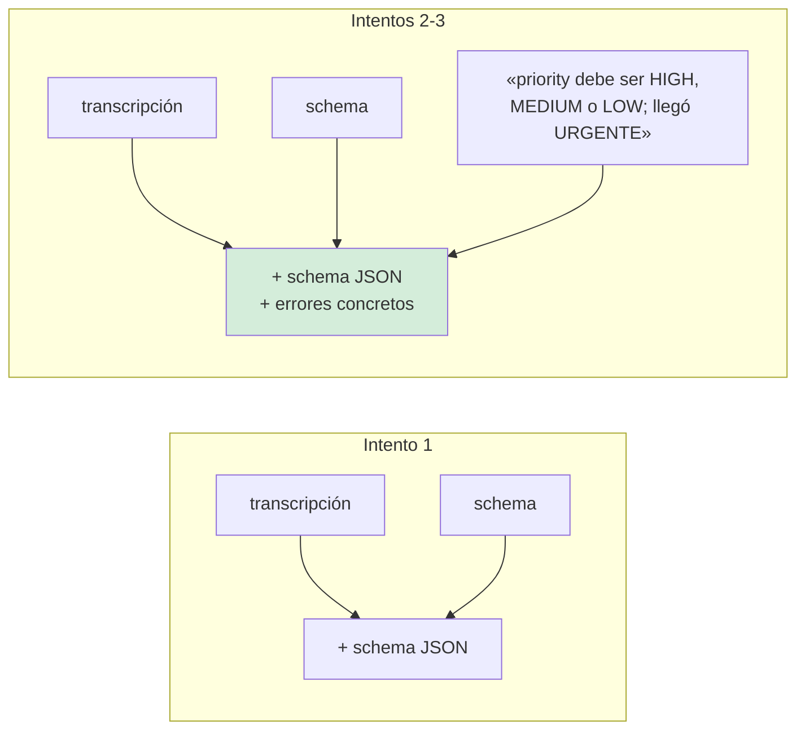
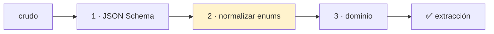
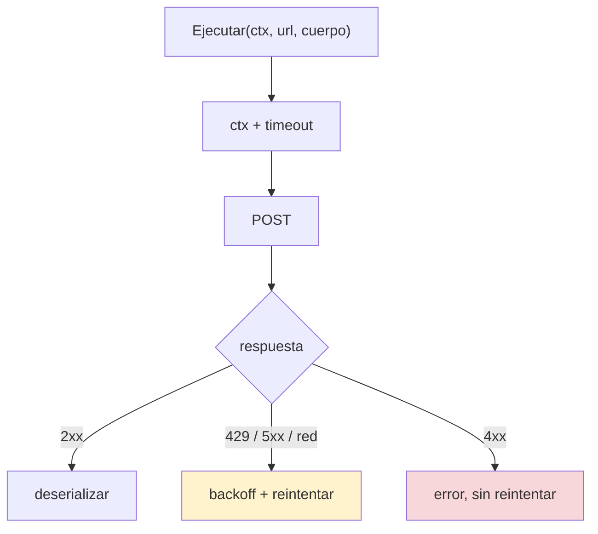

# Especificación 02 — Extracción con LLM

**RF-02, RF-03, RF-07** · **TC-02, TC-03** · `internal/application/extract_backlog.go` ·
`internal/infrastructure/llm/`

## Requisitos

> **RF-02.** El sistema debe soportar modelos locales (Ollama, LM Studio) y APIs
> en la nube (OpenAI, Anthropic, Gemini) mediante una interfaz unificada.
>
> **RF-03.** El sistema debe extraer de la transcripción las tareas accionables
> con título, responsable, prioridad y descripción.

## La interfaz unificada



```go
type LLMProvider interface {
    GenerateStructuredOutput(ctx context.Context, prompt, schemaJSON string) ([]byte, error)
    Name() string
}
```

El puerto devuelve **bytes**, no un struct: el adaptador no sabe qué significa
`Priority`. Quien interpreta es `ExtractBacklog`, porque necesita el detalle de
los fallos para construir el prompt de autocorrección.

## Selección del proveedor



**El motor local (`ollama`) es el default**, porque es el único que no necesita
cuenta ni tarjeta, y el proyecto tiene que funcionar en la máquina de alguien sin
nada configurado.

LM Studio habla el mismo protocolo: basta con apuntar `OLLAMA_BASE_URL` a su
endpoint.

## Cómo pide cada uno una salida estructurada



| Proveedor | Endpoint | Dónde se lee la respuesta | Restricciones del schema |
|---|---|---|---|
| Ollama | `POST /api/chat` | **`message.content`** | Acepta casi todo |
| OpenAI | `POST /chat/completions` | `choices[0].message.content` | Rechaza `additionalProperties` en algunos modelos |
| Anthropic | `POST /v1/messages` | bloque `tool_use` | `$schema`, `title`, `additionalProperties` **no** |
| Gemini | `POST :generateContent` | `candidates[0].content.parts[0].text` | Tampoco `additionalProperties` ni `default` |

### Cada adaptador simplifica el schema

Enviarlo tal cual produce un `400` que **no dice qué campo sobra**. La
simplificación es responsabilidad del adaptador, porque es lo que **esa** API no
acepta.

## La trampa de la respuesta

> `/api/chat` de Ollama devuelve el contenido en **`message.content`**. No en un
> campo `response`.
>
> Los dobles de test se escribieron leyendo la documentación equivocada y
> aceptaron `{"response": "..."}`. TC-02 pasaba en verde contra el doble y
> fallaría contra cualquier Ollama del mundo.
>
> Lo destapó un **smoke test contra un servidor real** con la forma de
> `/api/chat`. Ese test sigue en la suite.

> **Regla general: un doble de test que imita una API debe imitar sus rarezas, no
> su forma ideal.**

## La salida esperada

```json
{
  "meeting_summary": "Reunión de seguimiento del sprint",
  "action_items": [
    {
      "title": "Migrar la sesión fuera del contexto global",
      "description": "Pasarla a un middleware.",
      "assignee_name": "Omar Hernández",
      "priority": "HIGH",
      "labels": ["backend", "refactor"],
      "story_points": 3
    }
  ]
}
```

El schema completo está en [06-contrato-de-datos.md](06-contrato-de-datos.md).

## El retry loop con autocorrección



| Parámetro | Valor | Por qué |
|---|---|---|
| `MaxIntentosExtraccion` | 3 | Uno original y dos correcciones |
| `EsperaEntreIntentos` | 400 ms | Reiniciar el sampling es parte de la corrección |
| Errores | **Acumulados** | Un reintento puede corregir varios problemas |
| Fallo del proveedor | **No se reintenta aquí** | Lo reintenta el cliente HTTP, que sabe distinguir un 503 de un 401 |

### El prompt de corrección



> **Bug encontrado al escribir los tests.** El `promptPorDefecto.ConstruirCorreccion`
> devolvía `return transcript`: el reintento era una segunda tirada **ciega**, sin
> ninguna pista sobre qué había fallado. El modelo no puede adivinar cuál de
> varios requisitos incumplidos corregir, así que los tres intentos se agotaban con
> la misma respuesta inválida. Ahora el prompt incluye los errores acumulados, que
> es literalmente lo que pide TC-03.

## Las tres capas de validación



| Capa | Detecta | Corrige |
|---|---|---|
| 1 · JSON Schema | Tipos, obligatorios, longitudes, enumeraciones | Nada: solo informa |
| 2 · Normalización | `"high"` en vez de `"HIGH"` | **Mayúsculas/minúsculas** |
| 3 · Dominio | Invariantes de Go que el schema no expresa | Nada |

### Capa 2: los límites

| Llega | Se normaliza | Motivo |
|---|---|---|
| `"high"`, `"High"`, `"HIGH"` | → `"HIGH"` | El error más común de un LLM |
| `"urgent"`, `"URGENTE"` | **No** | No está en el `enum`; se rechaza |
| Un valor fuera del `enum` por otra razón | **No** | Normalizar solo convierte mayúsculas |

> **El error más común de un LLM con salida estructurada es el detalle de las
> mayúsculas.** Gastar los tres reintentos —con 400 ms de espera entre ellos— en
> eso es absurdo.

> **El segundo bug que escondía el primero:** la capa 3 deserializaba del
> documento **crudo**, no del ya normalizado. Arreglar la normalización sin
> arreglar esto no cambiaba nada.

## El cliente HTTP compartido



- **Reintenta** 429, 5xx y fallos de red. **No** reintenta 4xx: un 401 no se
  arregla esperando.
- **Los cuerpos de error se truncan.** Una respuesta puede pesar megabytes;
  volcarla entera en el log es su propia clase de denegación.
- **El timeout tiene suelo de 5 s.** `--timeout 1ms` produce una batería de
  fallos instantáneos en vez de una espera.

## RNF-03: el presupuesto de 15 minutos

| Tramo | Coste típico |
|---|---|
| Lectura del documento | 10–50 ms |
| Extracción, 1 intento | 2–15 s |
| Extracción, 3 intentos | 6–45 s |
| Identidades | < 10 ms |
| Publicación de 20 items | ~2 s |
| **Total** | **10–60 s** |

El presupuesto de 15 minutos es un límite de seguridad: existe para detectar un
LLM colgado, no como restricción real. Los reintentos (400 ms) son ruido en esa
escala.

## Verificación — TC-02 y TC-03

> **TC-02 — Ollama Adapter.** Envío de prompt a Ollama local (`llama3` /
> `qwen2.5`) → `MeetingBacklogExtraction` deserializada exitosamente → cero errores
> al ejecutar `json.Unmarshal`.
>
> **TC-03 — Retry Loop.** Respuesta simulada de LLM con sintaxis JSON corrupta →
> re-intento automático con contexto de error antes de fallar → manejo de contexto
> (`context.WithTimeout`) respetado.

| Criterio | Test |
|---|---|
| Deserialización sin errores de JSON | `TestTC02OllamaDeserializaSinErrores` |
| El schema viaja al modelo | `TestOllamaEnviaElSchema` |
| Sin schema, funciona | `TestOllamaSinSchema` |
| Schema inválido → error claro | `TestOllamaSchemaInvalido` |
| Respuesta vacía | `TestOllamaRespuestaVacia` |
| Reintento **con** contexto de error | `TestPromptDeCorreccionIncluyeErrores` |
| El prompt por defecto también | `TestPromptPorDefectoConstruyeCorreccion` |
| Tres intentos y se rinde | `TestReintentosAgotadosDevuelveCodigoDeExtraccion` |
| `context.WithTimeout` respetado | `TestClienteRespetaTimeout` |
| Contexto cancelado | `TestClienteCancelaConContexto` |
| Errores transitorios reintentados | `TestClienteReintentaErroresTransitorios` |
| Errores no transitorios no | `TestClienteNoReintentaErroresNoTransitorios` |
| Prompt determinista | `TestPromptEsDeterminista` |
| `Name()` de los cuatro | `TestTodosLosProveedoresImplementanElPuerto` |

**Ninguno sale a la red.** Todos usan `httptest` con un servidor local que imita la
respuesta del proveedor.

```bash
go test ./internal/infrastructure/llm/ -v
go test ./internal/application/ -run Extraccion -v
```

## Casos límite

| Situación | Comportamiento |
|---|---|
| Sin credencial en un proveedor SaaS | Error **antes** de la llamada, con el nombre de la variable |
| La credencial aparece en un error | **Nunca.** Se filtra (hay un test) |
| Respuesta con JSON válido pero campos raros | Se rechaza y se reintenta con el diagnóstico |
| Respuesta con JSON corrupto | Idem: el error dice dónde |
| Un LLM que responde `"high"` | Se normaliza, no se gasta el reintento |
| Un LLM que responde `"urgente"` | Se rechaza tres veces, con el enum en el mensaje |
| El proveedor devuelve 401 | Se propaga de inmediato, sin gastar intentos |
| El modelo no responde en el timeout | `ctx.Err()`, sin reintento |

## Relacionado

- [Flujo de extracción](../architecture/flujos/02-extraccion.md)
- [Contrato de datos](06-contrato-de-datos.md)
- [ADR-0005 — Validador propio](../adr/0005-validador-propio.md)