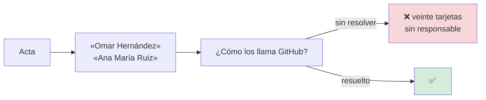
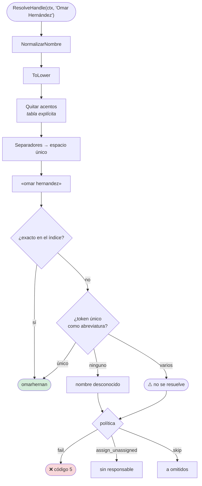
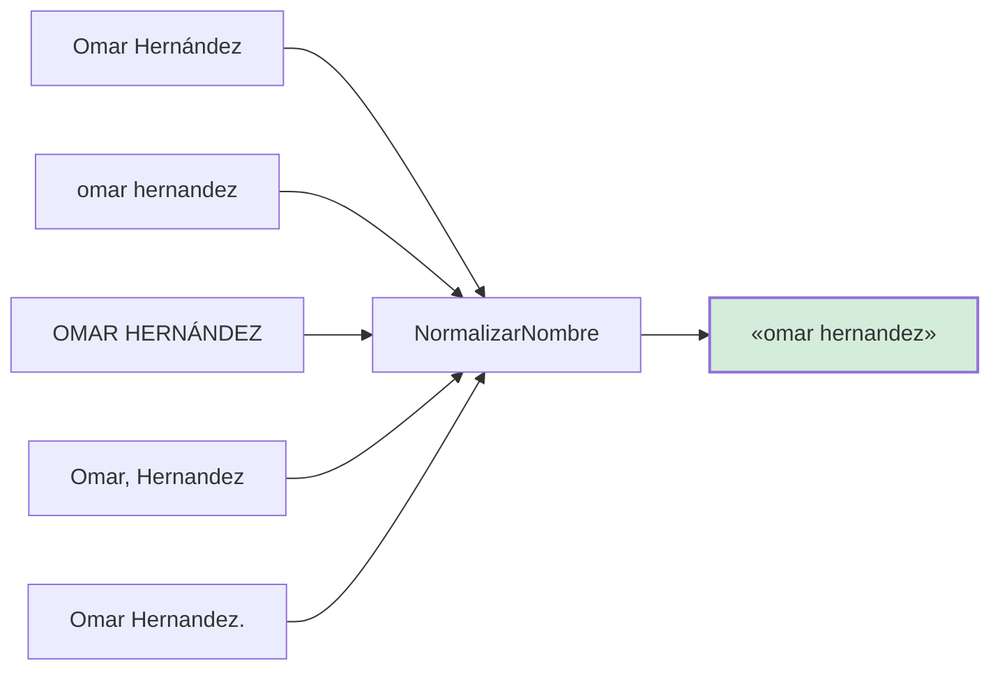
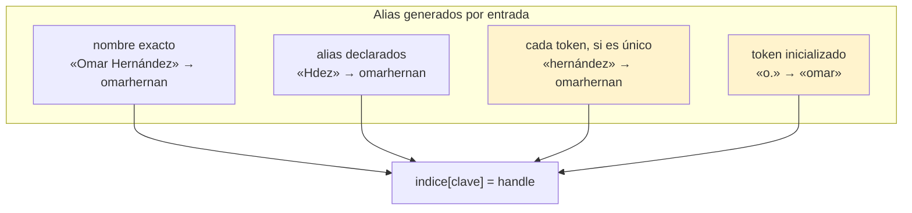
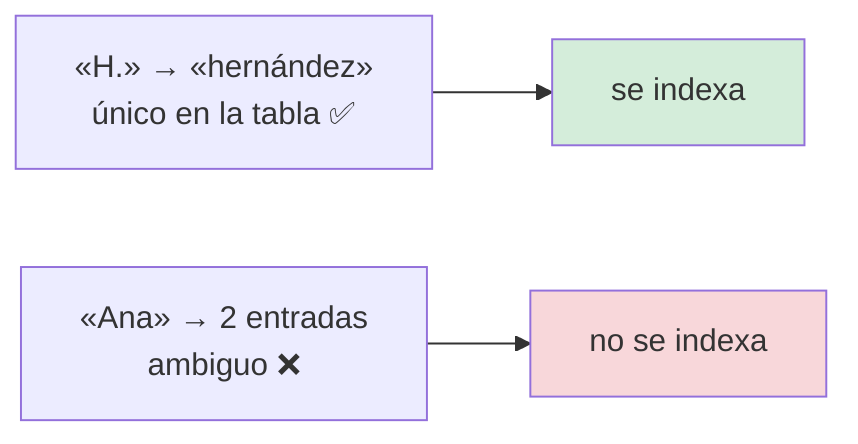
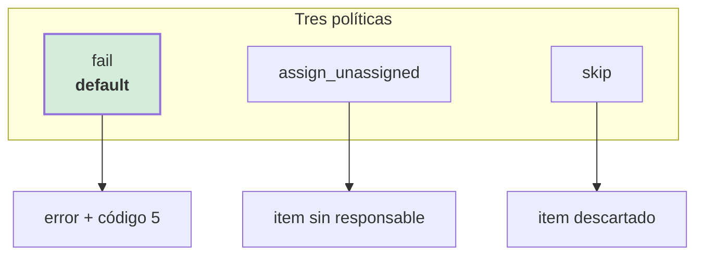
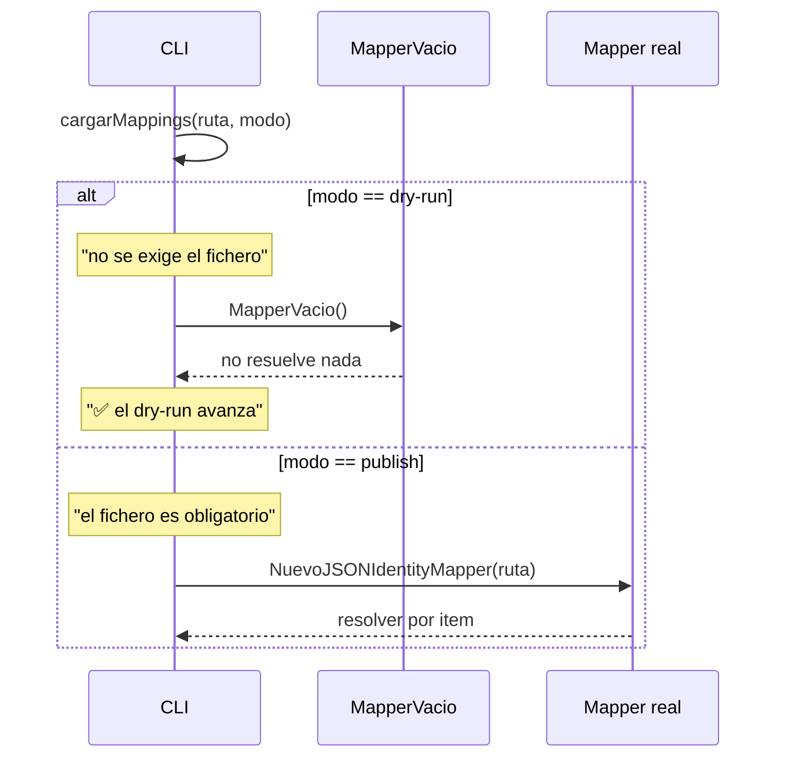
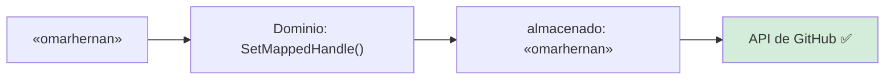

# Especificación 03 — Resolución de identidades

**RF-04** · **TC-04** · `internal/infrastructure/identity/json_mapper.go`

## Requisito

> El sistema debe traducir los nombres de personas presentes en la transcripción
> a los identificadores de la plataforma de destino, de forma case-insensitive y
> tolerante a acentos.

## El problema

El LLM devuelve nombres como aparecen en la minuta: `Omar Hernández`. La
plataforma exige `omarhernan`. Y el fallo silencioso es el peor resultado
posible:



## El formato de mapeo

```json
{
  "defaults": {
    "unknown_assignee_policy": "fail",
    "default_handle": ""
  },
  "mappings": [
    {
      "raw_names": ["Omar Hernández", "O. Hernández", "Hdez"],
      "handle": "omarhernan",
      "platforms": ["github"]
    },
    {
      "raw_names": ["Ana María Ruiz"],
      "alias": ["Ana", "A. Ruiz", "AMR"],
      "handle": "anamaria",
      "platforms": ["github"]
    }
  ]
}
```

| Campo | Obligatorio | Qué es |
|---|---|---|
| `raw_names` | Sí | Los nombres tal como pueden aparecer en la minuta |
| `alias` | No | Formas alternativas |
| `handle` | Sí | El identificador en la plataforma, **sin `@`** |
| `platforms` | No | Filtro por plataforma |
| `defaults.unknown_assignee_policy` | No | `fail` · `assign_unassigned` · `skip` |
| `defaults.default_handle` | No | Responsable para nombres desconocidos |

`configs/mappings.example.json` es un ejemplo válido. Una tabla vacía se rechaza:
`ErrTablaMapeoInvalida`, porque una tabla sin aliases publicaría todo sin
responsable.

## El algoritmo



## La normalización



| Regla | Por qué |
|---|---|
| Minúsculas | `ToLower` es de la stdlib |
| **Sin acentos** | `Hernández` y `Hernandez` son la misma persona |
| Separadores → un espacio | `Omar   Hernández` = `Omar Hernández` |
| `ñ` → `n` | Es el acento más frecuente en apellidos hispanos |
| `ç` → `c` | Idem |
| Sin espacios en los extremos | Un espacio inicial rompe la comparación con el índice |

La tabla de acentos es **explícita** porque la stdlib de Go no normaliza Unicode
(ADR-0002). Cubre el rango latino, que es lo que aparece en nombres.

## La construcción del índice



### Las reglas de abreviatura

**Un token genera abreviatura solo si es único en toda la tabla.**



> **Bug encontrado.** La primera versión generaba el alias de abreviatura
> **solo a partir del último apellido**: `H.` resolvía a `Hernández`, pero
> `Omar H.` no, porque el token `H.` no aparecía entre los tokens del apellido.
> La regla corregida genera un alias **por cada token** de cada nombre, con la
> condición de unicidad.

## La política



| Política | Efecto | Cuándo usarla |
|---|---|---|
| `fail` | **Error**, código 5 | Siempre, salvo que se sepa lo que se hace |
| `assign_unassigned` | Publica sin responsable, con aviso en el log | Cuando hay nombres que no son personas (un «Equipo») |
| `skip` | Descarta el item y lo lista en `omitidos` | Cuando esos items no valen |

**Por qué `fail` es el default.** Es la única política donde un nombre no
resuelto produce un fallo **visible**. Las otras dos producen trabajo a medias,
que es más difícil de detectar.

## El dry-run



`MapperVacio()` existe para el primer caso. Su documentación lleva la advertencia
en mayúsculas:

> **NO usarlo fuera de dry-run:** publicaría todo sin responsable, que es
> exactamente el fallo silencioso que TC-04 existe para evitar.

Y en dry-run la salida **no marca** «SIN RESOLVER»: no se intentó resolver nada.

## El handle no lleva `@`



La normalización ocurre **en el dominio**, una sola vez, en el punto donde el
identificador entra. La infraestructura recibe lo que el dominio da y no vuelve a
decidir.

## Casos límite

| Situación | Comportamiento |
|---|---|
| El nombre no está en la tabla | Política |
| El nombre es ambiguo | Política (nunca se resuelve solo) |
| Fichero ausente en dry-run | `MapperVacio()`, sigue |
| Fichero ausente en publish | Error, código 2 |
| Tabla con `mappings: []` | `ErrTablaMapeoInvalida` |
| JSON mal formado | `ErrTablaMapeoInvalida` |
| Una entrada sin `handle` | Se ignora, con aviso |
| Nombres con espacios irregulares | Normalizados |
| Nombres con todos los acentos | Normalizados |
| Solo espacios o puntos | Nombre vacío, no resuelve |
| Contexto cancelado | `ctx.Err()`, sin tocar la tabla |

## Verificación — TC-04

> **TC-04 — Identity Map.** «Omar Hernández» en la minuta → traducción a
> `@omarhernan` usando `JSONIdentityMapper` → mapeo case-insensitive exacto.

| Criterio | Test |
|---|---|
| Nombre real → handle | `TestTC04MapeaNombreRealAHandle` |
| Case-insensitive | `TestResolveHandleCaseInsensitive` |
| Tolerante a acentos ausentes | `TestResolveHandleToleraAcentosAusentes` |
| Abreviaturas | `TestResolveHandleAceptaAbreviaturas` |
| Ambigüedad no se resuelve | `TestNombreDePilaAmbiguoNoSeResuelve` |
| Unicidad sí resuelve | `TestNombreDePilaUnicoSiSeResuelve` |
| Nombre desconocido | `TestResolveHandleNombreDesconocido` |
| Respeta el contexto | `TestResolveHandleRespetaContexto` |
| Política por defecto y configurada | `TestPoliticaPorDefecto`, `TestPoliticaConfigurada` |
| `default_handle` | `TestHandlePorDefecto` |
| Tabla vacía se rechaza | `TestTablaVaciaSeRechaza` |
| JSON inválido se rechaza | `TestTablaJSONInvalido` |
| El fichero real del proyecto es válido | `TestTablaRealDelProyectoEsValida` |
| Normalización completa | `TestNormalizarNombre`, `TestNormalizarNombreCobreTodasLasVocalesAcentuadas` |
| Separadores en espacio único | `TestNormalizarNombreConvierteSeparadoresEnEspacioUnico` |
| Seguro en concurrencia | `TestMapperEsSeguroEnConcurrencia` |
| El mapper vacío no inventa | `TestMapperVacioNoResuelveNada` |
| El mapper vacío no marca política rara | `TestMapperVacioUsaLaPoliticaDeNoAsignar` |

```bash
go test ./internal/infrastructure/identity/ -v
```

## Relacionado

- [Flujo de identidades](../architecture/flujos/03-identidades.md)
- [Publicación](04-publicacion-en-projects.md)
- [Modelo de dominio: vocabulario](../architecture/domain.md#vocabulario)