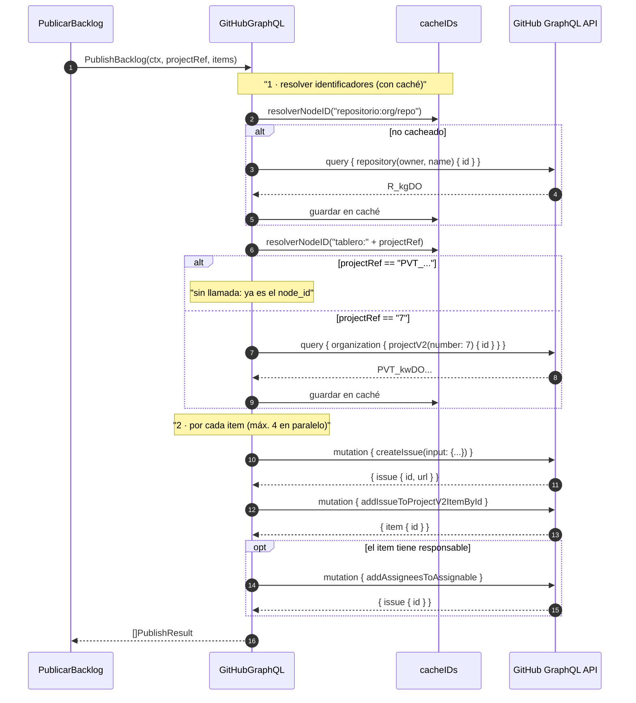
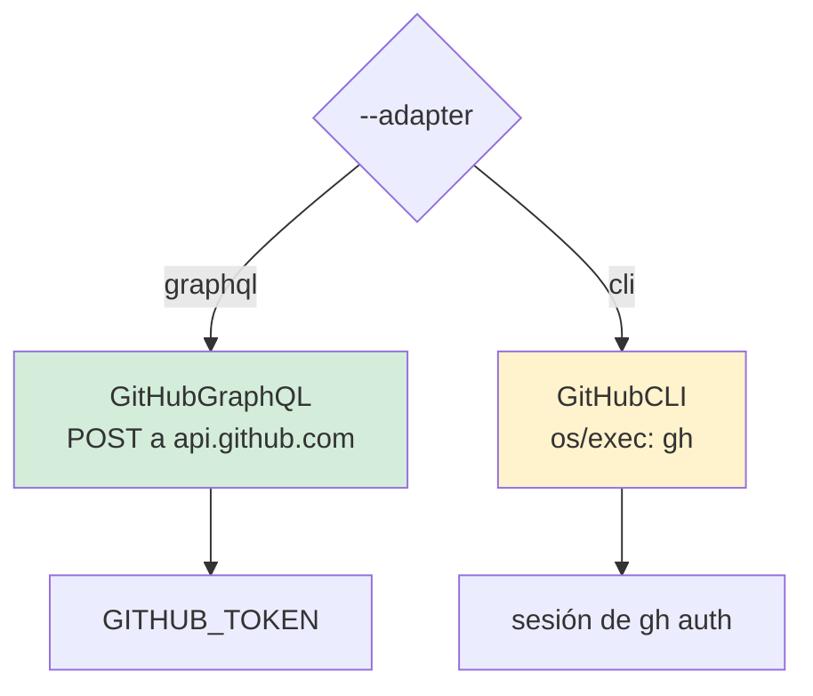
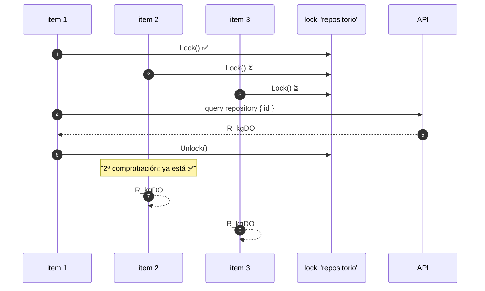
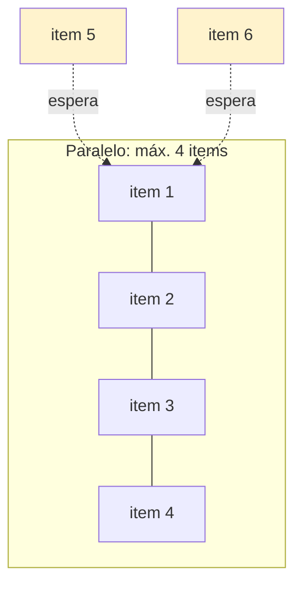
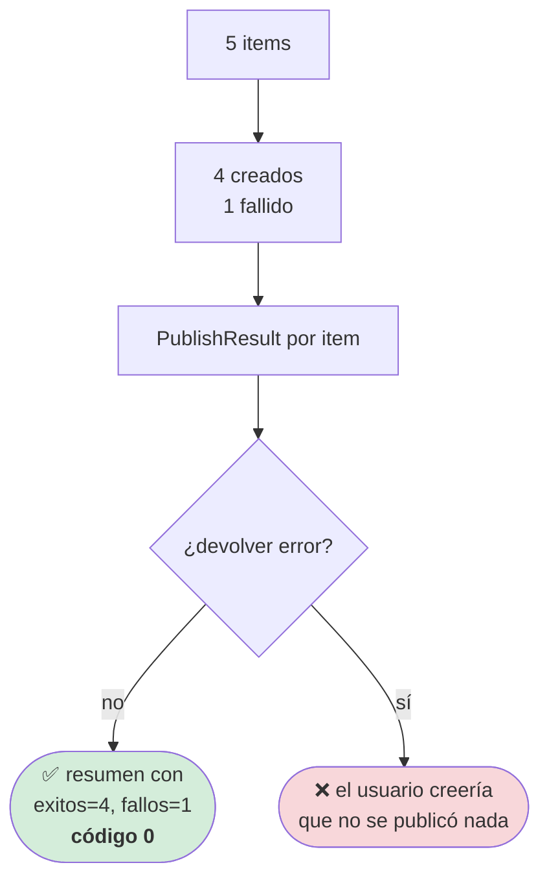
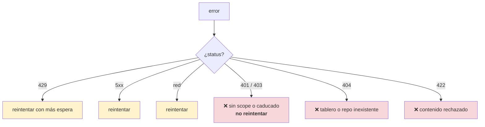

# Especificación 04 — Publicación en GitHub Projects v2

**RF-05** · **TC-06** · `internal/application/publish_backlog.go` ·
`internal/infrastructure/adapters/`

## Requisito

> El sistema debe ser capaz de crear las issues detectadas en el repositorio
> indicado por el usuario y agregarlas a un tablero de GitHub Projects v2.

## Las cuatro operaciones GraphQL



## Las dos rutas de adaptador



| | GraphQL (default) | CLI |
|---|---|---|
| Autenticación | `GITHUB_TOKEN` en el entorno | La sesión de `gh auth login` |
| Latencia | Una llamada HTTP | Un proceso por operación |
| Control de errores | El mensaje completo de la API | La salida de `gh` |
| Requiere instalar | Nada | El binario `gh` |
| Uso típico | CI, automatización | Station, donde no se exporta un PAT |

La ruta CLI existe por una razón concreta: en muchas máquinas de empresa el
token **no se puede exportar a un entorno**, pero `gh auth login` ya está hecho.

## `projectRef` acepta dos formas

| Entrada | Comportamiento |
|---|---|
| `PVT_kwDOABCDEF` | Se usa tal cual, **sin llamada a la API** |
| `7` | Se consulta a la API para obtener el node_id |
| `7` con espacios | Se toleran (`strings.TrimSpace`) |
| `abc`, `""`, `PVT` | Error: «no es un node_id ni un número válido» |

Aceptar las dos evita que el usuario tenga que descubrir un identificador opaco a
mano. Y si ya lo tiene, no se desperdicia una consulta.

### El `400` silencioso

> La API responde con **`200` y datos vacíos** cuando el tablero no existe o no es
> visible para el token. No es un error HTTP: es
> `data: {organization: {projectV2: null}}`.
>
> Sin comprobar el `id` vacío, el adaptador devolvería una cadena vacía y el fallo
> aparecería más tarde, como un error de mutación desconectado de su causa.

## La caché de identificadores

Publicar 20 items sin caché serían ~45 llamadas que devuelven siempre lo mismo. Con
la de `ADR-0009`:



- **Lock por clave**, no un mutex global: resolver un usuario no bloquea el
  repositorio.
- **Doble comprobación**: sin ella, los tres items esperarían y luego lanzarían su
  propia consulta (**cache stampede**).
- **El error no se cachea**: un 503 no puede convertirse en un fallo permanente
  durante la vida del proceso.

## La concurrencia



| Decisión | Elección | Motivo |
|---|---|---|
| Items en paralelo | 4 | Más rápido = más rate limits |
| Operaciones de un item | En serie | `addIssueToProject` necesita el `id` del issue |
| Estructura | `WaitGroup` + `chan struct{}` | `errgroup` es externo (RNF-01) |

## El fallo parcial



Es la razón por la que el puerto devuelve `[]PublishResult` en vez de un `error`:
el llamante necesita saber **cuántas** tarjetas se crearon.

## Requisitos de las credenciales

| Requisito | Detalle |
|---|---|
| Tipo | PAT (classic) con scope `project` |
| Alternativa | Fine-grained con permisos de project |
| Variable | `GITHUB_TOKEN` |
| Nunca | En la línea de comandos, en el código, en un `.env` versionado |

Si falta la credencial, el error se produce **antes de la red**, con el nombre de
la variable en el mensaje.

## Errores reintentables



Esperar a un 401 no lo convierte en 200.

## El contrato del puerto

```go
type ProjectBoardAdapter interface {
    PlatformName() string
    PublishBacklog(ctx context.Context, projectRef string, items []ActionItem) ([]PublishResult, error)
}
```

Dos reglas que el puerto exige **por contrato**:

1. **Tolerancia a fallos parciales.** `[]PublishResult` donde cada elemento refleja
   su propio éxito o fallo, en vez de abortar en el primer error.
2. **No debe hacer dry-run por su cuenta.** Esa decisión ya se tomó antes de
   invocar el puerto (RF-06).

## Casos límite

| Situación | Comportamiento |
|---|---|
| Lista de items vacía | Devuelve vacío, sin llamadas |
| Todos los items se omiten | Devuelve solo `omitidos`, sin llamadas al tablero |
| `projectRef` es un `node_id` | Sin consulta previa |
| `projectRef` es un número | Una consulta, cacheada |
| `projectRef` no existe | Error antes de crear nada |
| Token sin scope `project` | Error antes de la red |
| Un item falla al asignar | El item cuenta como fallo; los demás, no |
| La API devuelve 5xx | Reintentado por el cliente |
| La API devuelve 401 | No reintentado, error claro |
| La credencial aparece en un error | **Nunca**, hay filtro |
| `gh` no está instalado (ruta CLI) | Error antes de ejecutar |

## Verificación — TC-06

> **TC-06 — GitHub Project v2.** Petición de mutación GraphQL → creación de Issue
> y agregado del `item` al tablero → retorno con código de éxito e ID GraphQL
> generado.

| Criterio | Test |
|---|---|
| Crea issue y lo agrega | `TestTC06CreaIssueYAgregaAlTablero` |
| Variables correctas | `TestTC06EmiteLasVariablesCorrectas` |
| Errores in-band → error de Go | `TestErroresInBandSeConviertenEnErrorDeGo` |
| Fallo parcial deja constancia | `TestFalloAlAgregarAlTableroDejaConstancia` |
| Lista vacía | `TestPublishBacklogConListaVacia` |
| Límite de concurrencia | `TestPublicacionParalelaRespetaElLimite` |
| Caché de identificadores | `TestCacheDeIdentificadores` |
| Sin cache stampede | `TestResolverNodeIDEvitaElStampede` |
| El error no se cachea | `TestResolverNodeIDPropagaElErrorYNoLoCachea` |
| `node_id` resuelto | `TestConsultarProjectIDAceptaNodeIDSinIrALaRed` |
| Número resuelto | `TestConsultarProjectIDResuelveNumeroDeTablero` |
| Tablero inexistente | `TestConsultarProjectIDFallaSiElTableroNoExiste` |
| Referencia inválida | `TestConsultarProjectIDRechazaReferenciasInvalidas` |
| Contexto cancelado | `TestConsultarProjectIDRespetaContextoCancelado` |
| `PlatformName()` | `TestPlatformName` |
| Token ausente falla sin red | `TestTokenAusenteFallaAntesDeLaRed` |
| Configuración incompleta | `TestConfiguracionIncompleta` |
| Rate limit identificado | `TestRateLimitSeIdentifica` |
| `EsReintentable` | `TestEsReintentable` |
| La credencial no aparece en errores | `TestCredencialNoApareceEnErrores` |
| La ruta CLI implementa el puerto | `TestAdaptadorDeCLIImplementsPuerto` |
| `gh` ausente | `TestConstructorCLIReportaBinarioAusente` |

**Ningún test toca la API real.** Todos usan `httptest`.

```bash
go test ./internal/infrastructure/adapters/ -v
```

## Relacionado

- [Flujo de publicación](../architecture/flujos/04-publicacion.md)
- [ADR-0009 — Caché con lock por clave](../adr/0009-cache-con-lock-por-clave.md)
- [Concurrencia](../criticas/concurrencia.md)