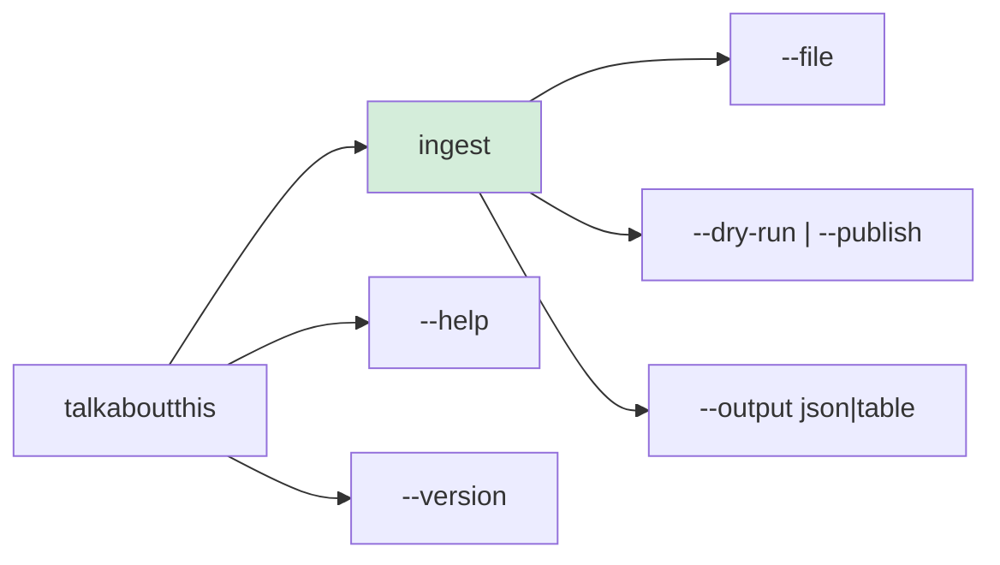
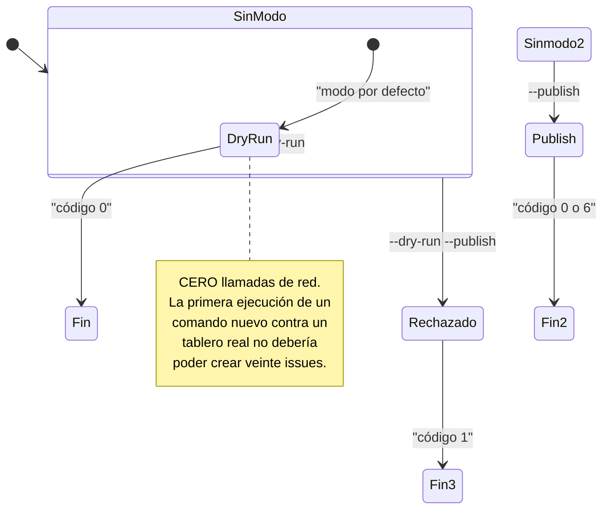
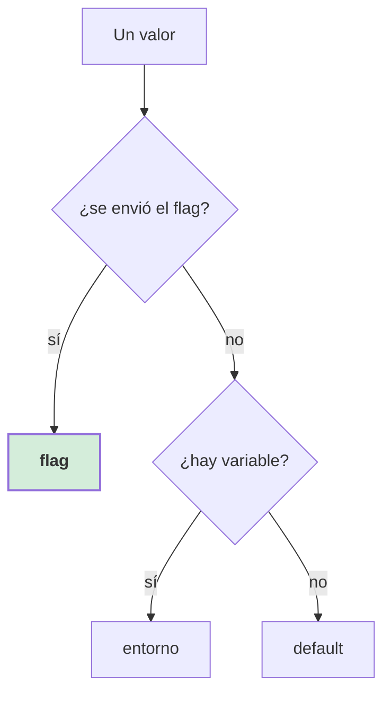
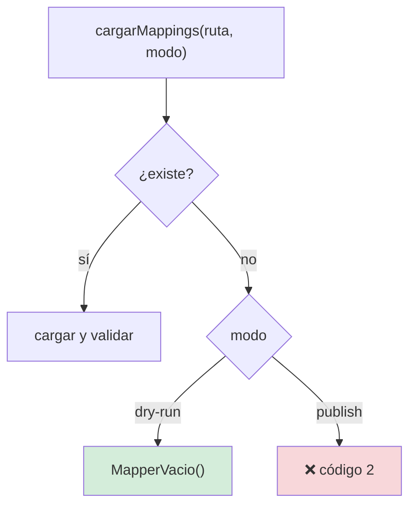
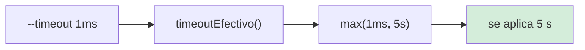
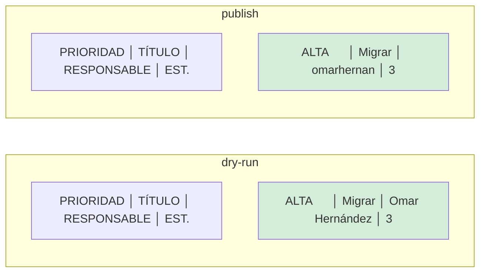
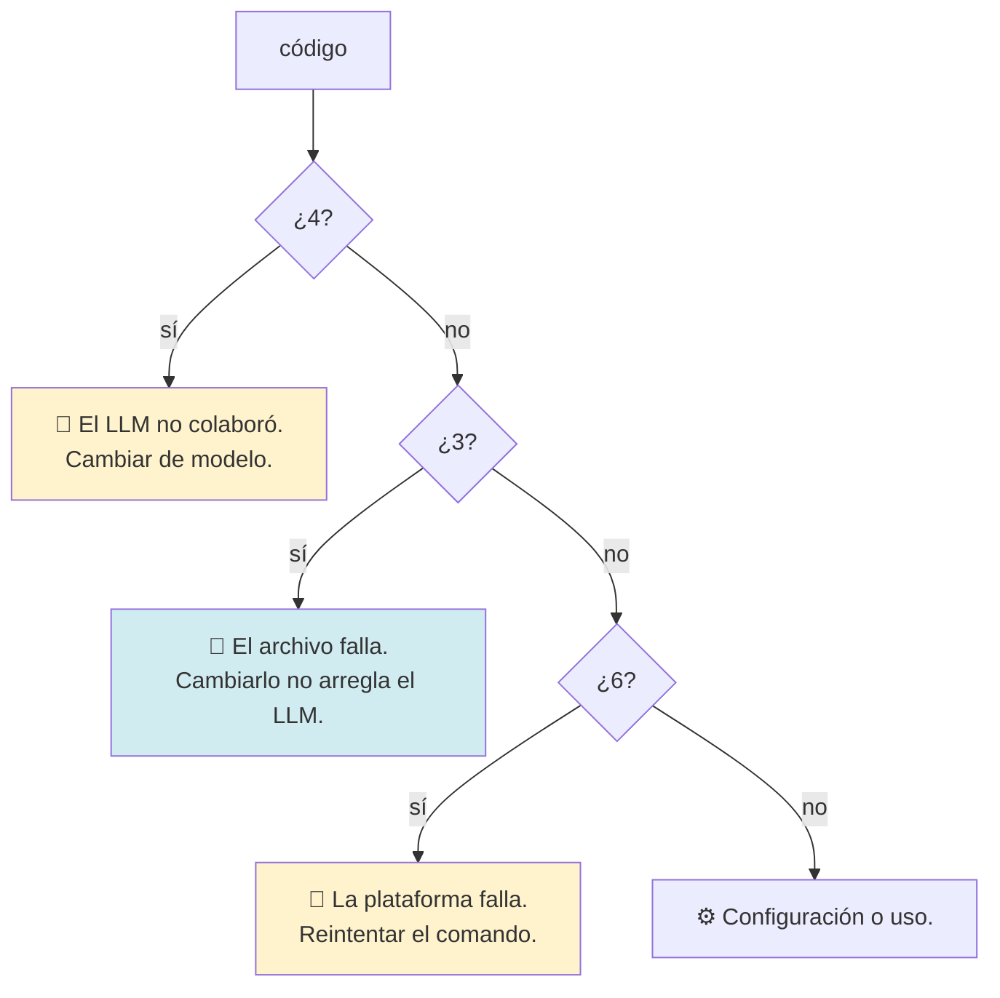
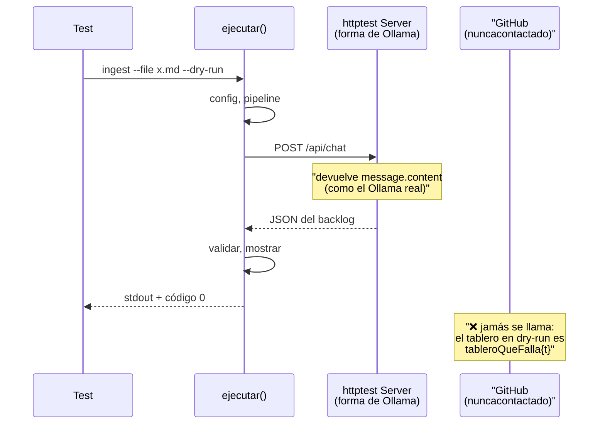

# Especificación 05 — CLI y modo seco

**RF-06** · **TC-05** · `cmd/talkaboutthis/`

## Requisito

> El sistema debe ejecutar el flujo completo en modo seguro por defecto
> (`--dry-run`), mostrando el resultado en la salida estándar sin realizar
> ninguna mutación en sistemas externos.

## La interfaz de línea de comandos



```
talkaboutthis <subcomando> [opciones]

Subcomandos:
  ingest      procesa una transcripción y extrae (o publica) el backlog
```

## El modo



**`--dry-run` y `--publish` son excluyentes.** Los dos a la vez es un error de
uso (código 1), no un «prioriza el que salga primero».

## Las banderas de `ingest`

| Banderas | Qué hacen |
|---|---|
| `--file <ruta>` | **Obligatorio.** `.md`, `.txt` o `.docx` |
| `--provider <id>` | `ollama` (default), `openai`, `anthropic`, `gemini` |
| `--timeout <dur>` | Timeout de red. Default 60 s, **suelo 5 s** |
| `--dry-run` | Muestra sin publicar. **Default** |
| `--publish` | Publica en el tablero destino |
| `--output <formato>` | `json` (default) o `table` |
| `--project <id\|num>` | `PVT_…` o el número del tablero |
| `--owner <org\|user>` | Dueño del repositorio |
| `--repo <nombre>` | Repositorio donde se crean las issues |
| `--adapter <id>` | `graphql` (default) o `cli` |
| `--mappings <ruta>` | Tabla de identidades. Default `configs/mappings.json` |
| `--assignee-policy <p>` | `fail` (default), `assign_unassigned`, `skip` |
| `--log-level <n>` | `debug`, `info` (default), `warn`, `error` |
| `--log-format <f>` | `text` (default) o `json` |

## La precedencia flag → entorno → default



> **El flag escrito en la línea de comandos gana siempre.**

Implementación: `flag.FlagSet.Visit` registra qué banderas se enviaron, **antes**
de `completar()` rellene los huecos. Ver
[ADR-0007](../adr/0007-precedencia-flag-sobre-entorno.md).

> **Bug real.** La primera versión consultaba el entorno primero: un
> `GITHUB_OWNER` de la sesión pisaba un `--owner` explícito. Y `--log-format text`,
> que coincide con el default, no podía ganar nunca.

## Las variables de entorno

| Variable | Bandera equivalente |
|---|---|
| `LLM_PROVIDER` | `--provider` |
| `OLLAMA_BASE_URL` | — |
| `OLLAMA_MODEL` | — |
| `OPENAI_API_KEY` | — |
| `OPENAI_BASE_URL` | — |
| `OPENAI_MODEL` | — |
| `ANTHROPIC_API_KEY` | — |
| `ANTHROPIC_MODEL` | — |
| `GEMINI_API_KEY` | — |
| `GEMINI_MODEL` | — |
| `GITHUB_TOKEN` | — |
| `GITHUB_OWNER` | `--owner` |
| `GITHUB_REPO` | `--repo` |
| `GITHUB_PROJECT_ID` | `--project` |
| `ASSIGNEE_POLICY` | `--assignee-policy` |
| `REQUEST_TIMEOUT` | `--timeout` |
| `LOG_LEVEL` | `--log-level` |
| `LOG_FORMAT` | `--log-format` |

`.env.example` es la plantilla. **Nunca** se versiona un `.env` real.

> **Bug real.** `LOG_LEVEL` y `LOG_FORMAT` estaban documentados desde el principio
> y **nunca se leían**. Documentar una variable que el programa ignora es peor que
> no documentarla: el usuario la ajusta, no pasa nada, y pierde la confianza en
> todo lo demás.

## `mappings.json`: obligatorio solo al publicar



> **Bug real.** La tabla era obligatoria **también en dry-run**, y el error salía
> con **código 5 (identidad)** cuando el problema era de configuración. Dos fallos
> en uno.

## El suelo del timeout



Sin suelo, un `--timeout` accidentalmente pequeño produce una batería de fallos
instantáneos en vez de una espera. Un timeout de 1 ms **no** significa «quiero
fallar rápido»: significa «quiero esperar poco».

## La salida

### JSON

Pensada para scripts. La estructura es estable:

```json
{
  "job_id": "a1b2c3d4e5f6",
  "modo": "dry-run",
  "duracion_ms": 8432,
  "etapas": ["ingesta", "extraccion"],
  "archivo": "reunion-equipo.md",
  "resumen_reunion": "Reunión de seguimiento del sprint",
  "items": [
    {
      "titulo": "Migrar la sesión",
      "descripcion": "Fuera del contexto global.",
      "responsable": "Omar Hernández",
      "handle": "",
      "priority": "HIGH",
      "labels": ["backend"],
      "story_points": 3
    }
  ],
  "despacho": {
    "plataforma": "github-projects-v2",
    "publicados": [],
    "omitidos": [],
    "exitos": 0,
    "fallos": 0
  }
}
```

Tres cosas que se corrigieron aquí:

| Antes | Ahora | Por qué |
|---|---|---|
| `labels: null` | Siempre `[]` | `null` y `[]` no son lo mismo en JSON |
| `plataforma` nunca rellenada | Se propaga del resumen | El campo existía vacío: **nunca se decía dónde se publicó** |
| `modoDe(nil)` hacía panic | Comprueba `nil` | Un fallo de renderizado tumba el proceso **después** del trabajo |

### Tabla



**En dry-run no se marca «SIN RESOLVER».** No se consultaron identidades, así que
el handle siempre está vacío: marcarlo sería una alarma falsa que enseña a ignorar
la marca donde sí importa.

## Los códigos de salida



| Código | Significado |
|---|---|
| 0 | Éxito (incluido el fallo parcial) |
| 1 | Uso: parámetros incorrectos o flags contradictorios |
| 2 | Configuración: credenciales o fichero incompleto |
| 3 | Ingesta: archivo ilegible o formato no soportado |
| 4 | Extracción: 3 intentos sin respuesta válida |
| 5 | Identidad: responsable sin resolver (política `fail`) |
| 6 | Publicación: fallo de la plataforma destino |
| 130 | Interrumpido por el usuario (Ctrl-C) |

Detalle en [flujo de errores](../architecture/flujos/05-errores-y-codigos.md).

## Verificación — TC-05

> **TC-05 — Dry-Run Mode.** Ejecución de CLI con `--dry-run` → salida formateada
> en stdout de las tareas procesadas → **cero llamadas de red** realizadas hacia la
> API de GitHub.

| Criterio | Test |
|---|---|
| El flujo completo en dry-run | `TestFlujoCompletoEnDryRun` |
| **La CLI no toca GitHub** | `TestTC05LaCLICompletaNoTocaGitHub` |
| Dry-run es el default real | `TestDryRunEsElModoPorDefectoEnLaPractica` |
| Funciona sin `mappings.json` | `TestTablaMappingsAusenteNoBloqueaElDryRun` |
| En publish sí lo exige | `TestTablaMappingsAusenteSiFallaEnPublish` |
| `MapperVacio` no resuelve nada | `TestMapperVacioNoResuelveNada` |
| `--dry-run --publish` se rechaza | `TestDryRunYPublishSonExcluyentes` |
| `--file` es obligatorio | `TestFileEsObligatorio` |
| Sin argumentos muestra el uso | `TestSinArgumentosMuestraUso` |
| `--help` y `--version` | `TestAyuda`, `TestVersion` |
| Subcomando desconocido | `TestSubcomandoDesconocido` |
| Formatos de salida inválidos | `TestFormatoDeSalidaDesconocido`, `TestFormatoDeLogDesconocido` |
| Proveedor desconocido | `TestProveedorDesconocido` |
| Credenciales ausentes | `TestPublishExigeCredenciales`, `TestPublishExigeToken` |
| Archivo inexistente | `TestArchivoInexistente` |
| Contexto cancelado | `TestContextoCancelado` |
| Códigos distintos | `TestCodigosDeSalidaSonDistintos` |
| Los códigos funcionan con error envuelto | `TestCodigoDeErrorEncadenadoConEtapa` |
| Salida en tabla | `TestSalidaEnTabla` |
| Grafo de archivo soportado | `TestGrafoDeArchivoSoportado` |

### Los tests end-to-end



El servidor de test **imita la forma real** de `/api/chat`, incluida la rareza de
`message.content`. Ese detalle es lo que hizo posible detectar el bug del campo
`response`.

## Casos límite

| Situación | Comportamiento |
|---|---|
| Sin subcomando | Uso, código 1 |
| Subcomando desconocido | Error, código 1 |
| `--file` ausente | Error, código 1 |
| `--dry-run --publish` | Error, código 1 |
| `--output` inválido | Error, código 1 |
| `--log-format` inválido | Error, código 1 |
| `--timeout 1ms` | Se eleva a 5 s |
| `--help` | Código **0** |
| `--version` | Código **0** |
| Ctrl-C | 130 |
| Fichero inexistente | Código 3 |
| GraphQL no se puede cargar en dry-run | No se intenta |

## Relacionado

- [La CLI](../architecture/cmd.md)
- [ADR-0006 — El dry-run se decide en el caso de uso](../adr/0006-dry-run-por-defecto.md)
- [ADR-0007 — Precedencia flag sobre entorno](../adr/0007-precedencia-flag-sobre-entorno.md)