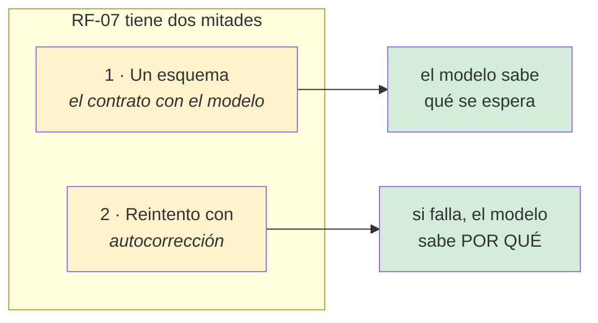
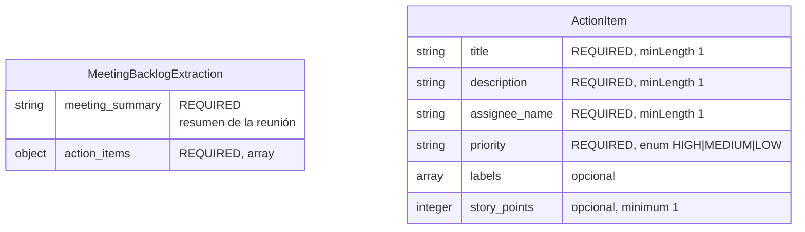
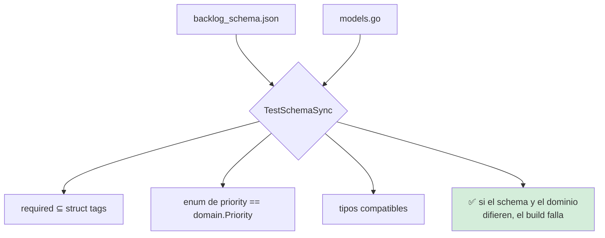
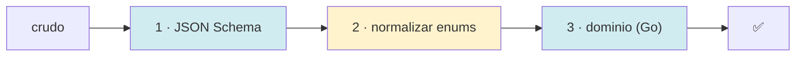

# Especificación 06 — Contrato de datos

**RF-07** · `docs/specifications/backlog_schema.json` · `internal/domain/models.go`

## Requisito

> El sistema debe definir un esquema JSON para la salida del LLM y **reintentar la
> extracción** si la respuesta no lo cumple, enviando al modelo el detalle de los
> errores detectados.

Este requisito tiene **dos mitades** que se olvidan una de otra:



## El esquema



### El JSON completo

```json
{
  "$schema": "https://json-schema.org/draft/2020-12/schema",
  "title": "MeetingBacklogExtraction",
  "type": "object",
  "required": ["meeting_summary", "action_items"],
  "properties": {
    "meeting_summary": {
      "type": "string",
      "minLength": 1,
      "description": "Resumen breve de la reunión."
    },
    "action_items": {
      "type": "array",
      "minItems": 1,
      "items": {
        "type": "object",
        "required": ["title", "description", "assignee_name", "priority"],
        "properties": {
          "title": {
            "type": "string",
            "minLength": 1,
            "maxLength": 200,
            "description": "Qué hay que hacer, en imperativo."
          },
          "description": {
            "type": "string",
            "minLength": 1,
            "maxLength": 2000,
            "description": "Detalle, contexto y criterio de aceptación."
          },
          "assignee_name": {
            "type": "string",
            "minLength": 1,
            "description": "Nombre de la persona tal como aparece en la minuta."
          },
          "priority": {
            "type": "string",
            "enum": ["HIGH", "MEDIUM", "LOW"],
            "description": "Urgencia. Solo estos tres valores."
          },
          "labels": {
            "type": "array",
            "items": {"type": "string"},
            "description": "Etiquetas libres."
          },
          "story_points": {
            "type": "integer",
            "minimum": 1,
            "maximum": 21,
            "description": "Estimación de complejidad."
          }
        },
        "additionalProperties": false
      }
    }
  },
  "additionalProperties": false
}
```

### Decisiones del esquema

| Decisión | Motivo |
|---|---|
| `additionalProperties: false` | Un campo inventado indica que el modelo no entendió el contrato |
| `minItems: 1` | Una reunión sin tareas no produce un backlog publicable |
| `minimum: 1` en `story_points` | `0` no es una estimación, es «no lo sé» |
| `maximum: 21` en `story_points` | 22 ya es «esto hay que partirlo» |
| `enum` de tres valores | Cuatro Prioridades no se distinguen al publicar |
| `minLength: 1` en los obligatorios | Una cadena vacía no es un dato |

### Las palabras clave que el validador **no** aplica

| Palabra clave | Por qué no | Efecto |
|---|---|---|
| `format` | No se implementa | Ninguno: es una anotación |
| `pattern` | No se implementa | **Una regla que no se aplica** |
| `maximum` en `story_points` | **Sí se implementa** | — |

El validador **avisa** de cada palabra no soportada, tanto al arrancar
(`PalabrasClaveDesconocidas`) como en el log. Una regla que no se comprueba es
peor que no tenerla, porque aparenta existir. Ver
[ADR-0005](../adr/0005-validador-propio.md).

## El equivalente en Go

```go
type MeetingBacklogExtraction struct {
    MeetingSummary string       `json:"meeting_summary"`
    ActionItems    []ActionItem `json:"action_items"`
}

type ActionItem struct {
    Title        string   `json:"title"`
    Description  string   `json:"description"`
    RawAssignee  string   `json:"assignee_name"`
    Priority     Priority `json:"priority"`
    Labels       []string `json:"labels"`
    StoryPoints  int      `json:"story_points"`
    MappedHandle string   `json:"-"`   // ← nunca viaja al LLM
}
```

| Detalle | Por qué |
|---|---|
| `MappedHandle` con `json:"-"` | Es interno: el modelo no debe inventar un handle |
| `RawAssignee` ≠ `MappedHandle` | El nombre del LLM y el identificador de la plataforma son cosas distintas |
| Sin `omitempty` en los obligatorios | `""` es un valor, no una ausencia |

## El test que impide la divergencia



**Sin este test**, cambiar el schema y olvidar el dominio —o al revés— produce
un fallo tres etapas después, con un mensaje que no señala la causa. Un schema
divergente es un fallo de compilación, no una sorpresa en producción.

## Las tres capas de validación



| Capa | Comprueba | Puede corregir |
|---|---|---|
| 1 · JSON Schema | Tipos, obligatorios, longitudes, enumeraciones, rangos | No |
| 2 · Normalización | `"high"` → `"HIGH"` | **Sí**, solo mayúsculas |
| 3 · Dominio | Invariantes de Go | No |

### Lo que la capa 3 comprueba y el schema no puede

| Invariante | Por qué no está en el schema |
|---|---|
| El handle **no** lleva `@` | Es una normalización, no una forma |
| `Priority` es un enum de Go | El schema no conoce el tipo de Go |
| Los slices nunca son `nil` | Una cuestión de Go |

## Los mensajes van al LLM

```mermaid
sequenceDiagram
    participant V as Validador
    participant E as ExtractBacklog
    participant L as Modelo

    L-->>E: {"action_items":[{"priority":"urgent"}]}
    E->>V: Validar
    V-->>E: "action_items[0].priority:<br/>se esperaba uno de HIGH, MEDIUM, LOW;<br/>se recibió &quot;urgent&quot;"
    E->>L: prompt + errores
    Note over L: "sabe QUÉ corregir y DÓNDE"
```

De ahí dos requisitos no negociables:

- **Rutas tipo JSON Pointer** (`action_items[2].priority`).
- **Orden determinista**: `ClavesOrdenadas()`. Iterar un mapa de Go produce un
  orden aleatorio, y un LLM que recibe las instrucciones barajadas corrige peor.

## Casos límite

| Respuesta del LLM | Qué pasa |
|---|---|
| JSON inválido | Se rechaza; el error dice dónde no parsea |
| JSON válido, falta un obligatorio | Se rechaza; el error nombra el campo |
| `"priority": "high"` | **Se normaliza** a `"HIGH"` |
| `"priority": "urgent"` | Se rechaza tres veces, con el enum en el mensaje |
| `"story_points": 0` | Se rechaza (`minimum: 1`) |
| `labels: null` | Se convierte a `[]` al serializar |
| Un campo extra | Se rechaza (`additionalProperties: false`) |
| El mismo campo en dos reinicios | Idempotente |
| Un elemento mal formado en el array | **Solo** ese elemento se rechaza; el resto se publica |

## Verificación

| Criterio | Test |
|---|---|
| El schema y los structs coinciden | `schema_sync_test.go` |
| Las prioridades coinciden | `schema_sync_test.go` |
| El schema es JSON válido | `embed_test.go` |
| Los errores son deterministas | `TestValidarEsDeterministaEnElOrdenDeLosErrores` |
| Los mensajes nombran esperado y recibido | `TestValidarNombraElTipoEsperadoEnLosMensajes` |
| Las palabras no soportadas se avisan | `TestPalabrasClaveDesconocidasInformaLoQueNoSeAplica` |
| Un schema soportado no da falsos positivos | `TestPalabrasClaveDesconocidasSinReglasNoSoportadas` |
| Orden determinista de propiedades | `TestClavesOrdenadasEsDeterminista` |
| Un enum en minúsculas se acepta | `TestEnumDePrioridadEnMinusculasSeAcepta` |
| Un enum inválido no se inventa | `TestEnumDePrioridadInvalidoNoSeInventa` |
| La normalización no toca otros campos | `TestNormalizarEnumsNoTocaLasEtiquetas` |
| La normalización tolera JSON malformado | `TestNormalizarEnumsToleraRespuestasMalformadas` |

```bash
go test ./docs/specifications/ -v
go test ./internal/domain/ -run SchemaSync -v
go test ./internal/infrastructure/jsonschema/ -v
```

## Dónde vive el schema

```
docs/specifications/
├── backlog_schema.json   el dato
├── embed.go              //go:embed + BacklogSchema() + Validar()
└── embed_test.go
```

Es **un paquete Go** porque `go:embed` no puede salir del directorio del paquete.
Ver [ADR-0004](../adr/0004-embed-del-schema.md).

## Relacionado

- [Modelo de dominio](../architecture/domain.md)
- [Flujo de extracción](../architecture/flujos/02-extraccion.md)
- [ADR-0004 — El schema se compila en el binario](../adr/0004-embed-del-schema.md)
- [ADR-0005 — Validador propio](../adr/0005-validador-propio.md)