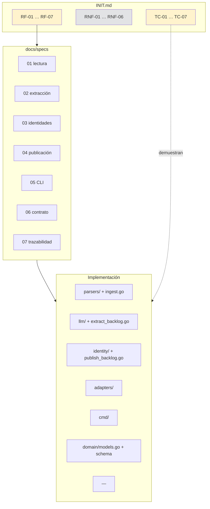
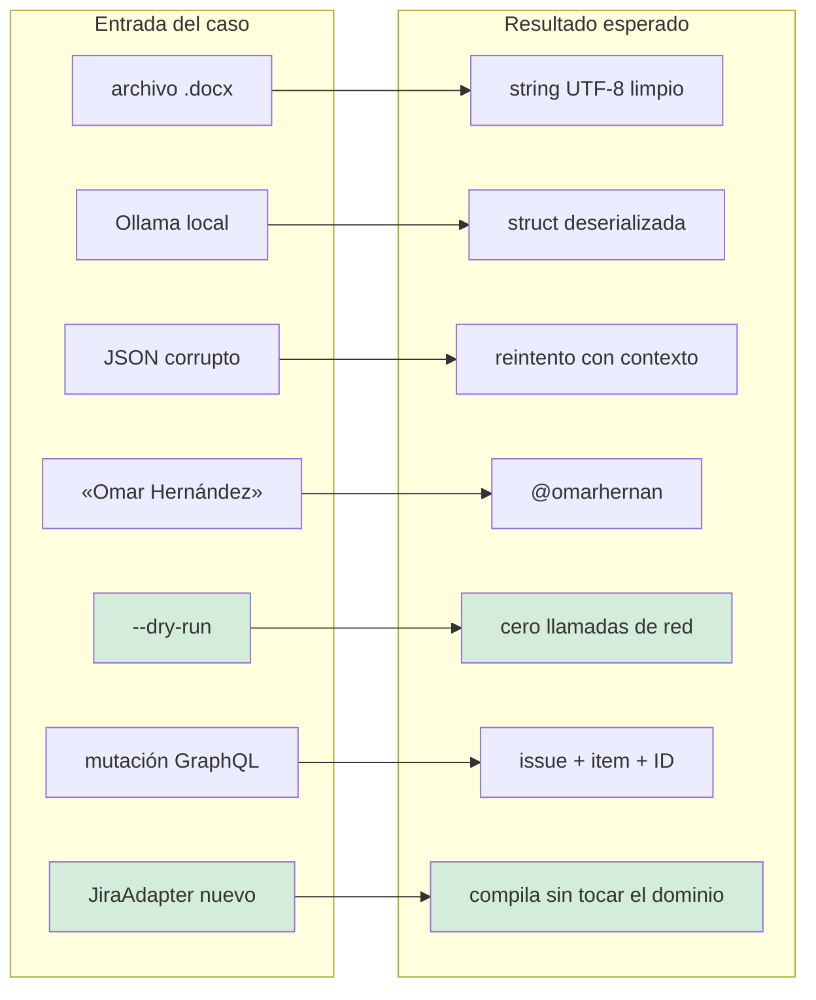
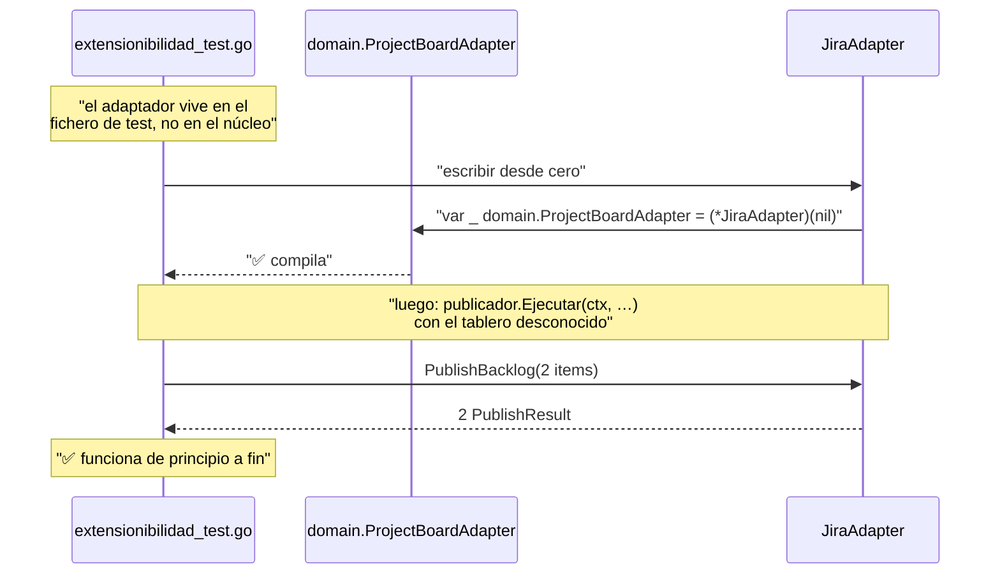
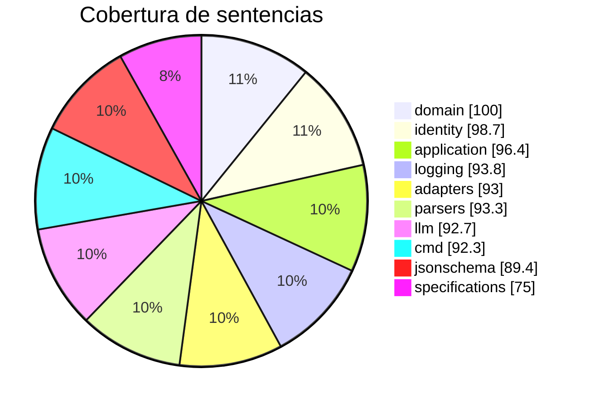
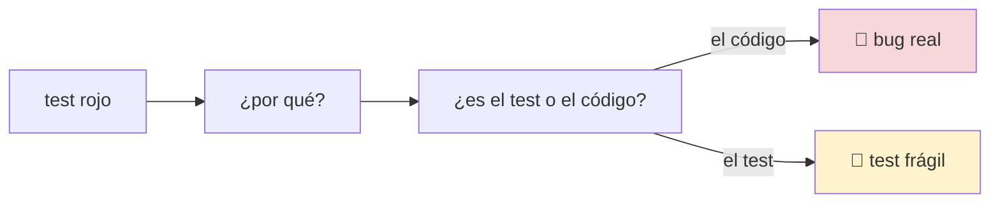

# Especificación 07 — Trazabilidad

Qué cubre qué: **requisito ↔ especificación ↔ implementación ↔ test**.

Si un requisito no tiene un test, no está implementado, por mucho que el código
lo parezca. Si un test no cubre ningún requisito, sobra.

## El mapa completo



## Requisitos funcionales

| RF | Qué exige | Especificación | Implementación | Test principal |
|---|---|---|---|---|
| **RF-01** | Leer `.md`, `.txt`, `.docx` | [01](01-lectura-de-transcripciones.md) | `internal/application/ingest.go`<br/>`internal/infrastructure/parsers/` | `TestTC01IngestaDocxRetornaTextoLimpio` |
| **RF-02** | Modelos locales y APIs SaaS, interfaz unificada | [02](02-extraccion-con-llm.md) | `internal/infrastructure/llm/` | `TestTC02OllamaDeserializaSinErrores` |
| **RF-03** | Extraer tareas accionables | [02](02-extraccion-con-llm.md) | `internal/application/extract_backlog.go` | `TestTC06EmiteLasVariablesCorrectas` |
| **RF-04** | Resolver identidades | [03](03-resolucion-de-identidades.md) | `internal/infrastructure/identity/json_mapper.go` | `TestTC04MapeaNombreRealAHandle` |
| **RF-05** | Publicar en GitHub Projects v2 | [04](04-publicacion-en-projects.md) | `internal/infrastructure/adapters/github_graphql.go` | `TestTC06CreaIssueYAgregaAlTablero` |
| **RF-06** | Modo seguro por defecto | [05](05-cli-y-modo-seco.md) | `internal/application/publish_backlog.go` | `TestTC05LaCLICompletaNoTocaGitHub` |
| **RF-07** | Esquema JSON y reintento con autocorrección | [06](06-contrato-de-datos.md) | `docs/specifications/`<br/>`internal/infrastructure/jsonschema/` | `TestPromptDeCorreccionIncluyeErrores` |

## Requisitos no funcionales

| RNF | Qué exige | Dónde se aplica | Cómo se verifica |
|---|---|---|---|
| **RNF-01** | Cero dependencias de terceros | Todo el árbol | `grep -c require go.mod` → `0`<br/>`TestDominioSoloUsaStdlib` |
| **RNF-02** | Arquitectura hexagonal | `internal/domain` puro | `TestDominioNoImportaInfrastructure`<br/>`TestDominioNoHaceLlamadasDeRed` |
| **RNF-03** | 15 min por reunión | `ExtractBacklog`, `Pipeline` | `TestPipelineDryRunCompleto` (duración medida) |
| **RNF-04** | Seguridad de credenciales | `cmd/config.go`, clientes HTTP | `TestCredencialNoApareceEnErrores`<br/>`.gitignore` incluye `.env` |
| **RNF-05** | Modularidad y extensibilidad | Los cuatro puertos | `TestTC07ElAdaptadorNuevoSeEnchufaSinTocarElDominio` |
| **RNF-06** | Logs estructurados | `internal/infrastructure/logging` | `TestNuevoNiveles`, `TestParseFormato` |

## Casos de evaluación



| TC | Escenario | Criterio de éxito | Estado |
|---|---|---|---|
| **TC-01** | Ingesta de `.docx` | Sin pánicos ni fuga de descriptores | ✅ |
| **TC-02** | Ollama local | Cero errores de `json.Unmarshal` | ✅ |
| **TC-03** | Retry loop | Reintento **con contexto de error** | ✅ |
| **TC-04** | Identity map | Mapeo case-insensitive exacto | ✅ |
| **TC-05** | Dry-run | Cero llamadas de red a GitHub | ✅ |
| **TC-06** | Project v2 | Crear issue y agregar al tablero | ✅ |
| **TC-07** | Extensibilidad | Compila sin modificar `internal/domain` | ✅ |

## TC-07 en detalle

Es el caso que más se ha reforzado, porque era el único que se declaraba sin
demostrarse.



El `JiraAdapter` es deliberadamente **heterogéneo**: una respuesta es un hilo de
comentarios, no un issue; el responsable es un campo, no un assignee. Si el puerto
estuviera modelado sobre GitHub, no encajaría. Eso es lo que demuestra que es un
puerto y no una copia de la API de GitHub.

### Verificado por inyección de regresión

Añadir un método a `domain.ProjectBoardAdapter` rompe la compilación:

```
cannot use (*JiraAdapter)(nil) as domain.ProjectBoardAdapter value:
  *JiraAdapter does not implement domain.ProjectBoardAdapter
  (missing method MetodoInyectadoParaRegresion)
```

## Cobertura por paquete



| Paquete | Cobertura | Nota |
|---|---|---|
| `internal/domain` | **100 %** | El núcleo, completo |
| `internal/infrastructure/identity` | 98,7 % | |
| `internal/application` | 96,4 % | |
| `internal/infrastructure/logging` | 93,8 % | |
| `internal/infrastructure/parsers` | 93,3 % | |
| `internal/infrastructure/adapters` | 93,0 % | |
| `internal/infrastructure/llm` | 92,7 % | |
| `cmd/talkaboutthis` | 92,3 % | |
| `internal/infrastructure/jsonschema` | 89,4 % | |
| `docs/specifications` | 75,0 % | Solo `embed.go` y `Validar` |
| **Global** | **93,4 %** | 390+ tests en 11 paquetes |

### Lo que no está cubierto, y por qué

| Hueco | Motivo |
|---|---|
| `main()` en `cmd` | Hace `os.Exit`; se prueba `ejecutar()`, que es el 90 % |
| Los caminos de error de `llm/client.go` más profundos | Requieren un servidor que simule timeouts real |
| `docs/specifications` al 75 % | La parte sin cubrir son rutas de error de lectura del schema, que no ocurren porque va incrustado |

Cobertura del 100 % en el dominio no es una casualidad: es lo que hace que un
refactor del núcleo **no pueda cambiar su comportamiento sin romper un test**.

## Bugs encontrados por los tests

Ninguno de estos lo detectó la revisión del código. Los tests los encontraron o,
más exactamente, los tests fallaron y hubo que explicar por qué.



| # | Bug | Cómo apareció |
|---|---|---|
| 1 | `promptPorDefecto.ConstruirCorreccion` devolvía solo el transcript | `TestPromptPorDefectoConstruyeCorreccion` |
| 2 | `PalabrasClaveDesconocidas()` devolvía `nil` siempre | `TestPalabrasClaveDesconocidasInformaLoQueNoSeAplica` |
| 3 | `modoDe(nil)` hacía panic | `TestModoDeCubreResultadoSinDespacho` |
| 4 | `tituloEnLinea` dejaba doble espacio con `\r\n` | `TestTituloEnLineaColapsaSaltos` |
| 5 | `salidaDespacho.Plataforma` nunca se rellenaba | Al escribir el test TC-07 de la plataforma |
| 6 | `TestPipelineDryRunCompleto` fallaba en Windows | Al ejecutar la suite completa |

El patrón es siempre el mismo: **un test que afirmaba algo que el código no
cumplía**, y que se había escrito confiando en que el código estaba bien.

## Verificación por inyección de regresión

La técnica más fiable del proyecto: **romper el código a propósito** y comprobar
que el test falla con el mensaje esperado.

| Qué se inyectó | Mensaje esperado | Test |
|---|---|---|
| Import prohibido en `domain` | `VIOLACION DE ARQUITECTURA (RNF-01)` | `TestDominioNoImportaInfrastructure` |
| Dry-run roto | `SE RESOLVIERON IDENTIDADES EN MODO DRY-RUN` | `TestTC05DryRunTampocoResuelveIdentidades` |
| Job ID duplicado | `el job_id aparece 2 veces en una linea` | `TestPipelineNoDuplicaElJobIDDelInyector` |
| Doble comprobación quitada | `se ejecuto el resolutor 32 veces, se esperaba 1` | `TestResolverNodeIDEvitaElStampede` |
| Método añadido al puerto | `does not implement domain.ProjectBoardAdapter` | `TestTC07ElDominioNoDefineAdaptadores` |

Un test que nunca ha fallado es una hipótesis. Estas cinco han fallado.

## Comprobación completa

```bash
# 1. Todo verde
go test ./... -count=1

# 2. Sin problemas de estilo ni de tipos
gofmt -l . | grep . && echo "HAY FORMATO PENDIENTE"
go vet ./...

# 3. Cero dependencias
grep -c "require" go.mod    # → 0

# 4. Cobertura
go test ./... -coverprofile=cov.out
go tool cover -func=cov.out | tail -1

# 5. Las guardas arquitectónicas, explícitamente
go test ./internal/domain/ -run 'Arquitectura|IO|Dependencias' -v
go test ./pkg/... -v
```

## Documentos relacionados

- [`INIT.md`](../../INIT.md) — el enunciado, fuente de verdad
- [Índice de especificaciones](README.md)
- [Arquitectura](../architecture/README.md)
- [Cobertura en `README.md`](../../README.md#cobertura)