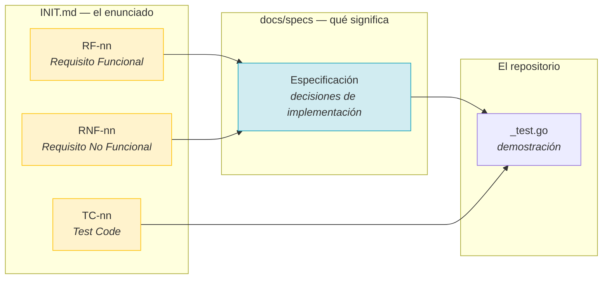

# Especificaciones

Qué **debe hacer** el sistema, En este directorio las responsabilidades del código,
por función: un requisito (RF) por documento, con sus criterios de aceptación, sus
casos límite y los tests que los demuestran.

## Índice

| # | Especificación | Requisitos | Casos |
|---|---|---|---|
| [01](01-lectura-de-transcripciones.md) | Lectura de transcripciones | RF-01 | TC-01 |
| [02](02-extraccion-con-llm.md) | Extracción con LLM | RF-02, RF-03 | TC-02, TC-03 |
| [03](03-resolucion-de-identidades.md) | Resolución de identidades | RF-04 | TC-04 |
| [04](04-publicacion-en-projects.md) | Publicación en GitHub Projects v2 | RF-05 | TC-06 |
| [05](05-cli-y-modo-seco.md) | CLI y modo seco | RF-06 | TC-05 |
| [06](06-contrato-de-datos.md) | Contrato de datos | RF-07 | — |
| [07](07-trazabilidad.md) | Trazabilidad RF ↔ RNF ↔ TC ↔ tests | todos | todos |

## Qué hay en cada documento

| Sección | Para qué sirve |
|---|---|
| **Requisito** | La frase de `INIT.md` que se está implementando |
| **Comportamiento** | Qué hace, INCLUDINGO los casos límite |
| **Diagramas** | El flujo, en Mermaid |
| **Contrato** | Los tipos y las invariantes |
| **Casos límite** | Lo que no está en el enunciado pero se decidió |
| **Verificación** | Qué test demuestra cada cosa |

## Los códigos

| Prefijo | Significado | Dónde vive el detalle |
|---|---|---|
| `RF` | Requisito funcional: qué hace | Estas especificaciones |
| `RNF` | Requisito no funcional: cómo lo hace | [ADR](../adr/) y [críticas](../criticas/) |
| `TC` | Caso de evaluación de la matriz | [Trazabilidad](07-trazabilidad.md) |

## Los siete requisitos funcionales

| # | Requisito | Especificación |
|---|---|---|
| RF-01 | Ingesta de transcripciones en `.md`, `.txt`, `.docx` | [01](01-lectura-de-transcripciones.md) |
| RF-02 | Integración con modelos locales y APIs SaaS | [02](02-extraccion-con-llm.md) |
| RF-03 | Extracción estructurada de tareas accionables | [02](02-extraccion-con-llm.md) |
| RF-04 | Resolución de identidades | [03](03-resolucion-de-identidades.md) |
| RF-05 | Publicación en GitHub Projects v2 | [04](04-publicacion-en-projects.md) |
| RF-06 | Modo seguro por defecto (dry-run) | [05](05-cli-y-modo-seco.md) |
| RF-07 | Esquema JSON y reintento con autocorrección | [06](06-contrato-de-datos.md) |

## Los seis requisitos no funcionales

| # | Requisito | Dónde se documenta |
|---|---|---|
| RNF-01 | Cero dependencias de terceros | [ADR-0002](../adr/0002-cero-dependencias-externas.md) |
| RNF-02 | Arquitectura hexagonal | [ADR-0001](../adr/0001-arquitectura-hexagonal.md) |
| RNF-03 | Rendimiento: 15 min por reunión | [Críticas: reintentos](../criticas/reintentos-y-timeouts.md) |
| RNF-04 | Seguridad: tokens fuera del código | [Críticas: seguridad](../criticas/seguridad-y-secretos.md) |
| RNF-05 | Modularidad y extensibilidad | [ADR-0001](../adr/0001-arquitectura-hexagonal.md), [TC-07](../architecture/capas.md) |
| RNF-06 | Observabilidad: logs estructurados | [Críticas: observabilidad](../criticas/observabilidad.md) |

## Documentos relacionados

- [`INIT.md`](../../INIT.md) — el enunciado. **Fuente de verdad**: si un documento
  de este directorio contradice a `INIT.md`, se equivoca este documento.
- [`docs/architecture/`](../architecture/) — cómo está construido.
- [`docs/adr/`](../adr/) — por qué está construido así.
- [`docs/criticas/`](../criticas/) — los compromisos que no se pueden romper.