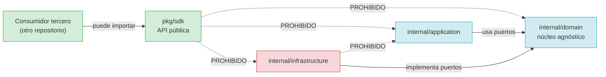

# `pkg/sdk` — reserva de la API pública

Este directorio está **vacío a propósito**.

No es código muerto ni un olvido: es el sitio reservado para la API pública del
proyecto, y esa API todavía no existe.

## Por qué existe un directorio vacío

En Go, `internal/` es **invisible para cualquiera que no esté dentro del módulo**.
Hoy, un tercero que quiera reusar los modelos, el contrato de tablero o el
cliente de GitHub **no puede importarlos**: tendría que copiar el código o
depender del ejecutable. `pkg/sdk` es la capa que resuelve eso.

Viene del árbol de referencia de `INIT.md` §7 (línea 314), donde aparece marcado
como **opcional**:

```
├── pkg/                       # Librerías reutilizables por terceros (opcional)
│   └── sdk/
```

## Qué NO es

- **No es "librerías internas mal colocadas".** `internal/` cubre eso.
- **No es código muerto.** Tiene dos reglas ya escritas y vigiladas por tests.
- **No es un sitio para mover cosas** que ya funcionan. Mover código a `pkg/`
  para "dejarlo más accesible" rompe el diseño: `internal/` existe precisamente
  para poder cambiar deimplementation sin romper a nadie.

## Las dos reglas

### 1. `pkg/sdk` no puede importar `internal/` ni `cmd/`

`pkg/` es la **superficie pública**: es lo único que alguien puede importar desde
fuera del repositorio. Si un paquete de `pkg/` dependiera de `internal/`, nadie
fuera podría compilarlo, y el directorio no cumpliría su propósito.

Vigilada por `TestPkgSdkNoDependeDeInternal`.

### 2. `internal/` no puede importar `pkg/sdk`

La regla recíproca. El núcleo **no depende de su propia API pública**: si lo
hiciera, la superficie que se ofrece a terceros empezaría a dictar el diseño
interno, y cualquier cambio pensado para un consumidor externo rompería el
núcleo.

Vigilada por `TestPkgSdkNoEsImportadoPorInternal`.

### Y una tercera, ya existente

`internal/domain` tiene prohibido importar `pkg/sdk`, además de `infrastructure`
y `application`. Es la guarda de RNF-01, en
`internal/domain/architecture_test.go`.

Las tres reglas, juntas:



## Cómo verificarlas

```bash
go test ./pkg/... -v
```

`TestPkgSdkNoDependeDeInternal` se salta mientras no haya código; en cuanto se
escriba el primer `.go`, empezará a comprobar de verdad. Y un test de este
directorio no puede pasar por vacío: si alguien borrara la reserva, la regla 1
dejaría de comprobar algo.

## Cuándo llenarlo

Cuando exista una segunda implementación que no viva en este repositorio, o una
integración que necesite los contratos sin arrastrar `cmd/`. Los candidatos
naturales, en orden:

1. Los contratos de `internal/domain` (`Transcript`, `ActionItem`,
   `MeetingBacklogExtraction`, `ProjectBoardAdapter`, `IdentityMapper`), mediante
   *reexportación* — **no** moviéndolos, que rompería la guarda de RNF-01.
2. Los parsers, si un tercero quiere leer minutas sin la CLI.

**Antes de hacerlo**, hace falta una decisión de producto que todavía no se ha
tomado: ¿existe un consumidor real? Añadir una superficie pública es una deuda
permanente — cada cambio de un contrato se convierte en un cambio de API — y no
se paga por adelantado «porque puede que haga falta».

Mientras tanto, la reserva con sus reglas es la forma correcta de tener la
opción disponible a coste cero.